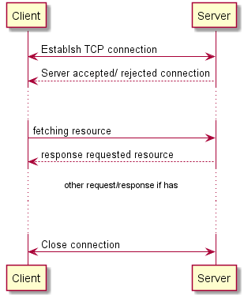
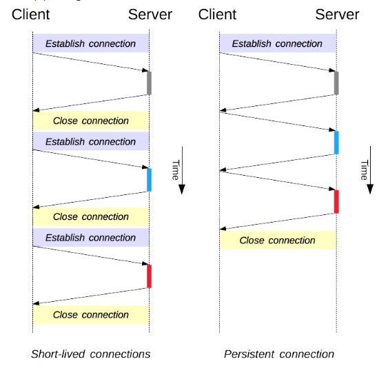

## 1. How http connection/ request work



## 2. There are two kind of connections



- Short-lived connections: Open new TCP connection for each request
- Persistent connections: Connection is opened for multiple requests. The time of opened connection could be limited by ** Keep-Alive** header. HTTP/1.1 by default use short-live connection, HTTP/2 use persistent connection

## 3. Concept of HTTP Connection Pooling

- Http Pooling connection works base on persistent connections
- The opened connection will be kept and re-user for other request. May be the same thread or diff thread.
- How long opened connection is kept that determine by the Keep-Alive attribute in header of response from http server.

## 4. How PoolingHttpClientConnectionManager works

- The PoolingHttpClientConnectionManager will create and manage a pool of connections for each route or target host.
- The default size of the pool of concurrent connections that can be open by the manager is 2 for each route or target host, and 20 for total open connections.

## 5. Example

```java
HttpGet httpGet = new HttpGet(SAMPLE_URL);
PoolingHttpClientConnectionManager connManager
        = new PoolingHttpClientConnectionManager();

CloseableHttpClient client = HttpClients.custom()
                .setConnectionManager(connManager)
                .build();

HttpResponse response = client.execute(httpGet);
httpGet.releaseConnection();
```

```log
16:56:22.047 [main] DEBUG org.apache.http.client.protocol.RequestAddCookies - CookieSpec selected: default
16:56:22.057 [main] DEBUG org.apache.http.client.protocol.RequestAuthCache - Auth cache not set in the context
16:56:22.058 [main] DEBUG org.apache.http.impl.conn.PoolingHttpClientConnectionManager - Connection request: [route: {}->http://localhost:8080][total kept alive: 0; route allocated: 0 of 2; total allocated: 0 of 20]
16:56:22.073 [main] DEBUG org.apache.http.impl.conn.PoolingHttpClientConnectionManager - Connection leased: [id: 0][route: {}->http://localhost:8080][total kept alive: 0; route allocated: 1 of 2; total allocated: 1 of 20]
16:56:22.074 [main] DEBUG org.apache.http.impl.execchain.MainClientExec - Opening connection {}->http://localhost:8080
16:56:22.079 [main] DEBUG org.apache.http.impl.conn.DefaultHttpClientConnectionOperator - Connecting to localhost/127.0.0.1:8080
16:56:22.080 [main] DEBUG org.apache.http.impl.conn.DefaultHttpClientConnectionOperator - Connection established 127.0.0.1:55443<->127.0.0.1:8080
16:56:22.080 [main] DEBUG org.apache.http.impl.execchain.MainClientExec - Executing request GET /hello-get?name=Thai HTTP/1.1
16:56:22.080 [main] DEBUG org.apache.http.impl.execchain.MainClientExec - Target auth state: UNCHALLENGED
16:56:22.080 [main] DEBUG org.apache.http.impl.execchain.MainClientExec - Proxy auth state: UNCHALLENGED
16:56:22.081 [main] DEBUG org.apache.http.headers - http-outgoing-0 >> GET /hello-get?name=Thai HTTP/1.1
16:56:22.081 [main] DEBUG org.apache.http.headers - http-outgoing-0 >> Host: localhost:8080
16:56:22.081 [main] DEBUG org.apache.http.headers - http-outgoing-0 >> Connection: Keep-Alive
16:56:22.081 [main] DEBUG org.apache.http.headers - http-outgoing-0 >> User-Agent: Apache-HttpClient/4.5.8 (Java/1.8.0_181)
16:56:22.081 [main] DEBUG org.apache.http.headers - http-outgoing-0 >> Accept-Encoding: gzip,deflate
16:56:22.081 [main] DEBUG org.apache.http.wire - http-outgoing-0 >> "GET /hello-get?name=Thai HTTP/1.1[\r][\n]"
16:56:22.081 [main] DEBUG org.apache.http.wire - http-outgoing-0 >> "Host: localhost:8080[\r][\n]"
16:56:22.081 [main] DEBUG org.apache.http.wire - http-outgoing-0 >> "Connection: Keep-Alive[\r][\n]"
16:56:22.081 [main] DEBUG org.apache.http.wire - http-outgoing-0 >> "User-Agent: Apache-HttpClient/4.5.8 (Java/1.8.0_181)[\r][\n]"
16:56:22.081 [main] DEBUG org.apache.http.wire - http-outgoing-0 >> "Accept-Encoding: gzip,deflate[\r][\n]"
16:56:22.081 [main] DEBUG org.apache.http.wire - http-outgoing-0 >> "[\r][\n]"
16:56:22.083 [main] DEBUG org.apache.http.wire - http-outgoing-0 << "HTTP/1.1 200 [\r][\n]"
16:56:22.083 [main] DEBUG org.apache.http.wire - http-outgoing-0 << "Content-Type: text/plain;charset=UTF-8[\r][\n]"
16:56:22.083 [main] DEBUG org.apache.http.wire - http-outgoing-0 << "Content-Length: 11[\r][\n]"
16:56:22.083 [main] DEBUG org.apache.http.wire - http-outgoing-0 << "Date: Wed, 15 Apr 2020 09:56:22 GMT[\r][\n]"
16:56:22.083 [main] DEBUG org.apache.http.wire - http-outgoing-0 << "Keep-Alive: timeout=60[\r][\n]"
16:56:22.083 [main] DEBUG org.apache.http.wire - http-outgoing-0 << "Connection: keep-alive[\r][\n]"
16:56:22.083 [main] DEBUG org.apache.http.wire - http-outgoing-0 << "[\r][\n]"
16:56:22.083 [main] DEBUG org.apache.http.wire - http-outgoing-0 << "Hello: Thai"
16:56:22.085 [main] DEBUG org.apache.http.headers - http-outgoing-0 << HTTP/1.1 200
16:56:22.085 [main] DEBUG org.apache.http.headers - http-outgoing-0 << Content-Type: text/plain;charset=UTF-8
16:56:22.085 [main] DEBUG org.apache.http.headers - http-outgoing-0 << Content-Length: 11
16:56:22.085 [main] DEBUG org.apache.http.headers - http-outgoing-0 << Date: Wed, 15 Apr 2020 09:56:22 GMT
16:56:22.085 [main] DEBUG org.apache.http.headers - http-outgoing-0 << Keep-Alive: timeout=60
16:56:22.085 [main] DEBUG org.apache.http.headers - http-outgoing-0 << Connection: keep-alive
16:56:22.088 [main] DEBUG org.apache.http.impl.execchain.MainClientExec - Connection can be kept alive for 60000 MILLISECONDS
```

## 6. Some of edge case

### a. Keep alive expired

##### Test case: Re-use opened connection when Keep-Alive NOT expire

- 1. Setting Keep-Alive for each connection on HTTP server is 60 seconds
- 2. Setting the MaxPerRoute of PoolingHttpClientConnectionManager is 5. (means 5 connections can be executed parallel at the time)
- 3. Executing first 5 parallel requesting to server.
- 4. Waiting for 50 seconds and then executing next 5 parallel requesting to server.

##### Expected

- When executing first 5 parallel requesting to server the http client will open 5 connection
- When executing next 5 parallel requesting to server the http client will re-use 5 opend connection
- The number of opened connection is 5

```java
@Test
public void testKeepAliveNotExpire() throws InterruptedException {
    HttpGet get = new HttpGet(SAMPLE_URL);
    PoolingHttpClientConnectionManager connManager
            = new PoolingHttpClientConnectionManager();
    connManager.setDefaultMaxPerRoute(5);

    CloseableHttpClient client = HttpClients.custom()
            .setConnectionManager(connManager)
            .build();

    MultiHttpClientConnThread[] threads
            = new  MultiHttpClientConnThread[10];
    for(int i = 0; i < threads.length; i++){

        // Executing first 5 parallel requesting to server.
        if(i < 5) {
            threads[i] = new MultiHttpClientConnThread(client, get, 0);
        } else {
            // Waiting for 50 seconds and then executing next 5 parallel requesting to server.
            threads[i] = new MultiHttpClientConnThread(client, get, 50 * 1000);
        }
    }

    for(int i = 0; i < threads.length; i++) {
        threads[i].start();
    }
    for (MultiHttpClientConnThread thread: threads) {
        thread.join(60 * 1000);
    }
}
```

```java
public class MultiHttpClientConnThread extends Thread {


    private CloseableHttpClient client;
    private HttpGet get;
    private int spleepTime = 0;

    public MultiHttpClientConnThread(CloseableHttpClient client, HttpGet get, int sleepTime) {
        this.client  = client;
        this.get = get;
        this.spleepTime = sleepTime;
    }

    // standard constructors
    public void run(){
        try {
            Thread.sleep(spleepTime);
            HttpResponse response = client.execute(get);
            EntityUtils.consume(response.getEntity());
            System.out.println("========== Finshed Thread ==========");
        } catch (ClientProtocolException ex) {
            ex.printStackTrace();
        } catch (IOException ex) {
            ex.printStackTrace();
        } catch (InterruptedException e) {
            e.printStackTrace();
        }
    }
}
```

```log
17:12:31.793 [Thread-0] DEBUG org.apache.http.client.protocol.RequestAddCookies - CookieSpec selected: default
17:12:31.793 [Thread-2] DEBUG org.apache.http.client.protocol.RequestAddCookies - CookieSpec selected: default
17:12:31.793 [Thread-3] DEBUG org.apache.http.client.protocol.RequestAddCookies - CookieSpec selected: default
17:12:31.793 [Thread-1] DEBUG org.apache.http.client.protocol.RequestAddCookies - CookieSpec selected: default
17:12:31.793 [Thread-4] DEBUG org.apache.http.client.protocol.RequestAddCookies - CookieSpec selected: default
17:12:31.808 [Thread-3] DEBUG org.apache.http.client.protocol.RequestAuthCache - Auth cache not set in the context
17:12:31.808 [Thread-4] DEBUG org.apache.http.client.protocol.RequestAuthCache - Auth cache not set in the context
17:12:31.808 [Thread-2] DEBUG org.apache.http.client.protocol.RequestAuthCache - Auth cache not set in the context
17:12:31.808 [Thread-1] DEBUG org.apache.http.client.protocol.RequestAuthCache - Auth cache not set in the context
17:12:31.808 [Thread-0] DEBUG org.apache.http.client.protocol.RequestAuthCache - Auth cache not set in the context
17:12:31.809 [Thread-3] DEBUG org.apache.http.impl.conn.PoolingHttpClientConnectionManager - Connection request: [route: {}->http://localhost:8080][total kept alive: 0; route allocated: 0 of 5; total allocated: 0 of 20]
17:12:31.809 [Thread-1] DEBUG org.apache.http.impl.conn.PoolingHttpClientConnectionManager - Connection request: [route: {}->http://localhost:8080][total kept alive: 0; route allocated: 0 of 5; total allocated: 0 of 20]
17:12:31.809 [Thread-4] DEBUG org.apache.http.impl.conn.PoolingHttpClientConnectionManager - Connection request: [route: {}->http://localhost:8080][total kept alive: 0; route allocated: 0 of 5; total allocated: 0 of 20]
17:12:31.809 [Thread-2] DEBUG org.apache.http.impl.conn.PoolingHttpClientConnectionManager - Connection request: [route: {}->http://localhost:8080][total kept alive: 0; route allocated: 0 of 5; total allocated: 0 of 20]
17:12:31.809 [Thread-0] DEBUG org.apache.http.impl.conn.PoolingHttpClientConnectionManager - Connection request: [route: {}->http://localhost:8080][total kept alive: 0; route allocated: 0 of 5; total allocated: 0 of 20]
17:12:31.825 [Thread-3] DEBUG org.apache.http.impl.conn.PoolingHttpClientConnectionManager - Connection leased: [id: 3][route: {}->http://localhost:8080][total kept alive: 0; route allocated: 4 of 5; total allocated: 4 of 20]
17:12:31.825 [Thread-4] DEBUG org.apache.http.impl.conn.PoolingHttpClientConnectionManager - Connection leased: [id: 0][route: {}->http://localhost:8080][total kept alive: 0; route allocated: 5 of 5; total allocated: 5 of 20]
17:12:31.825 [Thread-2] DEBUG org.apache.http.impl.conn.PoolingHttpClientConnectionManager - Connection leased: [id: 2][route: {}->http://localhost:8080][total kept alive: 0; route allocated: 5 of 5; total allocated: 5 of 20]
17:12:31.825 [Thread-1] DEBUG org.apache.http.impl.conn.PoolingHttpClientConnectionManager - Connection leased: [id: 1][route: {}->http://localhost:8080][total kept alive: 0; route allocated: 5 of 5; total allocated: 5 of 20]
17:12:31.825 [Thread-0] DEBUG org.apache.http.impl.conn.PoolingHttpClientConnectionManager - Connection leased: [id: 4][route: {}->http://localhost:8080][total kept alive: 0; route allocated: 5 of 5; total allocated: 5 of 20]
17:12:31.827 [Thread-1] DEBUG org.apache.http.impl.execchain.MainClientExec - Opening connection {}->http://localhost:8080
17:12:31.827 [Thread-4] DEBUG org.apache.http.impl.execchain.MainClientExec - Opening connection {}->http://localhost:8080
17:12:31.827 [Thread-2] DEBUG org.apache.http.impl.execchain.MainClientExec - Opening connection {}->http://localhost:8080
17:12:31.827 [Thread-0] DEBUG org.apache.http.impl.execchain.MainClientExec - Opening connection {}->http://localhost:8080
17:12:31.827 [Thread-3] DEBUG org.apache.http.impl.execchain.MainClientExec - Opening connection {}->http://localhost:8080
17:12:31.834 [Thread-1] DEBUG org.apache.http.impl.conn.DefaultHttpClientConnectionOperator - Connecting to localhost/127.0.0.1:8080
17:12:31.836 [Thread-1] DEBUG org.apache.http.impl.conn.DefaultHttpClientConnectionOperator - Connection established 127.0.0.1:55695<->127.0.0.1:8080
17:12:31.837 [Thread-1] DEBUG org.apache.http.impl.execchain.MainClientExec - Executing request GET /hello-get?name=Thai HTTP/1.1
17:12:31.837 [Thread-1] DEBUG org.apache.http.impl.execchain.MainClientExec - Target auth state: UNCHALLENGED
17:12:31.838 [Thread-2] DEBUG org.apache.http.impl.conn.DefaultHttpClientConnectionOperator - Connecting to localhost/127.0.0.1:8080
17:12:31.837 [Thread-1] DEBUG org.apache.http.impl.execchain.MainClientExec - Proxy auth state: UNCHALLENGED
17:12:31.838 [Thread-4] DEBUG org.apache.http.impl.conn.DefaultHttpClientConnectionOperator - Connecting to localhost/127.0.0.1:8080
17:12:31.838 [Thread-3] DEBUG org.apache.http.impl.conn.DefaultHttpClientConnectionOperator - Connecting to localhost/127.0.0.1:8080
17:12:31.838 [Thread-3] DEBUG org.apache.http.impl.conn.DefaultHttpClientConnectionOperator - Connection established 127.0.0.1:55697<->127.0.0.1:8080
17:12:31.839 [Thread-3] DEBUG org.apache.http.impl.execchain.MainClientExec - Executing request GET /hello-get?name=Thai HTTP/1.1
17:12:31.839 [Thread-3] DEBUG org.apache.http.impl.execchain.MainClientExec - Target auth state: UNCHALLENGED
17:12:31.839 [Thread-2] DEBUG org.apache.http.impl.conn.DefaultHttpClientConnectionOperator - Connection established 127.0.0.1:55698<->127.0.0.1:8080
17:12:31.839 [Thread-3] DEBUG org.apache.http.impl.execchain.MainClientExec - Proxy auth state: UNCHALLENGED
17:12:31.839 [Thread-2] DEBUG org.apache.http.impl.execchain.MainClientExec - Executing request GET /hello-get?name=Thai HTTP/1.1
17:12:31.839 [Thread-2] DEBUG org.apache.http.impl.execchain.MainClientExec - Target auth state: UNCHALLENGED
17:12:31.839 [Thread-2] DEBUG org.apache.http.impl.execchain.MainClientExec - Proxy auth state: UNCHALLENGED
17:12:31.839 [Thread-4] DEBUG org.apache.http.impl.conn.DefaultHttpClientConnectionOperator - Connection established 127.0.0.1:55696<->127.0.0.1:8080
17:12:31.839 [Thread-4] DEBUG org.apache.http.impl.execchain.MainClientExec - Executing request GET /hello-get?name=Thai HTTP/1.1
17:12:31.839 [Thread-4] DEBUG org.apache.http.impl.execchain.MainClientExec - Target auth state: UNCHALLENGED
17:12:31.839 [Thread-4] DEBUG org.apache.http.impl.execchain.MainClientExec - Proxy auth state: UNCHALLENGED
17:12:31.839 [Thread-0] DEBUG org.apache.http.impl.conn.DefaultHttpClientConnectionOperator - Connecting to localhost/127.0.0.1:8080
17:12:31.840 [Thread-0] DEBUG org.apache.http.impl.conn.DefaultHttpClientConnectionOperator - Connection established 127.0.0.1:55699<->127.0.0.1:8080
17:12:31.840 [Thread-0] DEBUG org.apache.http.impl.execchain.MainClientExec - Executing request GET /hello-get?name=Thai HTTP/1.1
17:12:31.840 [Thread-0] DEBUG org.apache.http.impl.execchain.MainClientExec - Target auth state: UNCHALLENGED
17:12:31.840 [Thread-0] DEBUG org.apache.http.impl.execchain.MainClientExec - Proxy auth state: UNCHALLENGED
17:12:31.841 [Thread-3] DEBUG org.apache.http.headers - http-outgoing-3 >> GET /hello-get?name=Thai HTTP/1.1
17:12:31.841 [Thread-0] DEBUG org.apache.http.headers - http-outgoing-4 >> GET /hello-get?name=Thai HTTP/1.1
17:12:31.841 [Thread-3] DEBUG org.apache.http.headers - http-outgoing-3 >> Host: localhost:8080
17:12:31.841 [Thread-0] DEBUG org.apache.http.headers - http-outgoing-4 >> Host: localhost:8080
17:12:31.841 [Thread-3] DEBUG org.apache.http.headers - http-outgoing-3 >> Connection: Keep-Alive
17:12:31.841 [Thread-4] DEBUG org.apache.http.headers - http-outgoing-0 >> GET /hello-get?name=Thai HTTP/1.1
17:12:31.841 [Thread-3] DEBUG org.apache.http.headers - http-outgoing-3 >> User-Agent: Apache-HttpClient/4.5.8 (Java/1.8.0_181)
17:12:31.841 [Thread-4] DEBUG org.apache.http.headers - http-outgoing-0 >> Host: localhost:8080
17:12:31.841 [Thread-0] DEBUG org.apache.http.headers - http-outgoing-4 >> Connection: Keep-Alive
17:12:31.841 [Thread-4] DEBUG org.apache.http.headers - http-outgoing-0 >> Connection: Keep-Alive
17:12:31.841 [Thread-3] DEBUG org.apache.http.headers - http-outgoing-3 >> Accept-Encoding: gzip,deflate
17:12:31.841 [Thread-0] DEBUG org.apache.http.headers - http-outgoing-4 >> User-Agent: Apache-HttpClient/4.5.8 (Java/1.8.0_181)
17:12:31.841 [Thread-0] DEBUG org.apache.http.headers - http-outgoing-4 >> Accept-Encoding: gzip,deflate
17:12:31.841 [Thread-3] DEBUG org.apache.http.wire - http-outgoing-3 >> "GET /hello-get?name=Thai HTTP/1.1[\r][\n]"
17:12:31.841 [Thread-3] DEBUG org.apache.http.wire - http-outgoing-3 >> "Host: localhost:8080[\r][\n]"
17:12:31.841 [Thread-0] DEBUG org.apache.http.wire - http-outgoing-4 >> "GET /hello-get?name=Thai HTTP/1.1[\r][\n]"
17:12:31.841 [Thread-3] DEBUG org.apache.http.wire - http-outgoing-3 >> "Connection: Keep-Alive[\r][\n]"
17:12:31.841 [Thread-0] DEBUG org.apache.http.wire - http-outgoing-4 >> "Host: localhost:8080[\r][\n]"
17:12:31.841 [Thread-0] DEBUG org.apache.http.wire - http-outgoing-4 >> "Connection: Keep-Alive[\r][\n]"
17:12:31.841 [Thread-4] DEBUG org.apache.http.headers - http-outgoing-0 >> User-Agent: Apache-HttpClient/4.5.8 (Java/1.8.0_181)
17:12:31.841 [Thread-3] DEBUG org.apache.http.wire - http-outgoing-3 >> "User-Agent: Apache-HttpClient/4.5.8 (Java/1.8.0_181)[\r][\n]"
17:12:31.842 [Thread-3] DEBUG org.apache.http.wire - http-outgoing-3 >> "Accept-Encoding: gzip,deflate[\r][\n]"
17:12:31.842 [Thread-4] DEBUG org.apache.http.headers - http-outgoing-0 >> Accept-Encoding: gzip,deflate
17:12:31.842 [Thread-3] DEBUG org.apache.http.wire - http-outgoing-3 >> "[\r][\n]"
17:12:31.842 [Thread-4] DEBUG org.apache.http.wire - http-outgoing-0 >> "GET /hello-get?name=Thai HTTP/1.1[\r][\n]"
17:12:31.842 [Thread-4] DEBUG org.apache.http.wire - http-outgoing-0 >> "Host: localhost:8080[\r][\n]"
17:12:31.842 [Thread-4] DEBUG org.apache.http.wire - http-outgoing-0 >> "Connection: Keep-Alive[\r][\n]"
17:12:31.842 [Thread-4] DEBUG org.apache.http.wire - http-outgoing-0 >> "User-Agent: Apache-HttpClient/4.5.8 (Java/1.8.0_181)[\r][\n]"
17:12:31.841 [Thread-2] DEBUG org.apache.http.headers - http-outgoing-2 >> GET /hello-get?name=Thai HTTP/1.1
17:12:31.842 [Thread-1] DEBUG org.apache.http.headers - http-outgoing-1 >> GET /hello-get?name=Thai HTTP/1.1
17:12:31.842 [Thread-1] DEBUG org.apache.http.headers - http-outgoing-1 >> Host: localhost:8080
17:12:31.842 [Thread-1] DEBUG org.apache.http.headers - http-outgoing-1 >> Connection: Keep-Alive
17:12:31.842 [Thread-1] DEBUG org.apache.http.headers - http-outgoing-1 >> User-Agent: Apache-HttpClient/4.5.8 (Java/1.8.0_181)
17:12:31.842 [Thread-1] DEBUG org.apache.http.headers - http-outgoing-1 >> Accept-Encoding: gzip,deflate
17:12:31.842 [Thread-1] DEBUG org.apache.http.wire - http-outgoing-1 >> "GET /hello-get?name=Thai HTTP/1.1[\r][\n]"
17:12:31.842 [Thread-1] DEBUG org.apache.http.wire - http-outgoing-1 >> "Host: localhost:8080[\r][\n]"
17:12:31.842 [Thread-1] DEBUG org.apache.http.wire - http-outgoing-1 >> "Connection: Keep-Alive[\r][\n]"
17:12:31.842 [Thread-1] DEBUG org.apache.http.wire - http-outgoing-1 >> "User-Agent: Apache-HttpClient/4.5.8 (Java/1.8.0_181)[\r][\n]"
17:12:31.842 [Thread-1] DEBUG org.apache.http.wire - http-outgoing-1 >> "Accept-Encoding: gzip,deflate[\r][\n]"
17:12:31.842 [Thread-1] DEBUG org.apache.http.wire - http-outgoing-1 >> "[\r][\n]"
17:12:31.842 [Thread-4] DEBUG org.apache.http.wire - http-outgoing-0 >> "Accept-Encoding: gzip,deflate[\r][\n]"
17:12:31.842 [Thread-4] DEBUG org.apache.http.wire - http-outgoing-0 >> "[\r][\n]"
17:12:31.842 [Thread-0] DEBUG org.apache.http.wire - http-outgoing-4 >> "User-Agent: Apache-HttpClient/4.5.8 (Java/1.8.0_181)[\r][\n]"
17:12:31.842 [Thread-0] DEBUG org.apache.http.wire - http-outgoing-4 >> "Accept-Encoding: gzip,deflate[\r][\n]"
17:12:31.843 [Thread-0] DEBUG org.apache.http.wire - http-outgoing-4 >> "[\r][\n]"
17:12:31.842 [Thread-2] DEBUG org.apache.http.headers - http-outgoing-2 >> Host: localhost:8080
17:12:31.843 [Thread-2] DEBUG org.apache.http.headers - http-outgoing-2 >> Connection: Keep-Alive
17:12:31.843 [Thread-2] DEBUG org.apache.http.headers - http-outgoing-2 >> User-Agent: Apache-HttpClient/4.5.8 (Java/1.8.0_181)
17:12:31.843 [Thread-2] DEBUG org.apache.http.headers - http-outgoing-2 >> Accept-Encoding: gzip,deflate
17:12:31.843 [Thread-2] DEBUG org.apache.http.wire - http-outgoing-2 >> "GET /hello-get?name=Thai HTTP/1.1[\r][\n]"
17:12:31.843 [Thread-2] DEBUG org.apache.http.wire - http-outgoing-2 >> "Host: localhost:8080[\r][\n]"
17:12:31.843 [Thread-2] DEBUG org.apache.http.wire - http-outgoing-2 >> "Connection: Keep-Alive[\r][\n]"
17:12:31.843 [Thread-2] DEBUG org.apache.http.wire - http-outgoing-2 >> "User-Agent: Apache-HttpClient/4.5.8 (Java/1.8.0_181)[\r][\n]"
17:12:31.843 [Thread-2] DEBUG org.apache.http.wire - http-outgoing-2 >> "Accept-Encoding: gzip,deflate[\r][\n]"
17:12:31.843 [Thread-2] DEBUG org.apache.http.wire - http-outgoing-2 >> "[\r][\n]"
17:12:31.846 [Thread-4] DEBUG org.apache.http.wire - http-outgoing-0 << "HTTP/1.1 200 [\r][\n]"
17:12:31.846 [Thread-4] DEBUG org.apache.http.wire - http-outgoing-0 << "Content-Type: text/plain;charset=UTF-8[\r][\n]"
17:12:31.846 [Thread-4] DEBUG org.apache.http.wire - http-outgoing-0 << "Content-Length: 11[\r][\n]"
17:12:31.846 [Thread-4] DEBUG org.apache.http.wire - http-outgoing-0 << "Date: Wed, 15 Apr 2020 10:12:31 GMT[\r][\n]"
17:12:31.846 [Thread-4] DEBUG org.apache.http.wire - http-outgoing-0 << "Keep-Alive: timeout=60[\r][\n]"
17:12:31.846 [Thread-4] DEBUG org.apache.http.wire - http-outgoing-0 << "Connection: keep-alive[\r][\n]"
17:12:31.846 [Thread-4] DEBUG org.apache.http.wire - http-outgoing-0 << "[\r][\n]"
17:12:31.846 [Thread-4] DEBUG org.apache.http.wire - http-outgoing-0 << "Hello: Thai"
17:12:31.847 [Thread-1] DEBUG org.apache.http.wire - http-outgoing-1 << "HTTP/1.1 200 [\r][\n]"
17:12:31.847 [Thread-1] DEBUG org.apache.http.wire - http-outgoing-1 << "Content-Type: text/plain;charset=UTF-8[\r][\n]"
17:12:31.847 [Thread-1] DEBUG org.apache.http.wire - http-outgoing-1 << "Content-Length: 11[\r][\n]"
17:12:31.848 [Thread-1] DEBUG org.apache.http.wire - http-outgoing-1 << "Date: Wed, 15 Apr 2020 10:12:31 GMT[\r][\n]"
17:12:31.848 [Thread-1] DEBUG org.apache.http.wire - http-outgoing-1 << "Keep-Alive: timeout=60[\r][\n]"
17:12:31.848 [Thread-1] DEBUG org.apache.http.wire - http-outgoing-1 << "Connection: keep-alive[\r][\n]"
17:12:31.848 [Thread-1] DEBUG org.apache.http.wire - http-outgoing-1 << "[\r][\n]"
17:12:31.848 [Thread-1] DEBUG org.apache.http.wire - http-outgoing-1 << "Hello: Thai"
17:12:31.849 [Thread-2] DEBUG org.apache.http.wire - http-outgoing-2 << "HTTP/1.1 200 [\r][\n]"
17:12:31.849 [Thread-2] DEBUG org.apache.http.wire - http-outgoing-2 << "Content-Type: text/plain;charset=UTF-8[\r][\n]"
17:12:31.849 [Thread-2] DEBUG org.apache.http.wire - http-outgoing-2 << "Content-Length: 11[\r][\n]"
17:12:31.849 [Thread-2] DEBUG org.apache.http.wire - http-outgoing-2 << "Date: Wed, 15 Apr 2020 10:12:31 GMT[\r][\n]"
17:12:31.849 [Thread-2] DEBUG org.apache.http.wire - http-outgoing-2 << "Keep-Alive: timeout=60[\r][\n]"
17:12:31.849 [Thread-2] DEBUG org.apache.http.wire - http-outgoing-2 << "Connection: keep-alive[\r][\n]"
17:12:31.849 [Thread-2] DEBUG org.apache.http.wire - http-outgoing-2 << "[\r][\n]"
17:12:31.849 [Thread-2] DEBUG org.apache.http.wire - http-outgoing-2 << "Hello: Thai"
17:12:31.849 [Thread-2] DEBUG org.apache.http.headers - http-outgoing-2 << HTTP/1.1 200
17:12:31.849 [Thread-4] DEBUG org.apache.http.headers - http-outgoing-0 << HTTP/1.1 200
17:12:31.849 [Thread-4] DEBUG org.apache.http.headers - http-outgoing-0 << Content-Type: text/plain;charset=UTF-8
17:12:31.849 [Thread-4] DEBUG org.apache.http.headers - http-outgoing-0 << Content-Length: 11
17:12:31.849 [Thread-4] DEBUG org.apache.http.headers - http-outgoing-0 << Date: Wed, 15 Apr 2020 10:12:31 GMT
17:12:31.849 [Thread-4] DEBUG org.apache.http.headers - http-outgoing-0 << Keep-Alive: timeout=60
17:12:31.849 [Thread-4] DEBUG org.apache.http.headers - http-outgoing-0 << Connection: keep-alive
17:12:31.850 [Thread-1] DEBUG org.apache.http.headers - http-outgoing-1 << HTTP/1.1 200
17:12:31.850 [Thread-1] DEBUG org.apache.http.headers - http-outgoing-1 << Content-Type: text/plain;charset=UTF-8
17:12:31.850 [Thread-1] DEBUG org.apache.http.headers - http-outgoing-1 << Content-Length: 11
17:12:31.850 [Thread-1] DEBUG org.apache.http.headers - http-outgoing-1 << Date: Wed, 15 Apr 2020 10:12:31 GMT
17:12:31.850 [Thread-1] DEBUG org.apache.http.headers - http-outgoing-1 << Keep-Alive: timeout=60
17:12:31.850 [Thread-1] DEBUG org.apache.http.headers - http-outgoing-1 << Connection: keep-alive
17:12:31.849 [Thread-2] DEBUG org.apache.http.headers - http-outgoing-2 << Content-Type: text/plain;charset=UTF-8
17:12:31.850 [Thread-2] DEBUG org.apache.http.headers - http-outgoing-2 << Content-Length: 11
17:12:31.850 [Thread-2] DEBUG org.apache.http.headers - http-outgoing-2 << Date: Wed, 15 Apr 2020 10:12:31 GMT
17:12:31.850 [Thread-2] DEBUG org.apache.http.headers - http-outgoing-2 << Keep-Alive: timeout=60
17:12:31.850 [Thread-2] DEBUG org.apache.http.headers - http-outgoing-2 << Connection: keep-alive
17:12:31.852 [Thread-0] DEBUG org.apache.http.wire - http-outgoing-4 << "HTTP/1.1 200 [\r][\n]"
17:12:31.852 [Thread-0] DEBUG org.apache.http.wire - http-outgoing-4 << "Content-Type: text/plain;charset=UTF-8[\r][\n]"
17:12:31.852 [Thread-0] DEBUG org.apache.http.wire - http-outgoing-4 << "Content-Length: 11[\r][\n]"
17:12:31.852 [Thread-0] DEBUG org.apache.http.wire - http-outgoing-4 << "Date: Wed, 15 Apr 2020 10:12:31 GMT[\r][\n]"
17:12:31.852 [Thread-0] DEBUG org.apache.http.wire - http-outgoing-4 << "Keep-Alive: timeout=60[\r][\n]"
17:12:31.852 [Thread-0] DEBUG org.apache.http.wire - http-outgoing-4 << "Connection: keep-alive[\r][\n]"
17:12:31.852 [Thread-0] DEBUG org.apache.http.wire - http-outgoing-4 << "[\r][\n]"
17:12:31.852 [Thread-0] DEBUG org.apache.http.wire - http-outgoing-4 << "Hello: Thai"
17:12:31.852 [Thread-0] DEBUG org.apache.http.headers - http-outgoing-4 << HTTP/1.1 200
17:12:31.852 [Thread-0] DEBUG org.apache.http.headers - http-outgoing-4 << Content-Type: text/plain;charset=UTF-8
17:12:31.852 [Thread-0] DEBUG org.apache.http.headers - http-outgoing-4 << Content-Length: 11
17:12:31.852 [Thread-0] DEBUG org.apache.http.headers - http-outgoing-4 << Date: Wed, 15 Apr 2020 10:12:31 GMT
17:12:31.852 [Thread-0] DEBUG org.apache.http.headers - http-outgoing-4 << Keep-Alive: timeout=60
17:12:31.852 [Thread-0] DEBUG org.apache.http.headers - http-outgoing-4 << Connection: keep-alive
17:12:31.854 [Thread-3] DEBUG org.apache.http.wire - http-outgoing-3 << "HTTP/1.1 200 [\r][\n]"
17:12:31.854 [Thread-3] DEBUG org.apache.http.wire - http-outgoing-3 << "Content-Type: text/plain;charset=UTF-8[\r][\n]"
17:12:31.855 [Thread-3] DEBUG org.apache.http.wire - http-outgoing-3 << "Content-Length: 11[\r][\n]"
17:12:31.855 [Thread-3] DEBUG org.apache.http.wire - http-outgoing-3 << "Date: Wed, 15 Apr 2020 10:12:31 GMT[\r][\n]"
17:12:31.855 [Thread-3] DEBUG org.apache.http.wire - http-outgoing-3 << "Keep-Alive: timeout=60[\r][\n]"
17:12:31.855 [Thread-3] DEBUG org.apache.http.wire - http-outgoing-3 << "Connection: keep-alive[\r][\n]"
17:12:31.855 [Thread-3] DEBUG org.apache.http.wire - http-outgoing-3 << "[\r][\n]"
17:12:31.855 [Thread-3] DEBUG org.apache.http.wire - http-outgoing-3 << "Hello: Thai"
17:12:31.855 [Thread-3] DEBUG org.apache.http.headers - http-outgoing-3 << HTTP/1.1 200
17:12:31.855 [Thread-3] DEBUG org.apache.http.headers - http-outgoing-3 << Content-Type: text/plain;charset=UTF-8
17:12:31.855 [Thread-3] DEBUG org.apache.http.headers - http-outgoing-3 << Content-Length: 11
17:12:31.855 [Thread-3] DEBUG org.apache.http.headers - http-outgoing-3 << Date: Wed, 15 Apr 2020 10:12:31 GMT
17:12:31.855 [Thread-3] DEBUG org.apache.http.headers - http-outgoing-3 << Keep-Alive: timeout=60
17:12:31.855 [Thread-3] DEBUG org.apache.http.headers - http-outgoing-3 << Connection: keep-alive
17:12:31.857 [Thread-0] DEBUG org.apache.http.impl.execchain.MainClientExec - Connection can be kept alive for 60000 MILLISECONDS
17:12:31.857 [Thread-4] DEBUG org.apache.http.impl.execchain.MainClientExec - Connection can be kept alive for 60000 MILLISECONDS
17:12:31.857 [Thread-3] DEBUG org.apache.http.impl.execchain.MainClientExec - Connection can be kept alive for 60000 MILLISECONDS
17:12:31.857 [Thread-1] DEBUG org.apache.http.impl.execchain.MainClientExec - Connection can be kept alive for 60000 MILLISECONDS
17:12:31.857 [Thread-2] DEBUG org.apache.http.impl.execchain.MainClientExec - Connection can be kept alive for 60000 MILLISECONDS
17:12:31.861 [Thread-2] DEBUG org.apache.http.impl.conn.PoolingHttpClientConnectionManager - Connection [id: 2][route: {}->http://localhost:8080] can be kept alive for 60.0 seconds
17:12:31.861 [Thread-4] DEBUG org.apache.http.impl.conn.PoolingHttpClientConnectionManager - Connection [id: 0][route: {}->http://localhost:8080] can be kept alive for 60.0 seconds
17:12:31.861 [Thread-3] DEBUG org.apache.http.impl.conn.PoolingHttpClientConnectionManager - Connection [id: 3][route: {}->http://localhost:8080] can be kept alive for 60.0 seconds
17:12:31.861 [Thread-4] DEBUG org.apache.http.impl.conn.DefaultManagedHttpClientConnection - http-outgoing-0: set socket timeout to 0
17:12:31.861 [Thread-0] DEBUG org.apache.http.impl.conn.PoolingHttpClientConnectionManager - Connection [id: 4][route: {}->http://localhost:8080] can be kept alive for 60.0 seconds
17:12:31.861 [Thread-1] DEBUG org.apache.http.impl.conn.PoolingHttpClientConnectionManager - Connection [id: 1][route: {}->http://localhost:8080] can be kept alive for 60.0 seconds
17:12:31.861 [Thread-0] DEBUG org.apache.http.impl.conn.DefaultManagedHttpClientConnection - http-outgoing-4: set socket timeout to 0
17:12:31.861 [Thread-2] DEBUG org.apache.http.impl.conn.DefaultManagedHttpClientConnection - http-outgoing-2: set socket timeout to 0
17:12:31.861 [Thread-3] DEBUG org.apache.http.impl.conn.DefaultManagedHttpClientConnection - http-outgoing-3: set socket timeout to 0
17:12:31.861 [Thread-1] DEBUG org.apache.http.impl.conn.DefaultManagedHttpClientConnection - http-outgoing-1: set socket timeout to 0
17:12:31.861 [Thread-3] DEBUG org.apache.http.impl.conn.PoolingHttpClientConnectionManager - Connection released: [id: 3][route: {}->http://localhost:8080][total kept alive: 4; route allocated: 5 of 5; total allocated: 5 of 20]
========== Finshed Thread ==========
17:12:31.862 [Thread-4] DEBUG org.apache.http.impl.conn.PoolingHttpClientConnectionManager - Connection released: [id: 0][route: {}->http://localhost:8080][total kept alive: 3; route allocated: 5 of 5; total allocated: 5 of 20]
========== Finshed Thread ==========
17:12:31.862 [Thread-0] DEBUG org.apache.http.impl.conn.PoolingHttpClientConnectionManager - Connection released: [id: 4][route: {}->http://localhost:8080][total kept alive: 3; route allocated: 5 of 5; total allocated: 5 of 20]
========== Finshed Thread ==========
17:12:31.862 [Thread-2] DEBUG org.apache.http.impl.conn.PoolingHttpClientConnectionManager - Connection released: [id: 2][route: {}->http://localhost:8080][total kept alive: 5; route allocated: 5 of 5; total allocated: 5 of 20]
========== Finshed Thread ==========
17:12:31.862 [Thread-1] DEBUG org.apache.http.impl.conn.PoolingHttpClientConnectionManager - Connection released: [id: 1][route: {}->http://localhost:8080][total kept alive: 5; route allocated: 5 of 5; total allocated: 5 of 20]
========== Finshed Thread ==========
17:13:21.774 [Thread-6] DEBUG org.apache.http.client.protocol.RequestAddCookies - CookieSpec selected: default
17:13:21.774 [Thread-5] DEBUG org.apache.http.client.protocol.RequestAddCookies - CookieSpec selected: default
17:13:21.774 [Thread-7] DEBUG org.apache.http.client.protocol.RequestAddCookies - CookieSpec selected: default
17:13:21.774 [Thread-9] DEBUG org.apache.http.client.protocol.RequestAddCookies - CookieSpec selected: default
17:13:21.774 [Thread-5] DEBUG org.apache.http.client.protocol.RequestAuthCache - Auth cache not set in the context
17:13:21.774 [Thread-6] DEBUG org.apache.http.client.protocol.RequestAuthCache - Auth cache not set in the context
17:13:21.774 [Thread-7] DEBUG org.apache.http.client.protocol.RequestAuthCache - Auth cache not set in the context
17:13:21.774 [Thread-9] DEBUG org.apache.http.client.protocol.RequestAuthCache - Auth cache not set in the context
17:13:21.774 [Thread-5] DEBUG org.apache.http.impl.conn.PoolingHttpClientConnectionManager - Connection request: [route: {}->http://localhost:8080][total kept alive: 5; route allocated: 5 of 5; total allocated: 5 of 20]
17:13:21.774 [Thread-6] DEBUG org.apache.http.impl.conn.PoolingHttpClientConnectionManager - Connection request: [route: {}->http://localhost:8080][total kept alive: 5; route allocated: 5 of 5; total allocated: 5 of 20]
17:13:21.774 [Thread-9] DEBUG org.apache.http.impl.conn.PoolingHttpClientConnectionManager - Connection request: [route: {}->http://localhost:8080][total kept alive: 5; route allocated: 5 of 5; total allocated: 5 of 20]
17:13:21.774 [Thread-7] DEBUG org.apache.http.impl.conn.PoolingHttpClientConnectionManager - Connection request: [route: {}->http://localhost:8080][total kept alive: 5; route allocated: 5 of 5; total allocated: 5 of 20]
17:13:21.775 [Thread-8] DEBUG org.apache.http.client.protocol.RequestAddCookies - CookieSpec selected: default
17:13:21.775 [Thread-8] DEBUG org.apache.http.client.protocol.RequestAuthCache - Auth cache not set in the context
17:13:21.775 [Thread-8] DEBUG org.apache.http.impl.conn.PoolingHttpClientConnectionManager - Connection request: [route: {}->http://localhost:8080][total kept alive: 1; route allocated: 5 of 5; total allocated: 5 of 20]
17:13:21.776 [Thread-6] DEBUG org.apache.http.wire - http-outgoing-3 << "[read] I/O error: Read timed out"
17:13:21.776 [Thread-9] DEBUG org.apache.http.wire - http-outgoing-4 << "[read] I/O error: Read timed out"
17:13:21.776 [Thread-5] DEBUG org.apache.http.wire - http-outgoing-1 << "[read] I/O error: Read timed out"
17:13:21.776 [Thread-6] DEBUG org.apache.http.impl.conn.PoolingHttpClientConnectionManager - Connection leased: [id: 3][route: {}->http://localhost:8080][total kept alive: 0; route allocated: 5 of 5; total allocated: 5 of 20]
17:13:21.776 [Thread-9] DEBUG org.apache.http.impl.conn.PoolingHttpClientConnectionManager - Connection leased: [id: 4][route: {}->http://localhost:8080][total kept alive: 0; route allocated: 5 of 5; total allocated: 5 of 20]
17:13:21.776 [Thread-5] DEBUG org.apache.http.impl.conn.PoolingHttpClientConnectionManager - Connection leased: [id: 1][route: {}->http://localhost:8080][total kept alive: 0; route allocated: 5 of 5; total allocated: 5 of 20]
17:13:21.776 [Thread-9] DEBUG org.apache.http.impl.conn.DefaultManagedHttpClientConnection - http-outgoing-4: set socket timeout to 0
17:13:21.776 [Thread-6] DEBUG org.apache.http.impl.conn.DefaultManagedHttpClientConnection - http-outgoing-3: set socket timeout to 0
17:13:21.776 [Thread-5] DEBUG org.apache.http.impl.conn.DefaultManagedHttpClientConnection - http-outgoing-1: set socket timeout to 0
17:13:21.776 [Thread-6] DEBUG org.apache.http.impl.execchain.MainClientExec - Executing request GET /hello-get?name=Thai HTTP/1.1
17:13:21.776 [Thread-9] DEBUG org.apache.http.impl.execchain.MainClientExec - Executing request GET /hello-get?name=Thai HTTP/1.1
17:13:21.776 [Thread-5] DEBUG org.apache.http.impl.execchain.MainClientExec - Executing request GET /hello-get?name=Thai HTTP/1.1
17:13:21.776 [Thread-9] DEBUG org.apache.http.impl.execchain.MainClientExec - Target auth state: UNCHALLENGED
17:13:21.776 [Thread-6] DEBUG org.apache.http.impl.execchain.MainClientExec - Target auth state: UNCHALLENGED
17:13:21.776 [Thread-5] DEBUG org.apache.http.impl.execchain.MainClientExec - Target auth state: UNCHALLENGED
17:13:21.776 [Thread-9] DEBUG org.apache.http.impl.execchain.MainClientExec - Proxy auth state: UNCHALLENGED
17:13:21.776 [Thread-6] DEBUG org.apache.http.impl.execchain.MainClientExec - Proxy auth state: UNCHALLENGED
17:13:21.776 [Thread-5] DEBUG org.apache.http.impl.execchain.MainClientExec - Proxy auth state: UNCHALLENGED
17:13:21.776 [Thread-5] DEBUG org.apache.http.headers - http-outgoing-1 >> GET /hello-get?name=Thai HTTP/1.1
17:13:21.776 [Thread-9] DEBUG org.apache.http.headers - http-outgoing-4 >> GET /hello-get?name=Thai HTTP/1.1
17:13:21.776 [Thread-6] DEBUG org.apache.http.headers - http-outgoing-3 >> GET /hello-get?name=Thai HTTP/1.1
17:13:21.776 [Thread-5] DEBUG org.apache.http.headers - http-outgoing-1 >> Host: localhost:8080
17:13:21.776 [Thread-6] DEBUG org.apache.http.headers - http-outgoing-3 >> Host: localhost:8080
17:13:21.776 [Thread-9] DEBUG org.apache.http.headers - http-outgoing-4 >> Host: localhost:8080
17:13:21.776 [Thread-6] DEBUG org.apache.http.headers - http-outgoing-3 >> Connection: Keep-Alive
17:13:21.776 [Thread-5] DEBUG org.apache.http.headers - http-outgoing-1 >> Connection: Keep-Alive
17:13:21.776 [Thread-9] DEBUG org.apache.http.headers - http-outgoing-4 >> Connection: Keep-Alive
17:13:21.776 [Thread-5] DEBUG org.apache.http.headers - http-outgoing-1 >> User-Agent: Apache-HttpClient/4.5.8 (Java/1.8.0_181)
17:13:21.776 [Thread-6] DEBUG org.apache.http.headers - http-outgoing-3 >> User-Agent: Apache-HttpClient/4.5.8 (Java/1.8.0_181)
17:13:21.776 [Thread-9] DEBUG org.apache.http.headers - http-outgoing-4 >> User-Agent: Apache-HttpClient/4.5.8 (Java/1.8.0_181)
17:13:21.776 [Thread-5] DEBUG org.apache.http.headers - http-outgoing-1 >> Accept-Encoding: gzip,deflate
17:13:21.776 [Thread-9] DEBUG org.apache.http.headers - http-outgoing-4 >> Accept-Encoding: gzip,deflate
17:13:21.776 [Thread-6] DEBUG org.apache.http.headers - http-outgoing-3 >> Accept-Encoding: gzip,deflate
17:13:21.776 [Thread-5] DEBUG org.apache.http.wire - http-outgoing-1 >> "GET /hello-get?name=Thai HTTP/1.1[\r][\n]"
17:13:21.776 [Thread-9] DEBUG org.apache.http.wire - http-outgoing-4 >> "GET /hello-get?name=Thai HTTP/1.1[\r][\n]"
17:13:21.776 [Thread-6] DEBUG org.apache.http.wire - http-outgoing-3 >> "GET /hello-get?name=Thai HTTP/1.1[\r][\n]"
17:13:21.776 [Thread-5] DEBUG org.apache.http.wire - http-outgoing-1 >> "Host: localhost:8080[\r][\n]"
17:13:21.776 [Thread-9] DEBUG org.apache.http.wire - http-outgoing-4 >> "Host: localhost:8080[\r][\n]"
17:13:21.776 [Thread-6] DEBUG org.apache.http.wire - http-outgoing-3 >> "Host: localhost:8080[\r][\n]"
17:13:21.776 [Thread-9] DEBUG org.apache.http.wire - http-outgoing-4 >> "Connection: Keep-Alive[\r][\n]"
17:13:21.776 [Thread-6] DEBUG org.apache.http.wire - http-outgoing-3 >> "Connection: Keep-Alive[\r][\n]"
17:13:21.776 [Thread-5] DEBUG org.apache.http.wire - http-outgoing-1 >> "Connection: Keep-Alive[\r][\n]"
17:13:21.777 [Thread-9] DEBUG org.apache.http.wire - http-outgoing-4 >> "User-Agent: Apache-HttpClient/4.5.8 (Java/1.8.0_181)[\r][\n]"
17:13:21.777 [Thread-7] DEBUG org.apache.http.wire - http-outgoing-2 << "[read] I/O error: Read timed out"
17:13:21.777 [Thread-9] DEBUG org.apache.http.wire - http-outgoing-4 >> "Accept-Encoding: gzip,deflate[\r][\n]"
17:13:21.777 [Thread-6] DEBUG org.apache.http.wire - http-outgoing-3 >> "User-Agent: Apache-HttpClient/4.5.8 (Java/1.8.0_181)[\r][\n]"
17:13:21.777 [Thread-5] DEBUG org.apache.http.wire - http-outgoing-1 >> "User-Agent: Apache-HttpClient/4.5.8 (Java/1.8.0_181)[\r][\n]"
17:13:21.777 [Thread-6] DEBUG org.apache.http.wire - http-outgoing-3 >> "Accept-Encoding: gzip,deflate[\r][\n]"
17:13:21.777 [Thread-5] DEBUG org.apache.http.wire - http-outgoing-1 >> "Accept-Encoding: gzip,deflate[\r][\n]"
17:13:21.777 [Thread-8] DEBUG org.apache.http.wire - http-outgoing-0 << "[read] I/O error: Read timed out"
17:13:21.777 [Thread-6] DEBUG org.apache.http.wire - http-outgoing-3 >> "[\r][\n]"
17:13:21.777 [Thread-8] DEBUG org.apache.http.impl.conn.PoolingHttpClientConnectionManager - Connection leased: [id: 0][route: {}->http://localhost:8080][total kept alive: 0; route allocated: 5 of 5; total allocated: 5 of 20]
17:13:21.777 [Thread-9] DEBUG org.apache.http.wire - http-outgoing-4 >> "[\r][\n]"
17:13:21.777 [Thread-8] DEBUG org.apache.http.impl.conn.DefaultManagedHttpClientConnection - http-outgoing-0: set socket timeout to 0
17:13:21.777 [Thread-7] DEBUG org.apache.http.impl.conn.PoolingHttpClientConnectionManager - Connection leased: [id: 2][route: {}->http://localhost:8080][total kept alive: 0; route allocated: 5 of 5; total allocated: 5 of 20]
17:13:21.777 [Thread-5] DEBUG org.apache.http.wire - http-outgoing-1 >> "[\r][\n]"
17:13:21.777 [Thread-7] DEBUG org.apache.http.impl.conn.DefaultManagedHttpClientConnection - http-outgoing-2: set socket timeout to 0
17:13:21.777 [Thread-8] DEBUG org.apache.http.impl.execchain.MainClientExec - Executing request GET /hello-get?name=Thai HTTP/1.1
17:13:21.777 [Thread-7] DEBUG org.apache.http.impl.execchain.MainClientExec - Executing request GET /hello-get?name=Thai HTTP/1.1
17:13:21.777 [Thread-8] DEBUG org.apache.http.impl.execchain.MainClientExec - Target auth state: UNCHALLENGED
17:13:21.777 [Thread-8] DEBUG org.apache.http.impl.execchain.MainClientExec - Proxy auth state: UNCHALLENGED
17:13:21.777 [Thread-7] DEBUG org.apache.http.impl.execchain.MainClientExec - Target auth state: UNCHALLENGED
17:13:21.777 [Thread-7] DEBUG org.apache.http.impl.execchain.MainClientExec - Proxy auth state: UNCHALLENGED
17:13:21.777 [Thread-8] DEBUG org.apache.http.headers - http-outgoing-0 >> GET /hello-get?name=Thai HTTP/1.1
17:13:21.777 [Thread-7] DEBUG org.apache.http.headers - http-outgoing-2 >> GET /hello-get?name=Thai HTTP/1.1
17:13:21.777 [Thread-7] DEBUG org.apache.http.headers - http-outgoing-2 >> Host: localhost:8080
17:13:21.777 [Thread-8] DEBUG org.apache.http.headers - http-outgoing-0 >> Host: localhost:8080
17:13:21.777 [Thread-7] DEBUG org.apache.http.headers - http-outgoing-2 >> Connection: Keep-Alive
17:13:21.777 [Thread-8] DEBUG org.apache.http.headers - http-outgoing-0 >> Connection: Keep-Alive
17:13:21.777 [Thread-8] DEBUG org.apache.http.headers - http-outgoing-0 >> User-Agent: Apache-HttpClient/4.5.8 (Java/1.8.0_181)
17:13:21.777 [Thread-7] DEBUG org.apache.http.headers - http-outgoing-2 >> User-Agent: Apache-HttpClient/4.5.8 (Java/1.8.0_181)
17:13:21.777 [Thread-8] DEBUG org.apache.http.headers - http-outgoing-0 >> Accept-Encoding: gzip,deflate
17:13:21.777 [Thread-7] DEBUG org.apache.http.headers - http-outgoing-2 >> Accept-Encoding: gzip,deflate
17:13:21.777 [Thread-8] DEBUG org.apache.http.wire - http-outgoing-0 >> "GET /hello-get?name=Thai HTTP/1.1[\r][\n]"
17:13:21.777 [Thread-7] DEBUG org.apache.http.wire - http-outgoing-2 >> "GET /hello-get?name=Thai HTTP/1.1[\r][\n]"
17:13:21.777 [Thread-8] DEBUG org.apache.http.wire - http-outgoing-0 >> "Host: localhost:8080[\r][\n]"
17:13:21.777 [Thread-7] DEBUG org.apache.http.wire - http-outgoing-2 >> "Host: localhost:8080[\r][\n]"
17:13:21.777 [Thread-8] DEBUG org.apache.http.wire - http-outgoing-0 >> "Connection: Keep-Alive[\r][\n]"
17:13:21.777 [Thread-7] DEBUG org.apache.http.wire - http-outgoing-2 >> "Connection: Keep-Alive[\r][\n]"
17:13:21.777 [Thread-8] DEBUG org.apache.http.wire - http-outgoing-0 >> "User-Agent: Apache-HttpClient/4.5.8 (Java/1.8.0_181)[\r][\n]"
17:13:21.777 [Thread-7] DEBUG org.apache.http.wire - http-outgoing-2 >> "User-Agent: Apache-HttpClient/4.5.8 (Java/1.8.0_181)[\r][\n]"
17:13:21.777 [Thread-7] DEBUG org.apache.http.wire - http-outgoing-2 >> "Accept-Encoding: gzip,deflate[\r][\n]"
17:13:21.777 [Thread-8] DEBUG org.apache.http.wire - http-outgoing-0 >> "Accept-Encoding: gzip,deflate[\r][\n]"
17:13:21.777 [Thread-7] DEBUG org.apache.http.wire - http-outgoing-2 >> "[\r][\n]"
17:13:21.777 [Thread-8] DEBUG org.apache.http.wire - http-outgoing-0 >> "[\r][\n]"
17:13:21.780 [Thread-5] DEBUG org.apache.http.wire - http-outgoing-1 << "HTTP/1.1 200 [\r][\n]"
17:13:21.780 [Thread-5] DEBUG org.apache.http.wire - http-outgoing-1 << "Content-Type: text/plain;charset=UTF-8[\r][\n]"
17:13:21.780 [Thread-5] DEBUG org.apache.http.wire - http-outgoing-1 << "Content-Length: 11[\r][\n]"
17:13:21.780 [Thread-5] DEBUG org.apache.http.wire - http-outgoing-1 << "Date: Wed, 15 Apr 2020 10:13:21 GMT[\r][\n]"
17:13:21.780 [Thread-5] DEBUG org.apache.http.wire - http-outgoing-1 << "Keep-Alive: timeout=60[\r][\n]"
17:13:21.780 [Thread-5] DEBUG org.apache.http.wire - http-outgoing-1 << "Connection: keep-alive[\r][\n]"
17:13:21.780 [Thread-5] DEBUG org.apache.http.wire - http-outgoing-1 << "[\r][\n]"
17:13:21.780 [Thread-5] DEBUG org.apache.http.wire - http-outgoing-1 << "Hello: Thai"
17:13:21.780 [Thread-9] DEBUG org.apache.http.wire - http-outgoing-4 << "HTTP/1.1 200 [\r][\n]"
17:13:21.780 [Thread-6] DEBUG org.apache.http.wire - http-outgoing-3 << "HTTP/1.1 200 [\r][\n]"
17:13:21.780 [Thread-9] DEBUG org.apache.http.wire - http-outgoing-4 << "Content-Type: text/plain;charset=UTF-8[\r][\n]"
17:13:21.780 [Thread-9] DEBUG org.apache.http.wire - http-outgoing-4 << "Content-Length: 11[\r][\n]"
17:13:21.780 [Thread-5] DEBUG org.apache.http.headers - http-outgoing-1 << HTTP/1.1 200
17:13:21.780 [Thread-6] DEBUG org.apache.http.wire - http-outgoing-3 << "Content-Type: text/plain;charset=UTF-8[\r][\n]"
17:13:21.780 [Thread-9] DEBUG org.apache.http.wire - http-outgoing-4 << "Date: Wed, 15 Apr 2020 10:13:21 GMT[\r][\n]"
17:13:21.780 [Thread-5] DEBUG org.apache.http.headers - http-outgoing-1 << Content-Type: text/plain;charset=UTF-8
17:13:21.780 [Thread-5] DEBUG org.apache.http.headers - http-outgoing-1 << Content-Length: 11
17:13:21.780 [Thread-5] DEBUG org.apache.http.headers - http-outgoing-1 << Date: Wed, 15 Apr 2020 10:13:21 GMT
17:13:21.780 [Thread-5] DEBUG org.apache.http.headers - http-outgoing-1 << Keep-Alive: timeout=60
17:13:21.780 [Thread-5] DEBUG org.apache.http.headers - http-outgoing-1 << Connection: keep-alive
17:13:21.780 [Thread-6] DEBUG org.apache.http.wire - http-outgoing-3 << "Content-Length: 11[\r][\n]"
17:13:21.780 [Thread-6] DEBUG org.apache.http.wire - http-outgoing-3 << "Date: Wed, 15 Apr 2020 10:13:21 GMT[\r][\n]"
17:13:21.780 [Thread-6] DEBUG org.apache.http.wire - http-outgoing-3 << "Keep-Alive: timeout=60[\r][\n]"
17:13:21.780 [Thread-6] DEBUG org.apache.http.wire - http-outgoing-3 << "Connection: keep-alive[\r][\n]"
17:13:21.780 [Thread-6] DEBUG org.apache.http.wire - http-outgoing-3 << "[\r][\n]"
17:13:21.780 [Thread-5] DEBUG org.apache.http.impl.execchain.MainClientExec - Connection can be kept alive for 60000 MILLISECONDS
17:13:21.780 [Thread-6] DEBUG org.apache.http.wire - http-outgoing-3 << "Hello: Thai"
17:13:21.780 [Thread-9] DEBUG org.apache.http.wire - http-outgoing-4 << "Keep-Alive: timeout=60[\r][\n]"
17:13:21.781 [Thread-6] DEBUG org.apache.http.headers - http-outgoing-3 << HTTP/1.1 200
17:13:21.781 [Thread-9] DEBUG org.apache.http.wire - http-outgoing-4 << "Connection: keep-alive[\r][\n]"
17:13:21.781 [Thread-5] DEBUG org.apache.http.impl.conn.PoolingHttpClientConnectionManager - Connection [id: 1][route: {}->http://localhost:8080] can be kept alive for 60.0 seconds
17:13:21.781 [Thread-6] DEBUG org.apache.http.headers - http-outgoing-3 << Content-Type: text/plain;charset=UTF-8
17:13:21.781 [Thread-5] DEBUG org.apache.http.impl.conn.DefaultManagedHttpClientConnection - http-outgoing-1: set socket timeout to 0
17:13:21.781 [Thread-6] DEBUG org.apache.http.headers - http-outgoing-3 << Content-Length: 11
17:13:21.781 [Thread-9] DEBUG org.apache.http.wire - http-outgoing-4 << "[\r][\n]"
17:13:21.781 [Thread-6] DEBUG org.apache.http.headers - http-outgoing-3 << Date: Wed, 15 Apr 2020 10:13:21 GMT
17:13:21.781 [Thread-6] DEBUG org.apache.http.headers - http-outgoing-3 << Keep-Alive: timeout=60
17:13:21.781 [Thread-9] DEBUG org.apache.http.wire - http-outgoing-4 << "Hello: Thai"
17:13:21.781 [Thread-6] DEBUG org.apache.http.headers - http-outgoing-3 << Connection: keep-alive
17:13:21.781 [Thread-5] DEBUG org.apache.http.impl.conn.PoolingHttpClientConnectionManager - Connection released: [id: 1][route: {}->http://localhost:8080][total kept alive: 1; route allocated: 5 of 5; total allocated: 5 of 20]
========== Finshed Thread ==========
17:13:21.781 [Thread-9] DEBUG org.apache.http.headers - http-outgoing-4 << HTTP/1.1 200
17:13:21.781 [Thread-8] DEBUG org.apache.http.wire - http-outgoing-0 << "HTTP/1.1 200 [\r][\n]"
17:13:21.781 [Thread-9] DEBUG org.apache.http.headers - http-outgoing-4 << Content-Type: text/plain;charset=UTF-8
17:13:21.781 [Thread-8] DEBUG org.apache.http.wire - http-outgoing-0 << "Content-Type: text/plain;charset=UTF-8[\r][\n]"
17:13:21.781 [Thread-8] DEBUG org.apache.http.wire - http-outgoing-0 << "Content-Length: 11[\r][\n]"
17:13:21.781 [Thread-8] DEBUG org.apache.http.wire - http-outgoing-0 << "Date: Wed, 15 Apr 2020 10:13:21 GMT[\r][\n]"
17:13:21.781 [Thread-6] DEBUG org.apache.http.impl.execchain.MainClientExec - Connection can be kept alive for 60000 MILLISECONDS
17:13:21.781 [Thread-8] DEBUG org.apache.http.wire - http-outgoing-0 << "Keep-Alive: timeout=60[\r][\n]"
17:13:21.781 [Thread-8] DEBUG org.apache.http.wire - http-outgoing-0 << "Connection: keep-alive[\r][\n]"
17:13:21.781 [Thread-8] DEBUG org.apache.http.wire - http-outgoing-0 << "[\r][\n]"
17:13:21.781 [Thread-8] DEBUG org.apache.http.wire - http-outgoing-0 << "Hello: Thai"
17:13:21.781 [Thread-6] DEBUG org.apache.http.impl.conn.PoolingHttpClientConnectionManager - Connection [id: 3][route: {}->http://localhost:8080] can be kept alive for 60.0 seconds
17:13:21.781 [Thread-6] DEBUG org.apache.http.impl.conn.DefaultManagedHttpClientConnection - http-outgoing-3: set socket timeout to 0
17:13:21.781 [Thread-6] DEBUG org.apache.http.impl.conn.PoolingHttpClientConnectionManager - Connection released: [id: 3][route: {}->http://localhost:8080][total kept alive: 2; route allocated: 5 of 5; total allocated: 5 of 20]
========== Finshed Thread ==========
17:13:21.781 [Thread-8] DEBUG org.apache.http.headers - http-outgoing-0 << HTTP/1.1 200
17:13:21.781 [Thread-8] DEBUG org.apache.http.headers - http-outgoing-0 << Content-Type: text/plain;charset=UTF-8
17:13:21.781 [Thread-8] DEBUG org.apache.http.headers - http-outgoing-0 << Content-Length: 11
17:13:21.781 [Thread-8] DEBUG org.apache.http.headers - http-outgoing-0 << Date: Wed, 15 Apr 2020 10:13:21 GMT
17:13:21.781 [Thread-8] DEBUG org.apache.http.headers - http-outgoing-0 << Keep-Alive: timeout=60
17:13:21.782 [Thread-8] DEBUG org.apache.http.headers - http-outgoing-0 << Connection: keep-alive
17:13:21.781 [Thread-9] DEBUG org.apache.http.headers - http-outgoing-4 << Content-Length: 11
17:13:21.782 [Thread-8] DEBUG org.apache.http.impl.execchain.MainClientExec - Connection can be kept alive for 60000 MILLISECONDS
17:13:21.782 [Thread-9] DEBUG org.apache.http.headers - http-outgoing-4 << Date: Wed, 15 Apr 2020 10:13:21 GMT
17:13:21.782 [Thread-9] DEBUG org.apache.http.headers - http-outgoing-4 << Keep-Alive: timeout=60
17:13:21.782 [Thread-9] DEBUG org.apache.http.headers - http-outgoing-4 << Connection: keep-alive
17:13:21.782 [Thread-8] DEBUG org.apache.http.impl.conn.PoolingHttpClientConnectionManager - Connection [id: 0][route: {}->http://localhost:8080] can be kept alive for 60.0 seconds
17:13:21.782 [Thread-8] DEBUG org.apache.http.impl.conn.DefaultManagedHttpClientConnection - http-outgoing-0: set socket timeout to 0
17:13:21.782 [Thread-8] DEBUG org.apache.http.impl.conn.PoolingHttpClientConnectionManager - Connection released: [id: 0][route: {}->http://localhost:8080][total kept alive: 3; route allocated: 5 of 5; total allocated: 5 of 20]
========== Finshed Thread ==========
17:13:21.782 [Thread-9] DEBUG org.apache.http.impl.execchain.MainClientExec - Connection can be kept alive for 60000 MILLISECONDS
17:13:21.782 [Thread-7] DEBUG org.apache.http.wire - http-outgoing-2 << "HTTP/1.1 200 [\r][\n]"
17:13:21.782 [Thread-7] DEBUG org.apache.http.wire - http-outgoing-2 << "Content-Type: text/plain;charset=UTF-8[\r][\n]"
17:13:21.782 [Thread-7] DEBUG org.apache.http.wire - http-outgoing-2 << "Content-Length: 11[\r][\n]"
17:13:21.782 [Thread-7] DEBUG org.apache.http.wire - http-outgoing-2 << "Date: Wed, 15 Apr 2020 10:13:21 GMT[\r][\n]"
17:13:21.782 [Thread-7] DEBUG org.apache.http.wire - http-outgoing-2 << "Keep-Alive: timeout=60[\r][\n]"
17:13:21.782 [Thread-9] DEBUG org.apache.http.impl.conn.PoolingHttpClientConnectionManager - Connection [id: 4][route: {}->http://localhost:8080] can be kept alive for 60.0 seconds
17:13:21.782 [Thread-7] DEBUG org.apache.http.wire - http-outgoing-2 << "Connection: keep-alive[\r][\n]"
17:13:21.782 [Thread-9] DEBUG org.apache.http.impl.conn.DefaultManagedHttpClientConnection - http-outgoing-4: set socket timeout to 0
17:13:21.782 [Thread-7] DEBUG org.apache.http.wire - http-outgoing-2 << "[\r][\n]"
17:13:21.782 [Thread-7] DEBUG org.apache.http.wire - http-outgoing-2 << "Hello: Thai"
17:13:21.782 [Thread-9] DEBUG org.apache.http.impl.conn.PoolingHttpClientConnectionManager - Connection released: [id: 4][route: {}->http://localhost:8080][total kept alive: 4; route allocated: 5 of 5; total allocated: 5 of 20]
========== Finshed Thread ==========
17:13:21.782 [Thread-7] DEBUG org.apache.http.headers - http-outgoing-2 << HTTP/1.1 200
17:13:21.782 [Thread-7] DEBUG org.apache.http.headers - http-outgoing-2 << Content-Type: text/plain;charset=UTF-8
17:13:21.782 [Thread-7] DEBUG org.apache.http.headers - http-outgoing-2 << Content-Length: 11
17:13:21.782 [Thread-7] DEBUG org.apache.http.headers - http-outgoing-2 << Date: Wed, 15 Apr 2020 10:13:21 GMT
17:13:21.782 [Thread-7] DEBUG org.apache.http.headers - http-outgoing-2 << Keep-Alive: timeout=60
17:13:21.782 [Thread-7] DEBUG org.apache.http.headers - http-outgoing-2 << Connection: keep-alive
17:13:21.782 [Thread-7] DEBUG org.apache.http.impl.execchain.MainClientExec - Connection can be kept alive for 60000 MILLISECONDS
17:13:21.783 [Thread-7] DEBUG org.apache.http.impl.conn.PoolingHttpClientConnectionManager - Connection [id: 2][route: {}->http://localhost:8080] can be kept alive for 60.0 seconds
17:13:21.783 [Thread-7] DEBUG org.apache.http.impl.conn.DefaultManagedHttpClientConnection - http-outgoing-2: set socket timeout to 0
17:13:21.783 [Thread-7] DEBUG org.apache.http.impl.conn.PoolingHttpClientConnectionManager - Connection released: [id: 2][route: {}->http://localhost:8080][total kept alive: 5; route allocated: 5 of 5; total allocated: 5 of 20]
========== Finshed Thread ==========
```

```diff
+ Only five records match with text: Opening connection {}->http://localhost:8080
+ That means only 5 connection are opened
```

##### Test case: Open new connection when Keep-Alive expired

- 1. Setting Keep-Alive for each connection on HTTP server is 60 seconds
- 2. Setting the MaxPerRoute of PoolingHttpClientConnectionManager is 5. (means 5 connections can be executed parallel at the time)
- 3. Executing first 5 parallel requesting to server.
- 4. Waiting for 70 seconds and then executing next 5 parallel requesting to server.

##### Expected

- When executing first 5 parallel requesting to server the http client will open 5 connection
- When executing next 5 parallel requesting to server the http client will open 5 connection
- The number of opened connection is 10

```java
@Test
public void testKeepAliveNotExpire() throws InterruptedException {
    HttpGet get = new HttpGet(SAMPLE_URL);
    PoolingHttpClientConnectionManager connManager
            = new PoolingHttpClientConnectionManager();
    connManager.setDefaultMaxPerRoute(5);

    CloseableHttpClient client = HttpClients.custom()
            .setConnectionManager(connManager)
            .build();

    MultiHttpClientConnThread[] threads
            = new  MultiHttpClientConnThread[10];
    for(int i = 0; i < threads.length; i++){

        // Executing first 5 parallel requesting to server.
        if(i < 5) {
            threads[i] = new MultiHttpClientConnThread(client, get, 0);
        } else {
            // Waiting for 70 seconds and then executing next 5 parallel requesting to server.
            threads[i] = new MultiHttpClientConnThread(client, get, 70 * 1000);
        }
    }

    for(int i = 0; i < threads.length; i++) {
        threads[i].start();
    }
    for (MultiHttpClientConnThread thread: threads) {
        thread.join(80 * 1000);
    }
}
```

```java
public class MultiHttpClientConnThread extends Thread {


    private CloseableHttpClient client;
    private HttpGet get;
    private int spleepTime = 0;

    public MultiHttpClientConnThread(CloseableHttpClient client, HttpGet get, int sleepTime) {
        this.client  = client;
        this.get = get;
        this.spleepTime = sleepTime;
    }

    // standard constructors
    public void run(){
        try {
            Thread.sleep(spleepTime);
            HttpResponse response = client.execute(get);
            EntityUtils.consume(response.getEntity());
            System.out.println("========== Finshed Thread ==========");
        } catch (ClientProtocolException ex) {
            ex.printStackTrace();
        } catch (IOException ex) {
            ex.printStackTrace();
        } catch (InterruptedException e) {
            e.printStackTrace();
        }
    }
}
```

```log
17:16:29.383 [Thread-1] DEBUG org.apache.http.client.protocol.RequestAddCookies - CookieSpec selected: default
17:16:29.383 [Thread-4] DEBUG org.apache.http.client.protocol.RequestAddCookies - CookieSpec selected: default
17:16:29.383 [Thread-0] DEBUG org.apache.http.client.protocol.RequestAddCookies - CookieSpec selected: default
17:16:29.383 [Thread-3] DEBUG org.apache.http.client.protocol.RequestAddCookies - CookieSpec selected: default
17:16:29.383 [Thread-2] DEBUG org.apache.http.client.protocol.RequestAddCookies - CookieSpec selected: default
17:16:29.398 [Thread-4] DEBUG org.apache.http.client.protocol.RequestAuthCache - Auth cache not set in the context
17:16:29.398 [Thread-1] DEBUG org.apache.http.client.protocol.RequestAuthCache - Auth cache not set in the context
17:16:29.398 [Thread-3] DEBUG org.apache.http.client.protocol.RequestAuthCache - Auth cache not set in the context
17:16:29.398 [Thread-2] DEBUG org.apache.http.client.protocol.RequestAuthCache - Auth cache not set in the context
17:16:29.398 [Thread-0] DEBUG org.apache.http.client.protocol.RequestAuthCache - Auth cache not set in the context
17:16:29.400 [Thread-4] DEBUG org.apache.http.impl.conn.PoolingHttpClientConnectionManager - Connection request: [route: {}->http://localhost:8080][total kept alive: 0; route allocated: 0 of 5; total allocated: 0 of 20]
17:16:29.400 [Thread-1] DEBUG org.apache.http.impl.conn.PoolingHttpClientConnectionManager - Connection request: [route: {}->http://localhost:8080][total kept alive: 0; route allocated: 0 of 5; total allocated: 0 of 20]
17:16:29.400 [Thread-0] DEBUG org.apache.http.impl.conn.PoolingHttpClientConnectionManager - Connection request: [route: {}->http://localhost:8080][total kept alive: 0; route allocated: 0 of 5; total allocated: 0 of 20]
17:16:29.400 [Thread-2] DEBUG org.apache.http.impl.conn.PoolingHttpClientConnectionManager - Connection request: [route: {}->http://localhost:8080][total kept alive: 0; route allocated: 0 of 5; total allocated: 0 of 20]
17:16:29.400 [Thread-3] DEBUG org.apache.http.impl.conn.PoolingHttpClientConnectionManager - Connection request: [route: {}->http://localhost:8080][total kept alive: 0; route allocated: 0 of 5; total allocated: 0 of 20]
17:16:29.417 [Thread-1] DEBUG org.apache.http.impl.conn.PoolingHttpClientConnectionManager - Connection leased: [id: 0][route: {}->http://localhost:8080][total kept alive: 0; route allocated: 1 of 5; total allocated: 1 of 20]
17:16:29.417 [Thread-0] DEBUG org.apache.http.impl.conn.PoolingHttpClientConnectionManager - Connection leased: [id: 1][route: {}->http://localhost:8080][total kept alive: 0; route allocated: 2 of 5; total allocated: 2 of 20]
17:16:29.417 [Thread-4] DEBUG org.apache.http.impl.conn.PoolingHttpClientConnectionManager - Connection leased: [id: 2][route: {}->http://localhost:8080][total kept alive: 0; route allocated: 3 of 5; total allocated: 3 of 20]
17:16:29.418 [Thread-2] DEBUG org.apache.http.impl.conn.PoolingHttpClientConnectionManager - Connection leased: [id: 4][route: {}->http://localhost:8080][total kept alive: 0; route allocated: 5 of 5; total allocated: 5 of 20]
17:16:29.418 [Thread-3] DEBUG org.apache.http.impl.conn.PoolingHttpClientConnectionManager - Connection leased: [id: 3][route: {}->http://localhost:8080][total kept alive: 0; route allocated: 5 of 5; total allocated: 5 of 20]
17:16:29.420 [Thread-4] DEBUG org.apache.http.impl.execchain.MainClientExec - Opening connection {}->http://localhost:8080
17:16:29.420 [Thread-3] DEBUG org.apache.http.impl.execchain.MainClientExec - Opening connection {}->http://localhost:8080
17:16:29.420 [Thread-1] DEBUG org.apache.http.impl.execchain.MainClientExec - Opening connection {}->http://localhost:8080
17:16:29.420 [Thread-0] DEBUG org.apache.http.impl.execchain.MainClientExec - Opening connection {}->http://localhost:8080
17:16:29.420 [Thread-2] DEBUG org.apache.http.impl.execchain.MainClientExec - Opening connection {}->http://localhost:8080
17:16:29.427 [Thread-1] DEBUG org.apache.http.impl.conn.DefaultHttpClientConnectionOperator - Connecting to localhost/127.0.0.1:8080
17:16:29.427 [Thread-0] DEBUG org.apache.http.impl.conn.DefaultHttpClientConnectionOperator - Connecting to localhost/127.0.0.1:8080
17:16:29.427 [Thread-3] DEBUG org.apache.http.impl.conn.DefaultHttpClientConnectionOperator - Connecting to localhost/127.0.0.1:8080
17:16:29.427 [Thread-2] DEBUG org.apache.http.impl.conn.DefaultHttpClientConnectionOperator - Connecting to localhost/127.0.0.1:8080
17:16:29.428 [Thread-0] DEBUG org.apache.http.impl.conn.DefaultHttpClientConnectionOperator - Connection established 127.0.0.1:55735<->127.0.0.1:8080
17:16:29.429 [Thread-0] DEBUG org.apache.http.impl.execchain.MainClientExec - Executing request GET /hello-get?name=Thai HTTP/1.1
17:16:29.429 [Thread-0] DEBUG org.apache.http.impl.execchain.MainClientExec - Target auth state: UNCHALLENGED
17:16:29.429 [Thread-0] DEBUG org.apache.http.impl.execchain.MainClientExec - Proxy auth state: UNCHALLENGED
17:16:29.430 [Thread-1] DEBUG org.apache.http.impl.conn.DefaultHttpClientConnectionOperator - Connection established 127.0.0.1:55734<->127.0.0.1:8080
17:16:29.430 [Thread-1] DEBUG org.apache.http.impl.execchain.MainClientExec - Executing request GET /hello-get?name=Thai HTTP/1.1
17:16:29.430 [Thread-1] DEBUG org.apache.http.impl.execchain.MainClientExec - Target auth state: UNCHALLENGED
17:16:29.430 [Thread-1] DEBUG org.apache.http.impl.execchain.MainClientExec - Proxy auth state: UNCHALLENGED
17:16:29.427 [Thread-4] DEBUG org.apache.http.impl.conn.DefaultHttpClientConnectionOperator - Connecting to localhost/127.0.0.1:8080
17:16:29.428 [Thread-2] DEBUG org.apache.http.impl.conn.DefaultHttpClientConnectionOperator - Connection established 127.0.0.1:55737<->127.0.0.1:8080
17:16:29.430 [Thread-2] DEBUG org.apache.http.impl.execchain.MainClientExec - Executing request GET /hello-get?name=Thai HTTP/1.1
17:16:29.430 [Thread-2] DEBUG org.apache.http.impl.execchain.MainClientExec - Target auth state: UNCHALLENGED
17:16:29.430 [Thread-2] DEBUG org.apache.http.impl.execchain.MainClientExec - Proxy auth state: UNCHALLENGED
17:16:29.430 [Thread-3] DEBUG org.apache.http.impl.conn.DefaultHttpClientConnectionOperator - Connection established 127.0.0.1:55736<->127.0.0.1:8080
17:16:29.430 [Thread-3] DEBUG org.apache.http.impl.execchain.MainClientExec - Executing request GET /hello-get?name=Thai HTTP/1.1
17:16:29.430 [Thread-3] DEBUG org.apache.http.impl.execchain.MainClientExec - Target auth state: UNCHALLENGED
17:16:29.430 [Thread-3] DEBUG org.apache.http.impl.execchain.MainClientExec - Proxy auth state: UNCHALLENGED
17:16:29.431 [Thread-4] DEBUG org.apache.http.impl.conn.DefaultHttpClientConnectionOperator - Connection established 127.0.0.1:55738<->127.0.0.1:8080
17:16:29.431 [Thread-4] DEBUG org.apache.http.impl.execchain.MainClientExec - Executing request GET /hello-get?name=Thai HTTP/1.1
17:16:29.431 [Thread-4] DEBUG org.apache.http.impl.execchain.MainClientExec - Target auth state: UNCHALLENGED
17:16:29.431 [Thread-4] DEBUG org.apache.http.impl.execchain.MainClientExec - Proxy auth state: UNCHALLENGED
17:16:29.432 [Thread-0] DEBUG org.apache.http.headers - http-outgoing-1 >> GET /hello-get?name=Thai HTTP/1.1
17:16:29.432 [Thread-3] DEBUG org.apache.http.headers - http-outgoing-3 >> GET /hello-get?name=Thai HTTP/1.1
17:16:29.432 [Thread-0] DEBUG org.apache.http.headers - http-outgoing-1 >> Host: localhost:8080
17:16:29.432 [Thread-3] DEBUG org.apache.http.headers - http-outgoing-3 >> Host: localhost:8080
17:16:29.432 [Thread-0] DEBUG org.apache.http.headers - http-outgoing-1 >> Connection: Keep-Alive
17:16:29.432 [Thread-3] DEBUG org.apache.http.headers - http-outgoing-3 >> Connection: Keep-Alive
17:16:29.432 [Thread-0] DEBUG org.apache.http.headers - http-outgoing-1 >> User-Agent: Apache-HttpClient/4.5.8 (Java/1.8.0_181)
17:16:29.432 [Thread-0] DEBUG org.apache.http.headers - http-outgoing-1 >> Accept-Encoding: gzip,deflate
17:16:29.432 [Thread-3] DEBUG org.apache.http.headers - http-outgoing-3 >> User-Agent: Apache-HttpClient/4.5.8 (Java/1.8.0_181)
17:16:29.432 [Thread-3] DEBUG org.apache.http.headers - http-outgoing-3 >> Accept-Encoding: gzip,deflate
17:16:29.432 [Thread-4] DEBUG org.apache.http.headers - http-outgoing-2 >> GET /hello-get?name=Thai HTTP/1.1
17:16:29.432 [Thread-3] DEBUG org.apache.http.wire - http-outgoing-3 >> "GET /hello-get?name=Thai HTTP/1.1[\r][\n]"
17:16:29.432 [Thread-0] DEBUG org.apache.http.wire - http-outgoing-1 >> "GET /hello-get?name=Thai HTTP/1.1[\r][\n]"
17:16:29.432 [Thread-3] DEBUG org.apache.http.wire - http-outgoing-3 >> "Host: localhost:8080[\r][\n]"
17:16:29.432 [Thread-0] DEBUG org.apache.http.wire - http-outgoing-1 >> "Host: localhost:8080[\r][\n]"
17:16:29.432 [Thread-3] DEBUG org.apache.http.wire - http-outgoing-3 >> "Connection: Keep-Alive[\r][\n]"
17:16:29.432 [Thread-0] DEBUG org.apache.http.wire - http-outgoing-1 >> "Connection: Keep-Alive[\r][\n]"
17:16:29.432 [Thread-3] DEBUG org.apache.http.wire - http-outgoing-3 >> "User-Agent: Apache-HttpClient/4.5.8 (Java/1.8.0_181)[\r][\n]"
17:16:29.432 [Thread-0] DEBUG org.apache.http.wire - http-outgoing-1 >> "User-Agent: Apache-HttpClient/4.5.8 (Java/1.8.0_181)[\r][\n]"
17:16:29.432 [Thread-3] DEBUG org.apache.http.wire - http-outgoing-3 >> "Accept-Encoding: gzip,deflate[\r][\n]"
17:16:29.432 [Thread-0] DEBUG org.apache.http.wire - http-outgoing-1 >> "Accept-Encoding: gzip,deflate[\r][\n]"
17:16:29.432 [Thread-0] DEBUG org.apache.http.wire - http-outgoing-1 >> "[\r][\n]"
17:16:29.432 [Thread-3] DEBUG org.apache.http.wire - http-outgoing-3 >> "[\r][\n]"
17:16:29.432 [Thread-4] DEBUG org.apache.http.headers - http-outgoing-2 >> Host: localhost:8080
17:16:29.432 [Thread-4] DEBUG org.apache.http.headers - http-outgoing-2 >> Connection: Keep-Alive
17:16:29.432 [Thread-4] DEBUG org.apache.http.headers - http-outgoing-2 >> User-Agent: Apache-HttpClient/4.5.8 (Java/1.8.0_181)
17:16:29.433 [Thread-4] DEBUG org.apache.http.headers - http-outgoing-2 >> Accept-Encoding: gzip,deflate
17:16:29.433 [Thread-4] DEBUG org.apache.http.wire - http-outgoing-2 >> "GET /hello-get?name=Thai HTTP/1.1[\r][\n]"
17:16:29.433 [Thread-4] DEBUG org.apache.http.wire - http-outgoing-2 >> "Host: localhost:8080[\r][\n]"
17:16:29.433 [Thread-4] DEBUG org.apache.http.wire - http-outgoing-2 >> "Connection: Keep-Alive[\r][\n]"
17:16:29.433 [Thread-4] DEBUG org.apache.http.wire - http-outgoing-2 >> "User-Agent: Apache-HttpClient/4.5.8 (Java/1.8.0_181)[\r][\n]"
17:16:29.433 [Thread-4] DEBUG org.apache.http.wire - http-outgoing-2 >> "Accept-Encoding: gzip,deflate[\r][\n]"
17:16:29.433 [Thread-4] DEBUG org.apache.http.wire - http-outgoing-2 >> "[\r][\n]"
17:16:29.434 [Thread-1] DEBUG org.apache.http.headers - http-outgoing-0 >> GET /hello-get?name=Thai HTTP/1.1
17:16:29.434 [Thread-1] DEBUG org.apache.http.headers - http-outgoing-0 >> Host: localhost:8080
17:16:29.434 [Thread-1] DEBUG org.apache.http.headers - http-outgoing-0 >> Connection: Keep-Alive
17:16:29.434 [Thread-1] DEBUG org.apache.http.headers - http-outgoing-0 >> User-Agent: Apache-HttpClient/4.5.8 (Java/1.8.0_181)
17:16:29.434 [Thread-1] DEBUG org.apache.http.headers - http-outgoing-0 >> Accept-Encoding: gzip,deflate
17:16:29.434 [Thread-1] DEBUG org.apache.http.wire - http-outgoing-0 >> "GET /hello-get?name=Thai HTTP/1.1[\r][\n]"
17:16:29.434 [Thread-1] DEBUG org.apache.http.wire - http-outgoing-0 >> "Host: localhost:8080[\r][\n]"
17:16:29.434 [Thread-1] DEBUG org.apache.http.wire - http-outgoing-0 >> "Connection: Keep-Alive[\r][\n]"
17:16:29.434 [Thread-1] DEBUG org.apache.http.wire - http-outgoing-0 >> "User-Agent: Apache-HttpClient/4.5.8 (Java/1.8.0_181)[\r][\n]"
17:16:29.434 [Thread-1] DEBUG org.apache.http.wire - http-outgoing-0 >> "Accept-Encoding: gzip,deflate[\r][\n]"
17:16:29.434 [Thread-1] DEBUG org.apache.http.wire - http-outgoing-0 >> "[\r][\n]"
17:16:29.432 [Thread-2] DEBUG org.apache.http.headers - http-outgoing-4 >> GET /hello-get?name=Thai HTTP/1.1
17:16:29.434 [Thread-2] DEBUG org.apache.http.headers - http-outgoing-4 >> Host: localhost:8080
17:16:29.434 [Thread-2] DEBUG org.apache.http.headers - http-outgoing-4 >> Connection: Keep-Alive
17:16:29.434 [Thread-2] DEBUG org.apache.http.headers - http-outgoing-4 >> User-Agent: Apache-HttpClient/4.5.8 (Java/1.8.0_181)
17:16:29.434 [Thread-2] DEBUG org.apache.http.headers - http-outgoing-4 >> Accept-Encoding: gzip,deflate
17:16:29.434 [Thread-2] DEBUG org.apache.http.wire - http-outgoing-4 >> "GET /hello-get?name=Thai HTTP/1.1[\r][\n]"
17:16:29.435 [Thread-2] DEBUG org.apache.http.wire - http-outgoing-4 >> "Host: localhost:8080[\r][\n]"
17:16:29.435 [Thread-2] DEBUG org.apache.http.wire - http-outgoing-4 >> "Connection: Keep-Alive[\r][\n]"
17:16:29.435 [Thread-2] DEBUG org.apache.http.wire - http-outgoing-4 >> "User-Agent: Apache-HttpClient/4.5.8 (Java/1.8.0_181)[\r][\n]"
17:16:29.435 [Thread-2] DEBUG org.apache.http.wire - http-outgoing-4 >> "Accept-Encoding: gzip,deflate[\r][\n]"
17:16:29.435 [Thread-2] DEBUG org.apache.http.wire - http-outgoing-4 >> "[\r][\n]"
17:16:29.438 [Thread-2] DEBUG org.apache.http.wire - http-outgoing-4 << "HTTP/1.1 200 [\r][\n]"
17:16:29.438 [Thread-2] DEBUG org.apache.http.wire - http-outgoing-4 << "Content-Type: text/plain;charset=UTF-8[\r][\n]"
17:16:29.438 [Thread-4] DEBUG org.apache.http.wire - http-outgoing-2 << "HTTP/1.1 200 [\r][\n]"
17:16:29.438 [Thread-3] DEBUG org.apache.http.wire - http-outgoing-3 << "HTTP/1.1 200 [\r][\n]"
17:16:29.438 [Thread-4] DEBUG org.apache.http.wire - http-outgoing-2 << "Content-Type: text/plain;charset=UTF-8[\r][\n]"
17:16:29.438 [Thread-3] DEBUG org.apache.http.wire - http-outgoing-3 << "Content-Type: text/plain;charset=UTF-8[\r][\n]"
17:16:29.438 [Thread-2] DEBUG org.apache.http.wire - http-outgoing-4 << "Content-Length: 11[\r][\n]"
17:16:29.438 [Thread-4] DEBUG org.apache.http.wire - http-outgoing-2 << "Content-Length: 11[\r][\n]"
17:16:29.438 [Thread-3] DEBUG org.apache.http.wire - http-outgoing-3 << "Content-Length: 11[\r][\n]"
17:16:29.438 [Thread-2] DEBUG org.apache.http.wire - http-outgoing-4 << "Date: Wed, 15 Apr 2020 10:16:29 GMT[\r][\n]"
17:16:29.438 [Thread-4] DEBUG org.apache.http.wire - http-outgoing-2 << "Date: Wed, 15 Apr 2020 10:16:29 GMT[\r][\n]"
17:16:29.438 [Thread-2] DEBUG org.apache.http.wire - http-outgoing-4 << "Keep-Alive: timeout=60[\r][\n]"
17:16:29.438 [Thread-3] DEBUG org.apache.http.wire - http-outgoing-3 << "Date: Wed, 15 Apr 2020 10:16:29 GMT[\r][\n]"
17:16:29.438 [Thread-2] DEBUG org.apache.http.wire - http-outgoing-4 << "Connection: keep-alive[\r][\n]"
17:16:29.438 [Thread-3] DEBUG org.apache.http.wire - http-outgoing-3 << "Keep-Alive: timeout=60[\r][\n]"
17:16:29.438 [Thread-2] DEBUG org.apache.http.wire - http-outgoing-4 << "[\r][\n]"
17:16:29.438 [Thread-3] DEBUG org.apache.http.wire - http-outgoing-3 << "Connection: keep-alive[\r][\n]"
17:16:29.438 [Thread-4] DEBUG org.apache.http.wire - http-outgoing-2 << "Keep-Alive: timeout=60[\r][\n]"
17:16:29.439 [Thread-4] DEBUG org.apache.http.wire - http-outgoing-2 << "Connection: keep-alive[\r][\n]"
17:16:29.438 [Thread-3] DEBUG org.apache.http.wire - http-outgoing-3 << "[\r][\n]"
17:16:29.439 [Thread-4] DEBUG org.apache.http.wire - http-outgoing-2 << "[\r][\n]"
17:16:29.439 [Thread-2] DEBUG org.apache.http.wire - http-outgoing-4 << "Hello: Thai"
17:16:29.439 [Thread-3] DEBUG org.apache.http.wire - http-outgoing-3 << "Hello: Thai"
17:16:29.439 [Thread-4] DEBUG org.apache.http.wire - http-outgoing-2 << "Hello: Thai"
17:16:29.440 [Thread-1] DEBUG org.apache.http.wire - http-outgoing-0 << "HTTP/1.1 200 [\r][\n]"
17:16:29.440 [Thread-1] DEBUG org.apache.http.wire - http-outgoing-0 << "Content-Type: text/plain;charset=UTF-8[\r][\n]"
17:16:29.440 [Thread-1] DEBUG org.apache.http.wire - http-outgoing-0 << "Content-Length: 11[\r][\n]"
17:16:29.440 [Thread-1] DEBUG org.apache.http.wire - http-outgoing-0 << "Date: Wed, 15 Apr 2020 10:16:29 GMT[\r][\n]"
17:16:29.440 [Thread-1] DEBUG org.apache.http.wire - http-outgoing-0 << "Keep-Alive: timeout=60[\r][\n]"
17:16:29.440 [Thread-1] DEBUG org.apache.http.wire - http-outgoing-0 << "Connection: keep-alive[\r][\n]"
17:16:29.440 [Thread-1] DEBUG org.apache.http.wire - http-outgoing-0 << "[\r][\n]"
17:16:29.440 [Thread-1] DEBUG org.apache.http.wire - http-outgoing-0 << "Hello: Thai"
17:16:29.441 [Thread-1] DEBUG org.apache.http.headers - http-outgoing-0 << HTTP/1.1 200
17:16:29.441 [Thread-2] DEBUG org.apache.http.headers - http-outgoing-4 << HTTP/1.1 200
17:16:29.441 [Thread-3] DEBUG org.apache.http.headers - http-outgoing-3 << HTTP/1.1 200
17:16:29.441 [Thread-4] DEBUG org.apache.http.headers - http-outgoing-2 << HTTP/1.1 200
17:16:29.442 [Thread-1] DEBUG org.apache.http.headers - http-outgoing-0 << Content-Type: text/plain;charset=UTF-8
17:16:29.442 [Thread-4] DEBUG org.apache.http.headers - http-outgoing-2 << Content-Type: text/plain;charset=UTF-8
17:16:29.442 [Thread-2] DEBUG org.apache.http.headers - http-outgoing-4 << Content-Type: text/plain;charset=UTF-8
17:16:29.442 [Thread-4] DEBUG org.apache.http.headers - http-outgoing-2 << Content-Length: 11
17:16:29.442 [Thread-2] DEBUG org.apache.http.headers - http-outgoing-4 << Content-Length: 11
17:16:29.442 [Thread-3] DEBUG org.apache.http.headers - http-outgoing-3 << Content-Type: text/plain;charset=UTF-8
17:16:29.442 [Thread-4] DEBUG org.apache.http.headers - http-outgoing-2 << Date: Wed, 15 Apr 2020 10:16:29 GMT
17:16:29.442 [Thread-1] DEBUG org.apache.http.headers - http-outgoing-0 << Content-Length: 11
17:16:29.442 [Thread-2] DEBUG org.apache.http.headers - http-outgoing-4 << Date: Wed, 15 Apr 2020 10:16:29 GMT
17:16:29.442 [Thread-3] DEBUG org.apache.http.headers - http-outgoing-3 << Content-Length: 11
17:16:29.442 [Thread-1] DEBUG org.apache.http.headers - http-outgoing-0 << Date: Wed, 15 Apr 2020 10:16:29 GMT
17:16:29.442 [Thread-4] DEBUG org.apache.http.headers - http-outgoing-2 << Keep-Alive: timeout=60
17:16:29.442 [Thread-1] DEBUG org.apache.http.headers - http-outgoing-0 << Keep-Alive: timeout=60
17:16:29.442 [Thread-3] DEBUG org.apache.http.headers - http-outgoing-3 << Date: Wed, 15 Apr 2020 10:16:29 GMT
17:16:29.442 [Thread-4] DEBUG org.apache.http.headers - http-outgoing-2 << Connection: keep-alive
17:16:29.442 [Thread-3] DEBUG org.apache.http.headers - http-outgoing-3 << Keep-Alive: timeout=60
17:16:29.442 [Thread-2] DEBUG org.apache.http.headers - http-outgoing-4 << Keep-Alive: timeout=60
17:16:29.442 [Thread-3] DEBUG org.apache.http.headers - http-outgoing-3 << Connection: keep-alive
17:16:29.442 [Thread-1] DEBUG org.apache.http.headers - http-outgoing-0 << Connection: keep-alive
17:16:29.442 [Thread-2] DEBUG org.apache.http.headers - http-outgoing-4 << Connection: keep-alive
17:16:29.443 [Thread-0] DEBUG org.apache.http.wire - http-outgoing-1 << "HTTP/1.1 200 [\r][\n]"
17:16:29.443 [Thread-0] DEBUG org.apache.http.wire - http-outgoing-1 << "Content-Type: text/plain;charset=UTF-8[\r][\n]"
17:16:29.443 [Thread-0] DEBUG org.apache.http.wire - http-outgoing-1 << "Content-Length: 11[\r][\n]"
17:16:29.443 [Thread-0] DEBUG org.apache.http.wire - http-outgoing-1 << "Date: Wed, 15 Apr 2020 10:16:29 GMT[\r][\n]"
17:16:29.443 [Thread-0] DEBUG org.apache.http.wire - http-outgoing-1 << "Keep-Alive: timeout=60[\r][\n]"
17:16:29.443 [Thread-0] DEBUG org.apache.http.wire - http-outgoing-1 << "Connection: keep-alive[\r][\n]"
17:16:29.444 [Thread-0] DEBUG org.apache.http.wire - http-outgoing-1 << "[\r][\n]"
17:16:29.444 [Thread-0] DEBUG org.apache.http.wire - http-outgoing-1 << "Hello: Thai"
17:16:29.444 [Thread-0] DEBUG org.apache.http.headers - http-outgoing-1 << HTTP/1.1 200
17:16:29.444 [Thread-0] DEBUG org.apache.http.headers - http-outgoing-1 << Content-Type: text/plain;charset=UTF-8
17:16:29.444 [Thread-0] DEBUG org.apache.http.headers - http-outgoing-1 << Content-Length: 11
17:16:29.444 [Thread-0] DEBUG org.apache.http.headers - http-outgoing-1 << Date: Wed, 15 Apr 2020 10:16:29 GMT
17:16:29.444 [Thread-0] DEBUG org.apache.http.headers - http-outgoing-1 << Keep-Alive: timeout=60
17:16:29.444 [Thread-0] DEBUG org.apache.http.headers - http-outgoing-1 << Connection: keep-alive
17:16:29.448 [Thread-0] DEBUG org.apache.http.impl.execchain.MainClientExec - Connection can be kept alive for 60000 MILLISECONDS
17:16:29.448 [Thread-2] DEBUG org.apache.http.impl.execchain.MainClientExec - Connection can be kept alive for 60000 MILLISECONDS
17:16:29.448 [Thread-1] DEBUG org.apache.http.impl.execchain.MainClientExec - Connection can be kept alive for 60000 MILLISECONDS
17:16:29.448 [Thread-4] DEBUG org.apache.http.impl.execchain.MainClientExec - Connection can be kept alive for 60000 MILLISECONDS
17:16:29.448 [Thread-3] DEBUG org.apache.http.impl.execchain.MainClientExec - Connection can be kept alive for 60000 MILLISECONDS
17:16:29.453 [Thread-3] DEBUG org.apache.http.impl.conn.PoolingHttpClientConnectionManager - Connection [id: 3][route: {}->http://localhost:8080] can be kept alive for 60.0 seconds
17:16:29.453 [Thread-4] DEBUG org.apache.http.impl.conn.PoolingHttpClientConnectionManager - Connection [id: 2][route: {}->http://localhost:8080] can be kept alive for 60.0 seconds
17:16:29.453 [Thread-0] DEBUG org.apache.http.impl.conn.PoolingHttpClientConnectionManager - Connection [id: 1][route: {}->http://localhost:8080] can be kept alive for 60.0 seconds
17:16:29.453 [Thread-2] DEBUG org.apache.http.impl.conn.PoolingHttpClientConnectionManager - Connection [id: 4][route: {}->http://localhost:8080] can be kept alive for 60.0 seconds
17:16:29.453 [Thread-0] DEBUG org.apache.http.impl.conn.DefaultManagedHttpClientConnection - http-outgoing-1: set socket timeout to 0
17:16:29.453 [Thread-3] DEBUG org.apache.http.impl.conn.DefaultManagedHttpClientConnection - http-outgoing-3: set socket timeout to 0
17:16:29.453 [Thread-2] DEBUG org.apache.http.impl.conn.DefaultManagedHttpClientConnection - http-outgoing-4: set socket timeout to 0
17:16:29.453 [Thread-1] DEBUG org.apache.http.impl.conn.PoolingHttpClientConnectionManager - Connection [id: 0][route: {}->http://localhost:8080] can be kept alive for 60.0 seconds
17:16:29.453 [Thread-4] DEBUG org.apache.http.impl.conn.DefaultManagedHttpClientConnection - http-outgoing-2: set socket timeout to 0
17:16:29.453 [Thread-1] DEBUG org.apache.http.impl.conn.DefaultManagedHttpClientConnection - http-outgoing-0: set socket timeout to 0
17:16:29.453 [Thread-3] DEBUG org.apache.http.impl.conn.PoolingHttpClientConnectionManager - Connection released: [id: 3][route: {}->http://localhost:8080][total kept alive: 3; route allocated: 5 of 5; total allocated: 5 of 20]
17:16:29.453 [Thread-4] DEBUG org.apache.http.impl.conn.PoolingHttpClientConnectionManager - Connection released: [id: 2][route: {}->http://localhost:8080][total kept alive: 4; route allocated: 5 of 5; total allocated: 5 of 20]
========== Finshed Thread ==========
17:16:29.453 [Thread-1] DEBUG org.apache.http.impl.conn.PoolingHttpClientConnectionManager - Connection released: [id: 0][route: {}->http://localhost:8080][total kept alive: 5; route allocated: 5 of 5; total allocated: 5 of 20]
========== Finshed Thread ==========
========== Finshed Thread ==========
17:16:29.453 [Thread-0] DEBUG org.apache.http.impl.conn.PoolingHttpClientConnectionManager - Connection released: [id: 1][route: {}->http://localhost:8080][total kept alive: 3; route allocated: 5 of 5; total allocated: 5 of 20]
========== Finshed Thread ==========
17:16:29.453 [Thread-2] DEBUG org.apache.http.impl.conn.PoolingHttpClientConnectionManager - Connection released: [id: 4][route: {}->http://localhost:8080][total kept alive: 3; route allocated: 5 of 5; total allocated: 5 of 20]
========== Finshed Thread ==========
17:17:39.362 [Thread-8] DEBUG org.apache.http.client.protocol.RequestAddCookies - CookieSpec selected: default
17:17:39.362 [Thread-5] DEBUG org.apache.http.client.protocol.RequestAddCookies - CookieSpec selected: default
17:17:39.362 [Thread-9] DEBUG org.apache.http.client.protocol.RequestAddCookies - CookieSpec selected: default
17:17:39.362 [Thread-8] DEBUG org.apache.http.client.protocol.RequestAuthCache - Auth cache not set in the context
17:17:39.362 [Thread-7] DEBUG org.apache.http.client.protocol.RequestAddCookies - CookieSpec selected: default
17:17:39.362 [Thread-6] DEBUG org.apache.http.client.protocol.RequestAddCookies - CookieSpec selected: default
17:17:39.363 [Thread-8] DEBUG org.apache.http.impl.conn.PoolingHttpClientConnectionManager - Connection request: [route: {}->http://localhost:8080][total kept alive: 5; route allocated: 5 of 5; total allocated: 5 of 20]
17:17:39.363 [Thread-6] DEBUG org.apache.http.client.protocol.RequestAuthCache - Auth cache not set in the context
17:17:39.362 [Thread-5] DEBUG org.apache.http.client.protocol.RequestAuthCache - Auth cache not set in the context
17:17:39.363 [Thread-9] DEBUG org.apache.http.client.protocol.RequestAuthCache - Auth cache not set in the context
17:17:39.363 [Thread-7] DEBUG org.apache.http.client.protocol.RequestAuthCache - Auth cache not set in the context
17:17:39.363 [Thread-8] DEBUG org.apache.http.impl.conn.CPool - Connection [id:0][route:{}->http://localhost:8080][state:null] expired @ Wed Apr 15 17:17:29 ICT 2020
17:17:39.363 [Thread-8] DEBUG org.apache.http.impl.conn.DefaultManagedHttpClientConnection - http-outgoing-0: Close connection
17:17:39.363 [Thread-8] DEBUG org.apache.http.impl.conn.CPool - Connection [id:2][route:{}->http://localhost:8080][state:null] expired @ Wed Apr 15 17:17:29 ICT 2020
17:17:39.363 [Thread-8] DEBUG org.apache.http.impl.conn.DefaultManagedHttpClientConnection - http-outgoing-2: Close connection
17:17:39.363 [Thread-8] DEBUG org.apache.http.impl.conn.CPool - Connection [id:4][route:{}->http://localhost:8080][state:null] expired @ Wed Apr 15 17:17:29 ICT 2020
17:17:39.363 [Thread-8] DEBUG org.apache.http.impl.conn.DefaultManagedHttpClientConnection - http-outgoing-4: Close connection
17:17:39.363 [Thread-8] DEBUG org.apache.http.impl.conn.CPool - Connection [id:3][route:{}->http://localhost:8080][state:null] expired @ Wed Apr 15 17:17:29 ICT 2020
17:17:39.363 [Thread-8] DEBUG org.apache.http.impl.conn.DefaultManagedHttpClientConnection - http-outgoing-3: Close connection
17:17:39.364 [Thread-8] DEBUG org.apache.http.impl.conn.CPool - Connection [id:1][route:{}->http://localhost:8080][state:null] expired @ Wed Apr 15 17:17:29 ICT 2020
17:17:39.364 [Thread-8] DEBUG org.apache.http.impl.conn.DefaultManagedHttpClientConnection - http-outgoing-1: Close connection
17:17:39.364 [Thread-8] DEBUG org.apache.http.impl.conn.PoolingHttpClientConnectionManager - Connection leased: [id: 5][route: {}->http://localhost:8080][total kept alive: 0; route allocated: 1 of 5; total allocated: 1 of 20]
17:17:39.364 [Thread-6] DEBUG org.apache.http.impl.conn.PoolingHttpClientConnectionManager - Connection request: [route: {}->http://localhost:8080][total kept alive: 0; route allocated: 1 of 5; total allocated: 1 of 20]
17:17:39.364 [Thread-8] DEBUG org.apache.http.impl.execchain.MainClientExec - Opening connection {}->http://localhost:8080
17:17:39.364 [Thread-5] DEBUG org.apache.http.impl.conn.PoolingHttpClientConnectionManager - Connection request: [route: {}->http://localhost:8080][total kept alive: 0; route allocated: 1 of 5; total allocated: 1 of 20]
17:17:39.364 [Thread-9] DEBUG org.apache.http.impl.conn.PoolingHttpClientConnectionManager - Connection request: [route: {}->http://localhost:8080][total kept alive: 0; route allocated: 3 of 5; total allocated: 3 of 20]
17:17:39.364 [Thread-7] DEBUG org.apache.http.impl.conn.PoolingHttpClientConnectionManager - Connection request: [route: {}->http://localhost:8080][total kept alive: 0; route allocated: 3 of 5; total allocated: 3 of 20]
17:17:39.364 [Thread-6] DEBUG org.apache.http.impl.conn.PoolingHttpClientConnectionManager - Connection leased: [id: 6][route: {}->http://localhost:8080][total kept alive: 0; route allocated: 3 of 5; total allocated: 3 of 20]
17:17:39.364 [Thread-5] DEBUG org.apache.http.impl.conn.PoolingHttpClientConnectionManager - Connection leased: [id: 7][route: {}->http://localhost:8080][total kept alive: 0; route allocated: 3 of 5; total allocated: 3 of 20]
17:17:39.364 [Thread-6] DEBUG org.apache.http.impl.execchain.MainClientExec - Opening connection {}->http://localhost:8080
17:17:39.364 [Thread-5] DEBUG org.apache.http.impl.execchain.MainClientExec - Opening connection {}->http://localhost:8080
17:17:39.364 [Thread-9] DEBUG org.apache.http.impl.conn.PoolingHttpClientConnectionManager - Connection leased: [id: 8][route: {}->http://localhost:8080][total kept alive: 0; route allocated: 4 of 5; total allocated: 4 of 20]
17:17:39.364 [Thread-9] DEBUG org.apache.http.impl.execchain.MainClientExec - Opening connection {}->http://localhost:8080
17:17:39.364 [Thread-7] DEBUG org.apache.http.impl.conn.PoolingHttpClientConnectionManager - Connection leased: [id: 9][route: {}->http://localhost:8080][total kept alive: 0; route allocated: 5 of 5; total allocated: 5 of 20]
17:17:39.364 [Thread-7] DEBUG org.apache.http.impl.execchain.MainClientExec - Opening connection {}->http://localhost:8080
17:17:39.364 [Thread-8] DEBUG org.apache.http.impl.conn.DefaultHttpClientConnectionOperator - Connecting to localhost/127.0.0.1:8080
17:17:39.365 [Thread-5] DEBUG org.apache.http.impl.conn.DefaultHttpClientConnectionOperator - Connecting to localhost/127.0.0.1:8080
17:17:39.365 [Thread-9] DEBUG org.apache.http.impl.conn.DefaultHttpClientConnectionOperator - Connecting to localhost/127.0.0.1:8080
17:17:39.365 [Thread-7] DEBUG org.apache.http.impl.conn.DefaultHttpClientConnectionOperator - Connecting to localhost/127.0.0.1:8080
17:17:39.365 [Thread-6] DEBUG org.apache.http.impl.conn.DefaultHttpClientConnectionOperator - Connecting to localhost/127.0.0.1:8080
17:17:39.365 [Thread-8] DEBUG org.apache.http.impl.conn.DefaultHttpClientConnectionOperator - Connection established 127.0.0.1:55763<->127.0.0.1:8080
17:17:39.365 [Thread-5] DEBUG org.apache.http.impl.conn.DefaultHttpClientConnectionOperator - Connection established 127.0.0.1:55764<->127.0.0.1:8080
17:17:39.365 [Thread-7] DEBUG org.apache.http.impl.conn.DefaultHttpClientConnectionOperator - Connection established 127.0.0.1:55767<->127.0.0.1:8080
17:17:39.365 [Thread-9] DEBUG org.apache.http.impl.conn.DefaultHttpClientConnectionOperator - Connection established 127.0.0.1:55765<->127.0.0.1:8080
17:17:39.365 [Thread-8] DEBUG org.apache.http.impl.execchain.MainClientExec - Executing request GET /hello-get?name=Thai HTTP/1.1
17:17:39.365 [Thread-7] DEBUG org.apache.http.impl.execchain.MainClientExec - Executing request GET /hello-get?name=Thai HTTP/1.1
17:17:39.365 [Thread-6] DEBUG org.apache.http.impl.conn.DefaultHttpClientConnectionOperator - Connection established 127.0.0.1:55766<->127.0.0.1:8080
17:17:39.365 [Thread-5] DEBUG org.apache.http.impl.execchain.MainClientExec - Executing request GET /hello-get?name=Thai HTTP/1.1
17:17:39.365 [Thread-9] DEBUG org.apache.http.impl.execchain.MainClientExec - Executing request GET /hello-get?name=Thai HTTP/1.1
17:17:39.365 [Thread-7] DEBUG org.apache.http.impl.execchain.MainClientExec - Target auth state: UNCHALLENGED
17:17:39.365 [Thread-9] DEBUG org.apache.http.impl.execchain.MainClientExec - Target auth state: UNCHALLENGED
17:17:39.365 [Thread-8] DEBUG org.apache.http.impl.execchain.MainClientExec - Target auth state: UNCHALLENGED
17:17:39.365 [Thread-9] DEBUG org.apache.http.impl.execchain.MainClientExec - Proxy auth state: UNCHALLENGED
17:17:39.365 [Thread-8] DEBUG org.apache.http.impl.execchain.MainClientExec - Proxy auth state: UNCHALLENGED
17:17:39.365 [Thread-5] DEBUG org.apache.http.impl.execchain.MainClientExec - Target auth state: UNCHALLENGED
17:17:39.365 [Thread-6] DEBUG org.apache.http.impl.execchain.MainClientExec - Executing request GET /hello-get?name=Thai HTTP/1.1
17:17:39.365 [Thread-5] DEBUG org.apache.http.impl.execchain.MainClientExec - Proxy auth state: UNCHALLENGED
17:17:39.365 [Thread-7] DEBUG org.apache.http.impl.execchain.MainClientExec - Proxy auth state: UNCHALLENGED
17:17:39.365 [Thread-6] DEBUG org.apache.http.impl.execchain.MainClientExec - Target auth state: UNCHALLENGED
17:17:39.365 [Thread-8] DEBUG org.apache.http.headers - http-outgoing-5 >> GET /hello-get?name=Thai HTTP/1.1
17:17:39.365 [Thread-6] DEBUG org.apache.http.impl.execchain.MainClientExec - Proxy auth state: UNCHALLENGED
17:17:39.365 [Thread-9] DEBUG org.apache.http.headers - http-outgoing-8 >> GET /hello-get?name=Thai HTTP/1.1
17:17:39.365 [Thread-8] DEBUG org.apache.http.headers - http-outgoing-5 >> Host: localhost:8080
17:17:39.365 [Thread-8] DEBUG org.apache.http.headers - http-outgoing-5 >> Connection: Keep-Alive
17:17:39.365 [Thread-9] DEBUG org.apache.http.headers - http-outgoing-8 >> Host: localhost:8080
17:17:39.365 [Thread-5] DEBUG org.apache.http.headers - http-outgoing-7 >> GET /hello-get?name=Thai HTTP/1.1
17:17:39.365 [Thread-8] DEBUG org.apache.http.headers - http-outgoing-5 >> User-Agent: Apache-HttpClient/4.5.8 (Java/1.8.0_181)
17:17:39.365 [Thread-7] DEBUG org.apache.http.headers - http-outgoing-9 >> GET /hello-get?name=Thai HTTP/1.1
17:17:39.365 [Thread-5] DEBUG org.apache.http.headers - http-outgoing-7 >> Host: localhost:8080
17:17:39.365 [Thread-9] DEBUG org.apache.http.headers - http-outgoing-8 >> Connection: Keep-Alive
17:17:39.365 [Thread-7] DEBUG org.apache.http.headers - http-outgoing-9 >> Host: localhost:8080
17:17:39.365 [Thread-6] DEBUG org.apache.http.headers - http-outgoing-6 >> GET /hello-get?name=Thai HTTP/1.1
17:17:39.365 [Thread-8] DEBUG org.apache.http.headers - http-outgoing-5 >> Accept-Encoding: gzip,deflate
17:17:39.365 [Thread-6] DEBUG org.apache.http.headers - http-outgoing-6 >> Host: localhost:8080
17:17:39.365 [Thread-5] DEBUG org.apache.http.headers - http-outgoing-7 >> Connection: Keep-Alive
17:17:39.365 [Thread-8] DEBUG org.apache.http.wire - http-outgoing-5 >> "GET /hello-get?name=Thai HTTP/1.1[\r][\n]"
17:17:39.365 [Thread-9] DEBUG org.apache.http.headers - http-outgoing-8 >> User-Agent: Apache-HttpClient/4.5.8 (Java/1.8.0_181)
17:17:39.365 [Thread-8] DEBUG org.apache.http.wire - http-outgoing-5 >> "Host: localhost:8080[\r][\n]"
17:17:39.365 [Thread-7] DEBUG org.apache.http.headers - http-outgoing-9 >> Connection: Keep-Alive
17:17:39.365 [Thread-6] DEBUG org.apache.http.headers - http-outgoing-6 >> Connection: Keep-Alive
17:17:39.365 [Thread-5] DEBUG org.apache.http.headers - http-outgoing-7 >> User-Agent: Apache-HttpClient/4.5.8 (Java/1.8.0_181)
17:17:39.366 [Thread-8] DEBUG org.apache.http.wire - http-outgoing-5 >> "Connection: Keep-Alive[\r][\n]"
17:17:39.366 [Thread-5] DEBUG org.apache.http.headers - http-outgoing-7 >> Accept-Encoding: gzip,deflate
17:17:39.366 [Thread-7] DEBUG org.apache.http.headers - http-outgoing-9 >> User-Agent: Apache-HttpClient/4.5.8 (Java/1.8.0_181)
17:17:39.366 [Thread-9] DEBUG org.apache.http.headers - http-outgoing-8 >> Accept-Encoding: gzip,deflate
17:17:39.366 [Thread-7] DEBUG org.apache.http.headers - http-outgoing-9 >> Accept-Encoding: gzip,deflate
17:17:39.366 [Thread-9] DEBUG org.apache.http.wire - http-outgoing-8 >> "GET /hello-get?name=Thai HTTP/1.1[\r][\n]"
17:17:39.366 [Thread-6] DEBUG org.apache.http.headers - http-outgoing-6 >> User-Agent: Apache-HttpClient/4.5.8 (Java/1.8.0_181)
17:17:39.366 [Thread-9] DEBUG org.apache.http.wire - http-outgoing-8 >> "Host: localhost:8080[\r][\n]"
17:17:39.366 [Thread-5] DEBUG org.apache.http.wire - http-outgoing-7 >> "GET /hello-get?name=Thai HTTP/1.1[\r][\n]"
17:17:39.366 [Thread-6] DEBUG org.apache.http.headers - http-outgoing-6 >> Accept-Encoding: gzip,deflate
17:17:39.366 [Thread-9] DEBUG org.apache.http.wire - http-outgoing-8 >> "Connection: Keep-Alive[\r][\n]"
17:17:39.366 [Thread-8] DEBUG org.apache.http.wire - http-outgoing-5 >> "User-Agent: Apache-HttpClient/4.5.8 (Java/1.8.0_181)[\r][\n]"
17:17:39.366 [Thread-7] DEBUG org.apache.http.wire - http-outgoing-9 >> "GET /hello-get?name=Thai HTTP/1.1[\r][\n]"
17:17:39.366 [Thread-9] DEBUG org.apache.http.wire - http-outgoing-8 >> "User-Agent: Apache-HttpClient/4.5.8 (Java/1.8.0_181)[\r][\n]"
17:17:39.366 [Thread-8] DEBUG org.apache.http.wire - http-outgoing-5 >> "Accept-Encoding: gzip,deflate[\r][\n]"
17:17:39.366 [Thread-5] DEBUG org.apache.http.wire - http-outgoing-7 >> "Host: localhost:8080[\r][\n]"
17:17:39.366 [Thread-8] DEBUG org.apache.http.wire - http-outgoing-5 >> "[\r][\n]"
17:17:39.366 [Thread-6] DEBUG org.apache.http.wire - http-outgoing-6 >> "GET /hello-get?name=Thai HTTP/1.1[\r][\n]"
17:17:39.366 [Thread-9] DEBUG org.apache.http.wire - http-outgoing-8 >> "Accept-Encoding: gzip,deflate[\r][\n]"
17:17:39.366 [Thread-6] DEBUG org.apache.http.wire - http-outgoing-6 >> "Host: localhost:8080[\r][\n]"
17:17:39.366 [Thread-9] DEBUG org.apache.http.wire - http-outgoing-8 >> "[\r][\n]"
17:17:39.366 [Thread-7] DEBUG org.apache.http.wire - http-outgoing-9 >> "Host: localhost:8080[\r][\n]"
17:17:39.366 [Thread-6] DEBUG org.apache.http.wire - http-outgoing-6 >> "Connection: Keep-Alive[\r][\n]"
17:17:39.366 [Thread-7] DEBUG org.apache.http.wire - http-outgoing-9 >> "Connection: Keep-Alive[\r][\n]"
17:17:39.366 [Thread-7] DEBUG org.apache.http.wire - http-outgoing-9 >> "User-Agent: Apache-HttpClient/4.5.8 (Java/1.8.0_181)[\r][\n]"
17:17:39.366 [Thread-5] DEBUG org.apache.http.wire - http-outgoing-7 >> "Connection: Keep-Alive[\r][\n]"
17:17:39.366 [Thread-7] DEBUG org.apache.http.wire - http-outgoing-9 >> "Accept-Encoding: gzip,deflate[\r][\n]"
17:17:39.366 [Thread-7] DEBUG org.apache.http.wire - http-outgoing-9 >> "[\r][\n]"
17:17:39.366 [Thread-6] DEBUG org.apache.http.wire - http-outgoing-6 >> "User-Agent: Apache-HttpClient/4.5.8 (Java/1.8.0_181)[\r][\n]"
17:17:39.366 [Thread-5] DEBUG org.apache.http.wire - http-outgoing-7 >> "User-Agent: Apache-HttpClient/4.5.8 (Java/1.8.0_181)[\r][\n]"
17:17:39.366 [Thread-5] DEBUG org.apache.http.wire - http-outgoing-7 >> "Accept-Encoding: gzip,deflate[\r][\n]"
17:17:39.366 [Thread-6] DEBUG org.apache.http.wire - http-outgoing-6 >> "Accept-Encoding: gzip,deflate[\r][\n]"
17:17:39.366 [Thread-5] DEBUG org.apache.http.wire - http-outgoing-7 >> "[\r][\n]"
17:17:39.366 [Thread-6] DEBUG org.apache.http.wire - http-outgoing-6 >> "[\r][\n]"
17:17:39.368 [Thread-7] DEBUG org.apache.http.wire - http-outgoing-9 << "HTTP/1.1 200 [\r][\n]"
17:17:39.368 [Thread-5] DEBUG org.apache.http.wire - http-outgoing-7 << "HTTP/1.1 200 [\r][\n]"
17:17:39.368 [Thread-7] DEBUG org.apache.http.wire - http-outgoing-9 << "Content-Type: text/plain;charset=UTF-8[\r][\n]"
17:17:39.368 [Thread-9] DEBUG org.apache.http.wire - http-outgoing-8 << "HTTP/1.1 200 [\r][\n]"
17:17:39.368 [Thread-5] DEBUG org.apache.http.wire - http-outgoing-7 << "Content-Type: text/plain;charset=UTF-8[\r][\n]"
17:17:39.368 [Thread-9] DEBUG org.apache.http.wire - http-outgoing-8 << "Content-Type: text/plain;charset=UTF-8[\r][\n]"
17:17:39.368 [Thread-7] DEBUG org.apache.http.wire - http-outgoing-9 << "Content-Length: 11[\r][\n]"
17:17:39.368 [Thread-9] DEBUG org.apache.http.wire - http-outgoing-8 << "Content-Length: 11[\r][\n]"
17:17:39.368 [Thread-7] DEBUG org.apache.http.wire - http-outgoing-9 << "Date: Wed, 15 Apr 2020 10:17:39 GMT[\r][\n]"
17:17:39.368 [Thread-9] DEBUG org.apache.http.wire - http-outgoing-8 << "Date: Wed, 15 Apr 2020 10:17:39 GMT[\r][\n]"
17:17:39.368 [Thread-7] DEBUG org.apache.http.wire - http-outgoing-9 << "Keep-Alive: timeout=60[\r][\n]"
17:17:39.368 [Thread-7] DEBUG org.apache.http.wire - http-outgoing-9 << "Connection: keep-alive[\r][\n]"
17:17:39.368 [Thread-6] DEBUG org.apache.http.wire - http-outgoing-6 << "HTTP/1.1 200 [\r][\n]"
17:17:39.368 [Thread-7] DEBUG org.apache.http.wire - http-outgoing-9 << "[\r][\n]"
17:17:39.368 [Thread-9] DEBUG org.apache.http.wire - http-outgoing-8 << "Keep-Alive: timeout=60[\r][\n]"
17:17:39.368 [Thread-7] DEBUG org.apache.http.wire - http-outgoing-9 << "Hello: Thai"
17:17:39.368 [Thread-5] DEBUG org.apache.http.wire - http-outgoing-7 << "Content-Length: 11[\r][\n]"
17:17:39.368 [Thread-6] DEBUG org.apache.http.wire - http-outgoing-6 << "Content-Type: text/plain;charset=UTF-8[\r][\n]"
17:17:39.368 [Thread-5] DEBUG org.apache.http.wire - http-outgoing-7 << "Date: Wed, 15 Apr 2020 10:17:39 GMT[\r][\n]"
17:17:39.368 [Thread-9] DEBUG org.apache.http.wire - http-outgoing-8 << "Connection: keep-alive[\r][\n]"
17:17:39.368 [Thread-5] DEBUG org.apache.http.wire - http-outgoing-7 << "Keep-Alive: timeout=60[\r][\n]"
17:17:39.368 [Thread-9] DEBUG org.apache.http.wire - http-outgoing-8 << "[\r][\n]"
17:17:39.368 [Thread-5] DEBUG org.apache.http.wire - http-outgoing-7 << "Connection: keep-alive[\r][\n]"
17:17:39.368 [Thread-9] DEBUG org.apache.http.wire - http-outgoing-8 << "Hello: Thai"
17:17:39.368 [Thread-5] DEBUG org.apache.http.wire - http-outgoing-7 << "[\r][\n]"
17:17:39.368 [Thread-5] DEBUG org.apache.http.wire - http-outgoing-7 << "Hello: Thai"
17:17:39.368 [Thread-6] DEBUG org.apache.http.wire - http-outgoing-6 << "Content-Length: 11[\r][\n]"
17:17:39.368 [Thread-7] DEBUG org.apache.http.headers - http-outgoing-9 << HTTP/1.1 200
17:17:39.368 [Thread-6] DEBUG org.apache.http.wire - http-outgoing-6 << "Date: Wed, 15 Apr 2020 10:17:39 GMT[\r][\n]"
17:17:39.368 [Thread-7] DEBUG org.apache.http.headers - http-outgoing-9 << Content-Type: text/plain;charset=UTF-8
17:17:39.368 [Thread-7] DEBUG org.apache.http.headers - http-outgoing-9 << Content-Length: 11
17:17:39.368 [Thread-6] DEBUG org.apache.http.wire - http-outgoing-6 << "Keep-Alive: timeout=60[\r][\n]"
17:17:39.368 [Thread-9] DEBUG org.apache.http.headers - http-outgoing-8 << HTTP/1.1 200
17:17:39.368 [Thread-6] DEBUG org.apache.http.wire - http-outgoing-6 << "Connection: keep-alive[\r][\n]"
17:17:39.368 [Thread-7] DEBUG org.apache.http.headers - http-outgoing-9 << Date: Wed, 15 Apr 2020 10:17:39 GMT
17:17:39.368 [Thread-5] DEBUG org.apache.http.headers - http-outgoing-7 << HTTP/1.1 200
17:17:39.368 [Thread-7] DEBUG org.apache.http.headers - http-outgoing-9 << Keep-Alive: timeout=60
17:17:39.368 [Thread-9] DEBUG org.apache.http.headers - http-outgoing-8 << Content-Type: text/plain;charset=UTF-8
17:17:39.368 [Thread-7] DEBUG org.apache.http.headers - http-outgoing-9 << Connection: keep-alive
17:17:39.368 [Thread-6] DEBUG org.apache.http.wire - http-outgoing-6 << "[\r][\n]"
17:17:39.368 [Thread-5] DEBUG org.apache.http.headers - http-outgoing-7 << Content-Type: text/plain;charset=UTF-8
17:17:39.368 [Thread-5] DEBUG org.apache.http.headers - http-outgoing-7 << Content-Length: 11
17:17:39.368 [Thread-9] DEBUG org.apache.http.headers - http-outgoing-8 << Content-Length: 11
17:17:39.368 [Thread-9] DEBUG org.apache.http.headers - http-outgoing-8 << Date: Wed, 15 Apr 2020 10:17:39 GMT
17:17:39.368 [Thread-9] DEBUG org.apache.http.headers - http-outgoing-8 << Keep-Alive: timeout=60
17:17:39.368 [Thread-9] DEBUG org.apache.http.headers - http-outgoing-8 << Connection: keep-alive
17:17:39.368 [Thread-6] DEBUG org.apache.http.wire - http-outgoing-6 << "Hello: Thai"
17:17:39.368 [Thread-7] DEBUG org.apache.http.impl.execchain.MainClientExec - Connection can be kept alive for 60000 MILLISECONDS
17:17:39.368 [Thread-6] DEBUG org.apache.http.headers - http-outgoing-6 << HTTP/1.1 200
17:17:39.368 [Thread-5] DEBUG org.apache.http.headers - http-outgoing-7 << Date: Wed, 15 Apr 2020 10:17:39 GMT
17:17:39.368 [Thread-6] DEBUG org.apache.http.headers - http-outgoing-6 << Content-Type: text/plain;charset=UTF-8
17:17:39.368 [Thread-5] DEBUG org.apache.http.headers - http-outgoing-7 << Keep-Alive: timeout=60
17:17:39.368 [Thread-6] DEBUG org.apache.http.headers - http-outgoing-6 << Content-Length: 11
17:17:39.368 [Thread-9] DEBUG org.apache.http.impl.execchain.MainClientExec - Connection can be kept alive for 60000 MILLISECONDS
17:17:39.368 [Thread-5] DEBUG org.apache.http.headers - http-outgoing-7 << Connection: keep-alive
17:17:39.368 [Thread-7] DEBUG org.apache.http.impl.conn.PoolingHttpClientConnectionManager - Connection [id: 9][route: {}->http://localhost:8080] can be kept alive for 60.0 seconds
17:17:39.368 [Thread-6] DEBUG org.apache.http.headers - http-outgoing-6 << Date: Wed, 15 Apr 2020 10:17:39 GMT
17:17:39.369 [Thread-7] DEBUG org.apache.http.impl.conn.DefaultManagedHttpClientConnection - http-outgoing-9: set socket timeout to 0
17:17:39.369 [Thread-9] DEBUG org.apache.http.impl.conn.PoolingHttpClientConnectionManager - Connection [id: 8][route: {}->http://localhost:8080] can be kept alive for 60.0 seconds
17:17:39.369 [Thread-6] DEBUG org.apache.http.headers - http-outgoing-6 << Keep-Alive: timeout=60
17:17:39.369 [Thread-9] DEBUG org.apache.http.impl.conn.DefaultManagedHttpClientConnection - http-outgoing-8: set socket timeout to 0
17:17:39.369 [Thread-8] DEBUG org.apache.http.wire - http-outgoing-5 << "HTTP/1.1 200 [\r][\n]"
17:17:39.369 [Thread-6] DEBUG org.apache.http.headers - http-outgoing-6 << Connection: keep-alive
17:17:39.369 [Thread-5] DEBUG org.apache.http.impl.execchain.MainClientExec - Connection can be kept alive for 60000 MILLISECONDS
17:17:39.369 [Thread-7] DEBUG org.apache.http.impl.conn.PoolingHttpClientConnectionManager - Connection released: [id: 9][route: {}->http://localhost:8080][total kept alive: 2; route allocated: 5 of 5; total allocated: 5 of 20]
17:17:39.369 [Thread-9] DEBUG org.apache.http.impl.conn.PoolingHttpClientConnectionManager - Connection released: [id: 8][route: {}->http://localhost:8080][total kept alive: 2; route allocated: 5 of 5; total allocated: 5 of 20]
========== Finshed Thread ==========
17:17:39.369 [Thread-8] DEBUG org.apache.http.wire - http-outgoing-5 << "Content-Type: text/plain;charset=UTF-8[\r][\n]"
========== Finshed Thread ==========
17:17:39.369 [Thread-5] DEBUG org.apache.http.impl.conn.PoolingHttpClientConnectionManager - Connection [id: 7][route: {}->http://localhost:8080] can be kept alive for 60.0 seconds
17:17:39.369 [Thread-5] DEBUG org.apache.http.impl.conn.DefaultManagedHttpClientConnection - http-outgoing-7: set socket timeout to 0
17:17:39.369 [Thread-6] DEBUG org.apache.http.impl.execchain.MainClientExec - Connection can be kept alive for 60000 MILLISECONDS
17:17:39.369 [Thread-8] DEBUG org.apache.http.wire - http-outgoing-5 << "Content-Length: 11[\r][\n]"
17:17:39.369 [Thread-5] DEBUG org.apache.http.impl.conn.PoolingHttpClientConnectionManager - Connection released: [id: 7][route: {}->http://localhost:8080][total kept alive: 3; route allocated: 5 of 5; total allocated: 5 of 20]
========== Finshed Thread ==========
17:17:39.369 [Thread-8] DEBUG org.apache.http.wire - http-outgoing-5 << "Date: Wed, 15 Apr 2020 10:17:39 GMT[\r][\n]"
17:17:39.369 [Thread-6] DEBUG org.apache.http.impl.conn.PoolingHttpClientConnectionManager - Connection [id: 6][route: {}->http://localhost:8080] can be kept alive for 60.0 seconds
17:17:39.369 [Thread-8] DEBUG org.apache.http.wire - http-outgoing-5 << "Keep-Alive: timeout=60[\r][\n]"
17:17:39.369 [Thread-6] DEBUG org.apache.http.impl.conn.DefaultManagedHttpClientConnection - http-outgoing-6: set socket timeout to 0
17:17:39.369 [Thread-8] DEBUG org.apache.http.wire - http-outgoing-5 << "Connection: keep-alive[\r][\n]"
17:17:39.369 [Thread-6] DEBUG org.apache.http.impl.conn.PoolingHttpClientConnectionManager - Connection released: [id: 6][route: {}->http://localhost:8080][total kept alive: 4; route allocated: 5 of 5; total allocated: 5 of 20]
========== Finshed Thread ==========
17:17:39.369 [Thread-8] DEBUG org.apache.http.wire - http-outgoing-5 << "[\r][\n]"
17:17:39.369 [Thread-8] DEBUG org.apache.http.wire - http-outgoing-5 << "Hello: Thai"
17:17:39.369 [Thread-8] DEBUG org.apache.http.headers - http-outgoing-5 << HTTP/1.1 200
17:17:39.369 [Thread-8] DEBUG org.apache.http.headers - http-outgoing-5 << Content-Type: text/plain;charset=UTF-8
17:17:39.369 [Thread-8] DEBUG org.apache.http.headers - http-outgoing-5 << Content-Length: 11
17:17:39.369 [Thread-8] DEBUG org.apache.http.headers - http-outgoing-5 << Date: Wed, 15 Apr 2020 10:17:39 GMT
17:17:39.369 [Thread-8] DEBUG org.apache.http.headers - http-outgoing-5 << Keep-Alive: timeout=60
17:17:39.370 [Thread-8] DEBUG org.apache.http.headers - http-outgoing-5 << Connection: keep-alive
17:17:39.370 [Thread-8] DEBUG org.apache.http.impl.execchain.MainClientExec - Connection can be kept alive for 60000 MILLISECONDS
17:17:39.370 [Thread-8] DEBUG org.apache.http.impl.conn.PoolingHttpClientConnectionManager - Connection [id: 5][route: {}->http://localhost:8080] can be kept alive for 60.0 seconds
17:17:39.370 [Thread-8] DEBUG org.apache.http.impl.conn.DefaultManagedHttpClientConnection - http-outgoing-5: set socket timeout to 0
17:17:39.370 [Thread-8] DEBUG org.apache.http.impl.conn.PoolingHttpClientConnectionManager - Connection released: [id: 5][route: {}->http://localhost:8080][total kept alive: 5; route allocated: 5 of 5; total allocated: 5 of 20]
========== Finshed Thread ==========
```

```diff
+ 10 records match with text: Opening connection {}->http://localhost:8080
+ That means 10 connection are opened (5 connection are opened when executing first 5 requesting then next 5 connection are opened because the time of KeepAlive expired)
```

### b. Http Server restart ( http client still keep the connection and know the state of them is still open)

##### Test case: Open new connection when http server is restarted

- 1. Setting Keep-Alive for each connection on HTTP server is 60 seconds
- 2. Setting the MaxPerRoute of PoolingHttpClientConnectionManager is 5. (means 5 connections can be executed parallel at the time)
- 3. Executing first 5 parallel requesting to server.
- 4. Waiting for 70 seconds and then executing next 5 parallel requesting to server.
- 5. In the time of waiting (The next 5 parallel requesting to server is NOT executed). Let restart the http server.

##### Expected

- When executing first 5 parallel requesting to server the http client will open 5 connection
- When executing next 5 parallel requesting to server the http client will open 5 connection
- The number of opened connection is 10

```java
@Test
public void testKeepAliveNotExpire() throws InterruptedException {
    HttpGet get = new HttpGet(SAMPLE_URL);
    PoolingHttpClientConnectionManager connManager
            = new PoolingHttpClientConnectionManager();
    connManager.setDefaultMaxPerRoute(5);

    CloseableHttpClient client = HttpClients.custom()
            .setConnectionManager(connManager)
            .build();

    MultiHttpClientConnThread[] threads
            = new  MultiHttpClientConnThread[10];
    for(int i = 0; i < threads.length; i++){

        // Executing first 5 parallel requesting to server.
        if(i < 5) {
            threads[i] = new MultiHttpClientConnThread(client, get, 0);
        } else {
            // Waiting for 70 seconds and then executing next 5 parallel requesting to server.
            threads[i] = new MultiHttpClientConnThread(client, get, 70 * 1000);
        }
    }

    for(int i = 0; i < threads.length; i++) {
        threads[i].start();
    }
    for (MultiHttpClientConnThread thread: threads) {
        thread.join(80 * 1000);
    }
}
```

```java
public class MultiHttpClientConnThread extends Thread {


    private CloseableHttpClient client;
    private HttpGet get;
    private int spleepTime = 0;

    public MultiHttpClientConnThread(CloseableHttpClient client, HttpGet get, int sleepTime) {
        this.client  = client;
        this.get = get;
        this.spleepTime = sleepTime;
    }

    // standard constructors
    public void run(){
        try {
            Thread.sleep(spleepTime);
            HttpResponse response = client.execute(get);
            EntityUtils.consume(response.getEntity());
            System.out.println("========== Finshed Thread ==========");
        } catch (ClientProtocolException ex) {
            ex.printStackTrace();
        } catch (IOException ex) {
            ex.printStackTrace();
        } catch (InterruptedException e) {
            e.printStackTrace();
        }
    }
}
```

```log
17:21:50.534 [Thread-0] DEBUG org.apache.http.client.protocol.RequestAddCookies - CookieSpec selected: default
17:21:50.534 [Thread-2] DEBUG org.apache.http.client.protocol.RequestAddCookies - CookieSpec selected: default
17:21:50.534 [Thread-3] DEBUG org.apache.http.client.protocol.RequestAddCookies - CookieSpec selected: default
17:21:50.534 [Thread-1] DEBUG org.apache.http.client.protocol.RequestAddCookies - CookieSpec selected: default
17:21:50.534 [Thread-4] DEBUG org.apache.http.client.protocol.RequestAddCookies - CookieSpec selected: default
17:21:50.546 [Thread-0] DEBUG org.apache.http.client.protocol.RequestAuthCache - Auth cache not set in the context
17:21:50.546 [Thread-4] DEBUG org.apache.http.client.protocol.RequestAuthCache - Auth cache not set in the context
17:21:50.546 [Thread-1] DEBUG org.apache.http.client.protocol.RequestAuthCache - Auth cache not set in the context
17:21:50.546 [Thread-2] DEBUG org.apache.http.client.protocol.RequestAuthCache - Auth cache not set in the context
17:21:50.546 [Thread-3] DEBUG org.apache.http.client.protocol.RequestAuthCache - Auth cache not set in the context
17:21:50.548 [Thread-4] DEBUG org.apache.http.impl.conn.PoolingHttpClientConnectionManager - Connection request: [route: {}->http://localhost:8080][total kept alive: 0; route allocated: 0 of 5; total allocated: 0 of 20]
17:21:50.548 [Thread-3] DEBUG org.apache.http.impl.conn.PoolingHttpClientConnectionManager - Connection request: [route: {}->http://localhost:8080][total kept alive: 0; route allocated: 0 of 5; total allocated: 0 of 20]
17:21:50.548 [Thread-2] DEBUG org.apache.http.impl.conn.PoolingHttpClientConnectionManager - Connection request: [route: {}->http://localhost:8080][total kept alive: 0; route allocated: 0 of 5; total allocated: 0 of 20]
17:21:50.548 [Thread-1] DEBUG org.apache.http.impl.conn.PoolingHttpClientConnectionManager - Connection request: [route: {}->http://localhost:8080][total kept alive: 0; route allocated: 0 of 5; total allocated: 0 of 20]
17:21:50.548 [Thread-0] DEBUG org.apache.http.impl.conn.PoolingHttpClientConnectionManager - Connection request: [route: {}->http://localhost:8080][total kept alive: 0; route allocated: 0 of 5; total allocated: 0 of 20]
17:21:50.564 [Thread-1] DEBUG org.apache.http.impl.conn.PoolingHttpClientConnectionManager - Connection leased: [id: 3][route: {}->http://localhost:8080][total kept alive: 0; route allocated: 4 of 5; total allocated: 4 of 20]
17:21:50.564 [Thread-2] DEBUG org.apache.http.impl.conn.PoolingHttpClientConnectionManager - Connection leased: [id: 0][route: {}->http://localhost:8080][total kept alive: 0; route allocated: 5 of 5; total allocated: 5 of 20]
17:21:50.564 [Thread-0] DEBUG org.apache.http.impl.conn.PoolingHttpClientConnectionManager - Connection leased: [id: 1][route: {}->http://localhost:8080][total kept alive: 0; route allocated: 5 of 5; total allocated: 2 of 20]
17:21:50.564 [Thread-4] DEBUG org.apache.http.impl.conn.PoolingHttpClientConnectionManager - Connection leased: [id: 2][route: {}->http://localhost:8080][total kept alive: 0; route allocated: 5 of 5; total allocated: 5 of 20]
17:21:50.564 [Thread-3] DEBUG org.apache.http.impl.conn.PoolingHttpClientConnectionManager - Connection leased: [id: 4][route: {}->http://localhost:8080][total kept alive: 0; route allocated: 5 of 5; total allocated: 5 of 20]
17:21:50.566 [Thread-0] DEBUG org.apache.http.impl.execchain.MainClientExec - Opening connection {}->http://localhost:8080
17:21:50.566 [Thread-3] DEBUG org.apache.http.impl.execchain.MainClientExec - Opening connection {}->http://localhost:8080
17:21:50.566 [Thread-2] DEBUG org.apache.http.impl.execchain.MainClientExec - Opening connection {}->http://localhost:8080
17:21:50.566 [Thread-1] DEBUG org.apache.http.impl.execchain.MainClientExec - Opening connection {}->http://localhost:8080
17:21:50.566 [Thread-4] DEBUG org.apache.http.impl.execchain.MainClientExec - Opening connection {}->http://localhost:8080
17:21:50.573 [Thread-1] DEBUG org.apache.http.impl.conn.DefaultHttpClientConnectionOperator - Connecting to localhost/127.0.0.1:8080
17:21:50.573 [Thread-3] DEBUG org.apache.http.impl.conn.DefaultHttpClientConnectionOperator - Connecting to localhost/127.0.0.1:8080
17:21:50.573 [Thread-2] DEBUG org.apache.http.impl.conn.DefaultHttpClientConnectionOperator - Connecting to localhost/127.0.0.1:8080
17:21:50.573 [Thread-4] DEBUG org.apache.http.impl.conn.DefaultHttpClientConnectionOperator - Connecting to localhost/127.0.0.1:8080
17:21:50.573 [Thread-0] DEBUG org.apache.http.impl.conn.DefaultHttpClientConnectionOperator - Connecting to localhost/127.0.0.1:8080
17:21:50.574 [Thread-2] DEBUG org.apache.http.impl.conn.DefaultHttpClientConnectionOperator - Connection established 127.0.0.1:55805<->127.0.0.1:8080
17:21:50.575 [Thread-2] DEBUG org.apache.http.impl.execchain.MainClientExec - Executing request GET /hello-get?name=Thai HTTP/1.1
17:21:50.575 [Thread-3] DEBUG org.apache.http.impl.conn.DefaultHttpClientConnectionOperator - Connection established 127.0.0.1:55804<->127.0.0.1:8080
17:21:50.575 [Thread-2] DEBUG org.apache.http.impl.execchain.MainClientExec - Target auth state: UNCHALLENGED
17:21:50.575 [Thread-3] DEBUG org.apache.http.impl.execchain.MainClientExec - Executing request GET /hello-get?name=Thai HTTP/1.1
17:21:50.575 [Thread-3] DEBUG org.apache.http.impl.execchain.MainClientExec - Target auth state: UNCHALLENGED
17:21:50.575 [Thread-0] DEBUG org.apache.http.impl.conn.DefaultHttpClientConnectionOperator - Connection established 127.0.0.1:55807<->127.0.0.1:8080
17:21:50.575 [Thread-4] DEBUG org.apache.http.impl.conn.DefaultHttpClientConnectionOperator - Connection established 127.0.0.1:55806<->127.0.0.1:8080
17:21:50.575 [Thread-0] DEBUG org.apache.http.impl.execchain.MainClientExec - Executing request GET /hello-get?name=Thai HTTP/1.1
17:21:50.575 [Thread-4] DEBUG org.apache.http.impl.execchain.MainClientExec - Executing request GET /hello-get?name=Thai HTTP/1.1
17:21:50.575 [Thread-0] DEBUG org.apache.http.impl.execchain.MainClientExec - Target auth state: UNCHALLENGED
17:21:50.575 [Thread-4] DEBUG org.apache.http.impl.execchain.MainClientExec - Target auth state: UNCHALLENGED
17:21:50.575 [Thread-1] DEBUG org.apache.http.impl.conn.DefaultHttpClientConnectionOperator - Connection established 127.0.0.1:55803<->127.0.0.1:8080
17:21:50.575 [Thread-1] DEBUG org.apache.http.impl.execchain.MainClientExec - Executing request GET /hello-get?name=Thai HTTP/1.1
17:21:50.575 [Thread-1] DEBUG org.apache.http.impl.execchain.MainClientExec - Target auth state: UNCHALLENGED
17:21:50.575 [Thread-2] DEBUG org.apache.http.impl.execchain.MainClientExec - Proxy auth state: UNCHALLENGED
17:21:50.575 [Thread-0] DEBUG org.apache.http.impl.execchain.MainClientExec - Proxy auth state: UNCHALLENGED
17:21:50.576 [Thread-3] DEBUG org.apache.http.impl.execchain.MainClientExec - Proxy auth state: UNCHALLENGED
17:21:50.575 [Thread-1] DEBUG org.apache.http.impl.execchain.MainClientExec - Proxy auth state: UNCHALLENGED
17:21:50.575 [Thread-4] DEBUG org.apache.http.impl.execchain.MainClientExec - Proxy auth state: UNCHALLENGED
17:21:50.577 [Thread-1] DEBUG org.apache.http.headers - http-outgoing-3 >> GET /hello-get?name=Thai HTTP/1.1
17:21:50.577 [Thread-2] DEBUG org.apache.http.headers - http-outgoing-0 >> GET /hello-get?name=Thai HTTP/1.1
17:21:50.577 [Thread-4] DEBUG org.apache.http.headers - http-outgoing-2 >> GET /hello-get?name=Thai HTTP/1.1
17:21:50.577 [Thread-3] DEBUG org.apache.http.headers - http-outgoing-4 >> GET /hello-get?name=Thai HTTP/1.1
17:21:50.577 [Thread-2] DEBUG org.apache.http.headers - http-outgoing-0 >> Host: localhost:8080
17:21:50.577 [Thread-0] DEBUG org.apache.http.headers - http-outgoing-1 >> GET /hello-get?name=Thai HTTP/1.1
17:21:50.578 [Thread-1] DEBUG org.apache.http.headers - http-outgoing-3 >> Host: localhost:8080
17:21:50.577 [Thread-4] DEBUG org.apache.http.headers - http-outgoing-2 >> Host: localhost:8080
17:21:50.577 [Thread-3] DEBUG org.apache.http.headers - http-outgoing-4 >> Host: localhost:8080
17:21:50.578 [Thread-1] DEBUG org.apache.http.headers - http-outgoing-3 >> Connection: Keep-Alive
17:21:50.578 [Thread-2] DEBUG org.apache.http.headers - http-outgoing-0 >> Connection: Keep-Alive
17:21:50.578 [Thread-3] DEBUG org.apache.http.headers - http-outgoing-4 >> Connection: Keep-Alive
17:21:50.578 [Thread-2] DEBUG org.apache.http.headers - http-outgoing-0 >> User-Agent: Apache-HttpClient/4.5.8 (Java/1.8.0_181)
17:21:50.578 [Thread-4] DEBUG org.apache.http.headers - http-outgoing-2 >> Connection: Keep-Alive
17:21:50.578 [Thread-2] DEBUG org.apache.http.headers - http-outgoing-0 >> Accept-Encoding: gzip,deflate
17:21:50.578 [Thread-3] DEBUG org.apache.http.headers - http-outgoing-4 >> User-Agent: Apache-HttpClient/4.5.8 (Java/1.8.0_181)
17:21:50.578 [Thread-3] DEBUG org.apache.http.headers - http-outgoing-4 >> Accept-Encoding: gzip,deflate
17:21:50.578 [Thread-4] DEBUG org.apache.http.headers - http-outgoing-2 >> User-Agent: Apache-HttpClient/4.5.8 (Java/1.8.0_181)
17:21:50.578 [Thread-3] DEBUG org.apache.http.wire - http-outgoing-4 >> "GET /hello-get?name=Thai HTTP/1.1[\r][\n]"
17:21:50.578 [Thread-4] DEBUG org.apache.http.headers - http-outgoing-2 >> Accept-Encoding: gzip,deflate
17:21:50.578 [Thread-3] DEBUG org.apache.http.wire - http-outgoing-4 >> "Host: localhost:8080[\r][\n]"
17:21:50.578 [Thread-4] DEBUG org.apache.http.wire - http-outgoing-2 >> "GET /hello-get?name=Thai HTTP/1.1[\r][\n]"
17:21:50.578 [Thread-3] DEBUG org.apache.http.wire - http-outgoing-4 >> "Connection: Keep-Alive[\r][\n]"
17:21:50.578 [Thread-4] DEBUG org.apache.http.wire - http-outgoing-2 >> "Host: localhost:8080[\r][\n]"
17:21:50.578 [Thread-3] DEBUG org.apache.http.wire - http-outgoing-4 >> "User-Agent: Apache-HttpClient/4.5.8 (Java/1.8.0_181)[\r][\n]"
17:21:50.578 [Thread-0] DEBUG org.apache.http.headers - http-outgoing-1 >> Host: localhost:8080
17:21:50.578 [Thread-1] DEBUG org.apache.http.headers - http-outgoing-3 >> User-Agent: Apache-HttpClient/4.5.8 (Java/1.8.0_181)
17:21:50.578 [Thread-2] DEBUG org.apache.http.wire - http-outgoing-0 >> "GET /hello-get?name=Thai HTTP/1.1[\r][\n]"
17:21:50.578 [Thread-0] DEBUG org.apache.http.headers - http-outgoing-1 >> Connection: Keep-Alive
17:21:50.578 [Thread-4] DEBUG org.apache.http.wire - http-outgoing-2 >> "Connection: Keep-Alive[\r][\n]"
17:21:50.578 [Thread-0] DEBUG org.apache.http.headers - http-outgoing-1 >> User-Agent: Apache-HttpClient/4.5.8 (Java/1.8.0_181)
17:21:50.578 [Thread-4] DEBUG org.apache.http.wire - http-outgoing-2 >> "User-Agent: Apache-HttpClient/4.5.8 (Java/1.8.0_181)[\r][\n]"
17:21:50.578 [Thread-3] DEBUG org.apache.http.wire - http-outgoing-4 >> "Accept-Encoding: gzip,deflate[\r][\n]"
17:21:50.578 [Thread-4] DEBUG org.apache.http.wire - http-outgoing-2 >> "Accept-Encoding: gzip,deflate[\r][\n]"
17:21:50.578 [Thread-2] DEBUG org.apache.http.wire - http-outgoing-0 >> "Host: localhost:8080[\r][\n]"
17:21:50.578 [Thread-4] DEBUG org.apache.http.wire - http-outgoing-2 >> "[\r][\n]"
17:21:50.578 [Thread-1] DEBUG org.apache.http.headers - http-outgoing-3 >> Accept-Encoding: gzip,deflate
17:21:50.578 [Thread-2] DEBUG org.apache.http.wire - http-outgoing-0 >> "Connection: Keep-Alive[\r][\n]"
17:21:50.578 [Thread-2] DEBUG org.apache.http.wire - http-outgoing-0 >> "User-Agent: Apache-HttpClient/4.5.8 (Java/1.8.0_181)[\r][\n]"
17:21:50.578 [Thread-2] DEBUG org.apache.http.wire - http-outgoing-0 >> "Accept-Encoding: gzip,deflate[\r][\n]"
17:21:50.578 [Thread-2] DEBUG org.apache.http.wire - http-outgoing-0 >> "[\r][\n]"
17:21:50.578 [Thread-0] DEBUG org.apache.http.headers - http-outgoing-1 >> Accept-Encoding: gzip,deflate
17:21:50.578 [Thread-0] DEBUG org.apache.http.wire - http-outgoing-1 >> "GET /hello-get?name=Thai HTTP/1.1[\r][\n]"
17:21:50.579 [Thread-0] DEBUG org.apache.http.wire - http-outgoing-1 >> "Host: localhost:8080[\r][\n]"
17:21:50.579 [Thread-0] DEBUG org.apache.http.wire - http-outgoing-1 >> "Connection: Keep-Alive[\r][\n]"
17:21:50.579 [Thread-0] DEBUG org.apache.http.wire - http-outgoing-1 >> "User-Agent: Apache-HttpClient/4.5.8 (Java/1.8.0_181)[\r][\n]"
17:21:50.579 [Thread-0] DEBUG org.apache.http.wire - http-outgoing-1 >> "Accept-Encoding: gzip,deflate[\r][\n]"
17:21:50.579 [Thread-0] DEBUG org.apache.http.wire - http-outgoing-1 >> "[\r][\n]"
17:21:50.578 [Thread-3] DEBUG org.apache.http.wire - http-outgoing-4 >> "[\r][\n]"
17:21:50.578 [Thread-1] DEBUG org.apache.http.wire - http-outgoing-3 >> "GET /hello-get?name=Thai HTTP/1.1[\r][\n]"
17:21:50.579 [Thread-1] DEBUG org.apache.http.wire - http-outgoing-3 >> "Host: localhost:8080[\r][\n]"
17:21:50.579 [Thread-1] DEBUG org.apache.http.wire - http-outgoing-3 >> "Connection: Keep-Alive[\r][\n]"
17:21:50.579 [Thread-1] DEBUG org.apache.http.wire - http-outgoing-3 >> "User-Agent: Apache-HttpClient/4.5.8 (Java/1.8.0_181)[\r][\n]"
17:21:50.579 [Thread-1] DEBUG org.apache.http.wire - http-outgoing-3 >> "Accept-Encoding: gzip,deflate[\r][\n]"
17:21:50.579 [Thread-1] DEBUG org.apache.http.wire - http-outgoing-3 >> "[\r][\n]"
17:21:50.581 [Thread-4] DEBUG org.apache.http.wire - http-outgoing-2 << "HTTP/1.1 200 [\r][\n]"
17:21:50.581 [Thread-3] DEBUG org.apache.http.wire - http-outgoing-4 << "HTTP/1.1 200 [\r][\n]"
17:21:50.581 [Thread-4] DEBUG org.apache.http.wire - http-outgoing-2 << "Content-Type: text/plain;charset=UTF-8[\r][\n]"
17:21:50.581 [Thread-0] DEBUG org.apache.http.wire - http-outgoing-1 << "HTTP/1.1 200 [\r][\n]"
17:21:50.581 [Thread-3] DEBUG org.apache.http.wire - http-outgoing-4 << "Content-Type: text/plain;charset=UTF-8[\r][\n]"
17:21:50.581 [Thread-4] DEBUG org.apache.http.wire - http-outgoing-2 << "Content-Length: 11[\r][\n]"
17:21:50.581 [Thread-0] DEBUG org.apache.http.wire - http-outgoing-1 << "Content-Type: text/plain;charset=UTF-8[\r][\n]"
17:21:50.581 [Thread-3] DEBUG org.apache.http.wire - http-outgoing-4 << "Content-Length: 11[\r][\n]"
17:21:50.581 [Thread-0] DEBUG org.apache.http.wire - http-outgoing-1 << "Content-Length: 11[\r][\n]"
17:21:50.581 [Thread-4] DEBUG org.apache.http.wire - http-outgoing-2 << "Date: Wed, 15 Apr 2020 10:21:50 GMT[\r][\n]"
17:21:50.581 [Thread-3] DEBUG org.apache.http.wire - http-outgoing-4 << "Date: Wed, 15 Apr 2020 10:21:50 GMT[\r][\n]"
17:21:50.581 [Thread-4] DEBUG org.apache.http.wire - http-outgoing-2 << "Keep-Alive: timeout=60[\r][\n]"
17:21:50.581 [Thread-0] DEBUG org.apache.http.wire - http-outgoing-1 << "Date: Wed, 15 Apr 2020 10:21:50 GMT[\r][\n]"
17:21:50.581 [Thread-3] DEBUG org.apache.http.wire - http-outgoing-4 << "Keep-Alive: timeout=60[\r][\n]"
17:21:50.581 [Thread-4] DEBUG org.apache.http.wire - http-outgoing-2 << "Connection: keep-alive[\r][\n]"
17:21:50.581 [Thread-0] DEBUG org.apache.http.wire - http-outgoing-1 << "Keep-Alive: timeout=60[\r][\n]"
17:21:50.581 [Thread-3] DEBUG org.apache.http.wire - http-outgoing-4 << "Connection: keep-alive[\r][\n]"
17:21:50.581 [Thread-4] DEBUG org.apache.http.wire - http-outgoing-2 << "[\r][\n]"
17:21:50.581 [Thread-0] DEBUG org.apache.http.wire - http-outgoing-1 << "Connection: keep-alive[\r][\n]"
17:21:50.581 [Thread-3] DEBUG org.apache.http.wire - http-outgoing-4 << "[\r][\n]"
17:21:50.581 [Thread-0] DEBUG org.apache.http.wire - http-outgoing-1 << "[\r][\n]"
17:21:50.581 [Thread-4] DEBUG org.apache.http.wire - http-outgoing-2 << "Hello: Thai"
17:21:50.581 [Thread-0] DEBUG org.apache.http.wire - http-outgoing-1 << "Hello: Thai"
17:21:50.581 [Thread-3] DEBUG org.apache.http.wire - http-outgoing-4 << "Hello: Thai"
17:21:50.582 [Thread-2] DEBUG org.apache.http.wire - http-outgoing-0 << "HTTP/1.1 200 [\r][\n]"
17:21:50.582 [Thread-2] DEBUG org.apache.http.wire - http-outgoing-0 << "Content-Type: text/plain;charset=UTF-8[\r][\n]"
17:21:50.582 [Thread-2] DEBUG org.apache.http.wire - http-outgoing-0 << "Content-Length: 11[\r][\n]"
17:21:50.582 [Thread-2] DEBUG org.apache.http.wire - http-outgoing-0 << "Date: Wed, 15 Apr 2020 10:21:50 GMT[\r][\n]"
17:21:50.582 [Thread-2] DEBUG org.apache.http.wire - http-outgoing-0 << "Keep-Alive: timeout=60[\r][\n]"
17:21:50.582 [Thread-2] DEBUG org.apache.http.wire - http-outgoing-0 << "Connection: keep-alive[\r][\n]"
17:21:50.582 [Thread-1] DEBUG org.apache.http.wire - http-outgoing-3 << "HTTP/1.1 200 [\r][\n]"
17:21:50.582 [Thread-1] DEBUG org.apache.http.wire - http-outgoing-3 << "Content-Type: text/plain;charset=UTF-8[\r][\n]"
17:21:50.583 [Thread-1] DEBUG org.apache.http.wire - http-outgoing-3 << "Content-Length: 11[\r][\n]"
17:21:50.583 [Thread-1] DEBUG org.apache.http.wire - http-outgoing-3 << "Date: Wed, 15 Apr 2020 10:21:50 GMT[\r][\n]"
17:21:50.583 [Thread-1] DEBUG org.apache.http.wire - http-outgoing-3 << "Keep-Alive: timeout=60[\r][\n]"
17:21:50.583 [Thread-1] DEBUG org.apache.http.wire - http-outgoing-3 << "Connection: keep-alive[\r][\n]"
17:21:50.583 [Thread-1] DEBUG org.apache.http.wire - http-outgoing-3 << "[\r][\n]"
17:21:50.583 [Thread-1] DEBUG org.apache.http.wire - http-outgoing-3 << "Hello: Thai"
17:21:50.583 [Thread-2] DEBUG org.apache.http.wire - http-outgoing-0 << "[\r][\n]"
17:21:50.583 [Thread-2] DEBUG org.apache.http.wire - http-outgoing-0 << "Hello: Thai"
17:21:50.584 [Thread-3] DEBUG org.apache.http.headers - http-outgoing-4 << HTTP/1.1 200
17:21:50.584 [Thread-1] DEBUG org.apache.http.headers - http-outgoing-3 << HTTP/1.1 200
17:21:50.584 [Thread-4] DEBUG org.apache.http.headers - http-outgoing-2 << HTTP/1.1 200
17:21:50.584 [Thread-2] DEBUG org.apache.http.headers - http-outgoing-0 << HTTP/1.1 200
17:21:50.584 [Thread-4] DEBUG org.apache.http.headers - http-outgoing-2 << Content-Type: text/plain;charset=UTF-8
17:21:50.584 [Thread-0] DEBUG org.apache.http.headers - http-outgoing-1 << HTTP/1.1 200
17:21:50.584 [Thread-4] DEBUG org.apache.http.headers - http-outgoing-2 << Content-Length: 11
17:21:50.584 [Thread-3] DEBUG org.apache.http.headers - http-outgoing-4 << Content-Type: text/plain;charset=UTF-8
17:21:50.584 [Thread-4] DEBUG org.apache.http.headers - http-outgoing-2 << Date: Wed, 15 Apr 2020 10:21:50 GMT
17:21:50.584 [Thread-0] DEBUG org.apache.http.headers - http-outgoing-1 << Content-Type: text/plain;charset=UTF-8
17:21:50.584 [Thread-4] DEBUG org.apache.http.headers - http-outgoing-2 << Keep-Alive: timeout=60
17:21:50.584 [Thread-3] DEBUG org.apache.http.headers - http-outgoing-4 << Content-Length: 11
17:21:50.584 [Thread-0] DEBUG org.apache.http.headers - http-outgoing-1 << Content-Length: 11
17:21:50.584 [Thread-4] DEBUG org.apache.http.headers - http-outgoing-2 << Connection: keep-alive
17:21:50.584 [Thread-1] DEBUG org.apache.http.headers - http-outgoing-3 << Content-Type: text/plain;charset=UTF-8
17:21:50.584 [Thread-2] DEBUG org.apache.http.headers - http-outgoing-0 << Content-Type: text/plain;charset=UTF-8
17:21:50.584 [Thread-1] DEBUG org.apache.http.headers - http-outgoing-3 << Content-Length: 11
17:21:50.584 [Thread-3] DEBUG org.apache.http.headers - http-outgoing-4 << Date: Wed, 15 Apr 2020 10:21:50 GMT
17:21:50.584 [Thread-1] DEBUG org.apache.http.headers - http-outgoing-3 << Date: Wed, 15 Apr 2020 10:21:50 GMT
17:21:50.584 [Thread-0] DEBUG org.apache.http.headers - http-outgoing-1 << Date: Wed, 15 Apr 2020 10:21:50 GMT
17:21:50.584 [Thread-1] DEBUG org.apache.http.headers - http-outgoing-3 << Keep-Alive: timeout=60
17:21:50.584 [Thread-2] DEBUG org.apache.http.headers - http-outgoing-0 << Content-Length: 11
17:21:50.584 [Thread-1] DEBUG org.apache.http.headers - http-outgoing-3 << Connection: keep-alive
17:21:50.584 [Thread-3] DEBUG org.apache.http.headers - http-outgoing-4 << Keep-Alive: timeout=60
17:21:50.584 [Thread-0] DEBUG org.apache.http.headers - http-outgoing-1 << Keep-Alive: timeout=60
17:21:50.584 [Thread-3] DEBUG org.apache.http.headers - http-outgoing-4 << Connection: keep-alive
17:21:50.584 [Thread-2] DEBUG org.apache.http.headers - http-outgoing-0 << Date: Wed, 15 Apr 2020 10:21:50 GMT
17:21:50.584 [Thread-0] DEBUG org.apache.http.headers - http-outgoing-1 << Connection: keep-alive
17:21:50.584 [Thread-2] DEBUG org.apache.http.headers - http-outgoing-0 << Keep-Alive: timeout=60
17:21:50.584 [Thread-2] DEBUG org.apache.http.headers - http-outgoing-0 << Connection: keep-alive
17:21:50.589 [Thread-4] DEBUG org.apache.http.impl.execchain.MainClientExec - Connection can be kept alive for 60000 MILLISECONDS
17:21:50.589 [Thread-3] DEBUG org.apache.http.impl.execchain.MainClientExec - Connection can be kept alive for 60000 MILLISECONDS
17:21:50.589 [Thread-0] DEBUG org.apache.http.impl.execchain.MainClientExec - Connection can be kept alive for 60000 MILLISECONDS
17:21:50.589 [Thread-1] DEBUG org.apache.http.impl.execchain.MainClientExec - Connection can be kept alive for 60000 MILLISECONDS
17:21:50.589 [Thread-2] DEBUG org.apache.http.impl.execchain.MainClientExec - Connection can be kept alive for 60000 MILLISECONDS
17:21:50.592 [Thread-4] DEBUG org.apache.http.impl.conn.PoolingHttpClientConnectionManager - Connection [id: 2][route: {}->http://localhost:8080] can be kept alive for 60.0 seconds
17:21:50.592 [Thread-2] DEBUG org.apache.http.impl.conn.PoolingHttpClientConnectionManager - Connection [id: 0][route: {}->http://localhost:8080] can be kept alive for 60.0 seconds
17:21:50.592 [Thread-4] DEBUG org.apache.http.impl.conn.DefaultManagedHttpClientConnection - http-outgoing-2: set socket timeout to 0
17:21:50.592 [Thread-0] DEBUG org.apache.http.impl.conn.PoolingHttpClientConnectionManager - Connection [id: 1][route: {}->http://localhost:8080] can be kept alive for 60.0 seconds
17:21:50.592 [Thread-3] DEBUG org.apache.http.impl.conn.PoolingHttpClientConnectionManager - Connection [id: 4][route: {}->http://localhost:8080] can be kept alive for 60.0 seconds
17:21:50.592 [Thread-1] DEBUG org.apache.http.impl.conn.PoolingHttpClientConnectionManager - Connection [id: 3][route: {}->http://localhost:8080] can be kept alive for 60.0 seconds
17:21:50.593 [Thread-0] DEBUG org.apache.http.impl.conn.DefaultManagedHttpClientConnection - http-outgoing-1: set socket timeout to 0
17:21:50.593 [Thread-1] DEBUG org.apache.http.impl.conn.DefaultManagedHttpClientConnection - http-outgoing-3: set socket timeout to 0
17:21:50.593 [Thread-4] DEBUG org.apache.http.impl.conn.PoolingHttpClientConnectionManager - Connection released: [id: 2][route: {}->http://localhost:8080][total kept alive: 1; route allocated: 5 of 5; total allocated: 5 of 20]
========== Finshed Thread ==========
17:21:50.592 [Thread-2] DEBUG org.apache.http.impl.conn.DefaultManagedHttpClientConnection - http-outgoing-0: set socket timeout to 0
17:21:50.593 [Thread-3] DEBUG org.apache.http.impl.conn.DefaultManagedHttpClientConnection - http-outgoing-4: set socket timeout to 0
17:21:50.593 [Thread-1] DEBUG org.apache.http.impl.conn.PoolingHttpClientConnectionManager - Connection released: [id: 3][route: {}->http://localhost:8080][total kept alive: 3; route allocated: 5 of 5; total allocated: 5 of 20]
17:21:50.593 [Thread-0] DEBUG org.apache.http.impl.conn.PoolingHttpClientConnectionManager - Connection released: [id: 1][route: {}->http://localhost:8080][total kept alive: 3; route allocated: 5 of 5; total allocated: 5 of 20]
========== Finshed Thread ==========
========== Finshed Thread ==========
17:21:50.593 [Thread-3] DEBUG org.apache.http.impl.conn.PoolingHttpClientConnectionManager - Connection released: [id: 4][route: {}->http://localhost:8080][total kept alive: 5; route allocated: 5 of 5; total allocated: 5 of 20]
========== Finshed Thread ==========
17:21:50.593 [Thread-2] DEBUG org.apache.http.impl.conn.PoolingHttpClientConnectionManager - Connection released: [id: 0][route: {}->http://localhost:8080][total kept alive: 5; route allocated: 5 of 5; total allocated: 5 of 20]
========== Finshed Thread ==========
17:23:00.517 [Thread-5] DEBUG org.apache.http.client.protocol.RequestAddCookies - CookieSpec selected: default
17:23:00.517 [Thread-5] DEBUG org.apache.http.client.protocol.RequestAuthCache - Auth cache not set in the context
17:23:00.517 [Thread-5] DEBUG org.apache.http.impl.conn.PoolingHttpClientConnectionManager - Connection request: [route: {}->http://localhost:8080][total kept alive: 5; route allocated: 5 of 5; total allocated: 5 of 20]
17:23:00.517 [Thread-5] DEBUG org.apache.http.impl.conn.CPool - Connection [id:4][route:{}->http://localhost:8080][state:null] expired @ Wed Apr 15 17:22:50 ICT 2020
17:23:00.517 [Thread-5] DEBUG org.apache.http.impl.conn.DefaultManagedHttpClientConnection - http-outgoing-4: Close connection
17:23:00.518 [Thread-5] DEBUG org.apache.http.impl.conn.CPool - Connection [id:0][route:{}->http://localhost:8080][state:null] expired @ Wed Apr 15 17:22:50 ICT 2020
17:23:00.518 [Thread-8] DEBUG org.apache.http.client.protocol.RequestAddCookies - CookieSpec selected: default
17:23:00.518 [Thread-9] DEBUG org.apache.http.client.protocol.RequestAddCookies - CookieSpec selected: default
17:23:00.518 [Thread-6] DEBUG org.apache.http.client.protocol.RequestAddCookies - CookieSpec selected: default
17:23:00.518 [Thread-8] DEBUG org.apache.http.client.protocol.RequestAuthCache - Auth cache not set in the context
17:23:00.518 [Thread-7] DEBUG org.apache.http.client.protocol.RequestAddCookies - CookieSpec selected: default
17:23:00.518 [Thread-5] DEBUG org.apache.http.impl.conn.DefaultManagedHttpClientConnection - http-outgoing-0: Close connection
17:23:00.518 [Thread-9] DEBUG org.apache.http.client.protocol.RequestAuthCache - Auth cache not set in the context
17:23:00.518 [Thread-6] DEBUG org.apache.http.client.protocol.RequestAuthCache - Auth cache not set in the context
17:23:00.518 [Thread-7] DEBUG org.apache.http.client.protocol.RequestAuthCache - Auth cache not set in the context
17:23:00.518 [Thread-5] DEBUG org.apache.http.impl.conn.CPool - Connection [id:3][route:{}->http://localhost:8080][state:null] expired @ Wed Apr 15 17:22:50 ICT 2020
17:23:00.518 [Thread-5] DEBUG org.apache.http.impl.conn.DefaultManagedHttpClientConnection - http-outgoing-3: Close connection
17:23:00.518 [Thread-5] DEBUG org.apache.http.impl.conn.CPool - Connection [id:1][route:{}->http://localhost:8080][state:null] expired @ Wed Apr 15 17:22:50 ICT 2020
17:23:00.518 [Thread-5] DEBUG org.apache.http.impl.conn.DefaultManagedHttpClientConnection - http-outgoing-1: Close connection
17:23:00.518 [Thread-5] DEBUG org.apache.http.impl.conn.CPool - Connection [id:2][route:{}->http://localhost:8080][state:null] expired @ Wed Apr 15 17:22:50 ICT 2020
17:23:00.518 [Thread-5] DEBUG org.apache.http.impl.conn.DefaultManagedHttpClientConnection - http-outgoing-2: Close connection
17:23:00.518 [Thread-5] DEBUG org.apache.http.impl.conn.PoolingHttpClientConnectionManager - Connection leased: [id: 5][route: {}->http://localhost:8080][total kept alive: 0; route allocated: 1 of 5; total allocated: 1 of 20]
17:23:00.518 [Thread-5] DEBUG org.apache.http.impl.execchain.MainClientExec - Opening connection {}->http://localhost:8080
17:23:00.518 [Thread-8] DEBUG org.apache.http.impl.conn.PoolingHttpClientConnectionManager - Connection request: [route: {}->http://localhost:8080][total kept alive: 0; route allocated: 1 of 5; total allocated: 1 of 20]
17:23:00.518 [Thread-9] DEBUG org.apache.http.impl.conn.PoolingHttpClientConnectionManager - Connection request: [route: {}->http://localhost:8080][total kept alive: 0; route allocated: 1 of 5; total allocated: 1 of 20]
17:23:00.518 [Thread-6] DEBUG org.apache.http.impl.conn.PoolingHttpClientConnectionManager - Connection request: [route: {}->http://localhost:8080][total kept alive: 0; route allocated: 1 of 5; total allocated: 1 of 20]
17:23:00.518 [Thread-7] DEBUG org.apache.http.impl.conn.PoolingHttpClientConnectionManager - Connection request: [route: {}->http://localhost:8080][total kept alive: 0; route allocated: 1 of 5; total allocated: 1 of 20]
17:23:00.519 [Thread-9] DEBUG org.apache.http.impl.conn.PoolingHttpClientConnectionManager - Connection leased: [id: 7][route: {}->http://localhost:8080][total kept alive: 0; route allocated: 3 of 5; total allocated: 3 of 20]
17:23:00.519 [Thread-9] DEBUG org.apache.http.impl.execchain.MainClientExec - Opening connection {}->http://localhost:8080
17:23:00.519 [Thread-7] DEBUG org.apache.http.impl.conn.PoolingHttpClientConnectionManager - Connection leased: [id: 9][route: {}->http://localhost:8080][total kept alive: 0; route allocated: 5 of 5; total allocated: 5 of 20]
17:23:00.519 [Thread-8] DEBUG org.apache.http.impl.conn.PoolingHttpClientConnectionManager - Connection leased: [id: 6][route: {}->http://localhost:8080][total kept alive: 0; route allocated: 5 of 5; total allocated: 5 of 20]
17:23:00.519 [Thread-7] DEBUG org.apache.http.impl.execchain.MainClientExec - Opening connection {}->http://localhost:8080
17:23:00.519 [Thread-6] DEBUG org.apache.http.impl.conn.PoolingHttpClientConnectionManager - Connection leased: [id: 8][route: {}->http://localhost:8080][total kept alive: 0; route allocated: 5 of 5; total allocated: 5 of 20]
17:23:00.519 [Thread-8] DEBUG org.apache.http.impl.execchain.MainClientExec - Opening connection {}->http://localhost:8080
17:23:00.519 [Thread-6] DEBUG org.apache.http.impl.execchain.MainClientExec - Opening connection {}->http://localhost:8080
17:23:00.519 [Thread-6] DEBUG org.apache.http.impl.conn.DefaultHttpClientConnectionOperator - Connecting to localhost/127.0.0.1:8080
17:23:00.519 [Thread-8] DEBUG org.apache.http.impl.conn.DefaultHttpClientConnectionOperator - Connecting to localhost/127.0.0.1:8080
17:23:00.519 [Thread-5] DEBUG org.apache.http.impl.conn.DefaultHttpClientConnectionOperator - Connecting to localhost/127.0.0.1:8080
17:23:00.519 [Thread-9] DEBUG org.apache.http.impl.conn.DefaultHttpClientConnectionOperator - Connecting to localhost/127.0.0.1:8080
17:23:00.519 [Thread-7] DEBUG org.apache.http.impl.conn.DefaultHttpClientConnectionOperator - Connecting to localhost/127.0.0.1:8080
17:23:00.519 [Thread-8] DEBUG org.apache.http.impl.conn.DefaultHttpClientConnectionOperator - Connection established 127.0.0.1:55846<->127.0.0.1:8080
17:23:00.519 [Thread-6] DEBUG org.apache.http.impl.conn.DefaultHttpClientConnectionOperator - Connection established 127.0.0.1:55845<->127.0.0.1:8080
17:23:00.519 [Thread-9] DEBUG org.apache.http.impl.conn.DefaultHttpClientConnectionOperator - Connection established 127.0.0.1:55847<->127.0.0.1:8080
17:23:00.519 [Thread-6] DEBUG org.apache.http.impl.execchain.MainClientExec - Executing request GET /hello-get?name=Thai HTTP/1.1
17:23:00.519 [Thread-8] DEBUG org.apache.http.impl.execchain.MainClientExec - Executing request GET /hello-get?name=Thai HTTP/1.1
17:23:00.519 [Thread-5] DEBUG org.apache.http.impl.conn.DefaultHttpClientConnectionOperator - Connection established 127.0.0.1:55848<->127.0.0.1:8080
17:23:00.519 [Thread-6] DEBUG org.apache.http.impl.execchain.MainClientExec - Target auth state: UNCHALLENGED
17:23:00.519 [Thread-8] DEBUG org.apache.http.impl.execchain.MainClientExec - Target auth state: UNCHALLENGED
17:23:00.519 [Thread-9] DEBUG org.apache.http.impl.execchain.MainClientExec - Executing request GET /hello-get?name=Thai HTTP/1.1
17:23:00.519 [Thread-6] DEBUG org.apache.http.impl.execchain.MainClientExec - Proxy auth state: UNCHALLENGED
17:23:00.519 [Thread-5] DEBUG org.apache.http.impl.execchain.MainClientExec - Executing request GET /hello-get?name=Thai HTTP/1.1
17:23:00.519 [Thread-9] DEBUG org.apache.http.impl.execchain.MainClientExec - Target auth state: UNCHALLENGED
17:23:00.519 [Thread-8] DEBUG org.apache.http.impl.execchain.MainClientExec - Proxy auth state: UNCHALLENGED
17:23:00.519 [Thread-7] DEBUG org.apache.http.impl.conn.DefaultHttpClientConnectionOperator - Connection established 127.0.0.1:55849<->127.0.0.1:8080
17:23:00.519 [Thread-5] DEBUG org.apache.http.impl.execchain.MainClientExec - Target auth state: UNCHALLENGED
17:23:00.520 [Thread-9] DEBUG org.apache.http.impl.execchain.MainClientExec - Proxy auth state: UNCHALLENGED
17:23:00.520 [Thread-7] DEBUG org.apache.http.impl.execchain.MainClientExec - Executing request GET /hello-get?name=Thai HTTP/1.1
17:23:00.520 [Thread-5] DEBUG org.apache.http.impl.execchain.MainClientExec - Proxy auth state: UNCHALLENGED
17:23:00.520 [Thread-7] DEBUG org.apache.http.impl.execchain.MainClientExec - Target auth state: UNCHALLENGED
17:23:00.520 [Thread-8] DEBUG org.apache.http.headers - http-outgoing-6 >> GET /hello-get?name=Thai HTTP/1.1
17:23:00.520 [Thread-7] DEBUG org.apache.http.impl.execchain.MainClientExec - Proxy auth state: UNCHALLENGED
17:23:00.520 [Thread-9] DEBUG org.apache.http.headers - http-outgoing-7 >> GET /hello-get?name=Thai HTTP/1.1
17:23:00.520 [Thread-8] DEBUG org.apache.http.headers - http-outgoing-6 >> Host: localhost:8080
17:23:00.520 [Thread-5] DEBUG org.apache.http.headers - http-outgoing-5 >> GET /hello-get?name=Thai HTTP/1.1
17:23:00.520 [Thread-9] DEBUG org.apache.http.headers - http-outgoing-7 >> Host: localhost:8080
17:23:00.520 [Thread-8] DEBUG org.apache.http.headers - http-outgoing-6 >> Connection: Keep-Alive
17:23:00.520 [Thread-5] DEBUG org.apache.http.headers - http-outgoing-5 >> Host: localhost:8080
17:23:00.520 [Thread-9] DEBUG org.apache.http.headers - http-outgoing-7 >> Connection: Keep-Alive
17:23:00.520 [Thread-8] DEBUG org.apache.http.headers - http-outgoing-6 >> User-Agent: Apache-HttpClient/4.5.8 (Java/1.8.0_181)
17:23:00.520 [Thread-7] DEBUG org.apache.http.headers - http-outgoing-9 >> GET /hello-get?name=Thai HTTP/1.1
17:23:00.520 [Thread-5] DEBUG org.apache.http.headers - http-outgoing-5 >> Connection: Keep-Alive
17:23:00.520 [Thread-8] DEBUG org.apache.http.headers - http-outgoing-6 >> Accept-Encoding: gzip,deflate
17:23:00.520 [Thread-9] DEBUG org.apache.http.headers - http-outgoing-7 >> User-Agent: Apache-HttpClient/4.5.8 (Java/1.8.0_181)
17:23:00.520 [Thread-6] DEBUG org.apache.http.headers - http-outgoing-8 >> GET /hello-get?name=Thai HTTP/1.1
17:23:00.520 [Thread-7] DEBUG org.apache.http.headers - http-outgoing-9 >> Host: localhost:8080
17:23:00.520 [Thread-9] DEBUG org.apache.http.headers - http-outgoing-7 >> Accept-Encoding: gzip,deflate
17:23:00.520 [Thread-8] DEBUG org.apache.http.wire - http-outgoing-6 >> "GET /hello-get?name=Thai HTTP/1.1[\r][\n]"
17:23:00.520 [Thread-5] DEBUG org.apache.http.headers - http-outgoing-5 >> User-Agent: Apache-HttpClient/4.5.8 (Java/1.8.0_181)
17:23:00.520 [Thread-7] DEBUG org.apache.http.headers - http-outgoing-9 >> Connection: Keep-Alive
17:23:00.520 [Thread-6] DEBUG org.apache.http.headers - http-outgoing-8 >> Host: localhost:8080
17:23:00.520 [Thread-7] DEBUG org.apache.http.headers - http-outgoing-9 >> User-Agent: Apache-HttpClient/4.5.8 (Java/1.8.0_181)
17:23:00.520 [Thread-8] DEBUG org.apache.http.wire - http-outgoing-6 >> "Host: localhost:8080[\r][\n]"
17:23:00.520 [Thread-6] DEBUG org.apache.http.headers - http-outgoing-8 >> Connection: Keep-Alive
17:23:00.520 [Thread-7] DEBUG org.apache.http.headers - http-outgoing-9 >> Accept-Encoding: gzip,deflate
17:23:00.520 [Thread-8] DEBUG org.apache.http.wire - http-outgoing-6 >> "Connection: Keep-Alive[\r][\n]"
17:23:00.520 [Thread-9] DEBUG org.apache.http.wire - http-outgoing-7 >> "GET /hello-get?name=Thai HTTP/1.1[\r][\n]"
17:23:00.520 [Thread-8] DEBUG org.apache.http.wire - http-outgoing-6 >> "User-Agent: Apache-HttpClient/4.5.8 (Java/1.8.0_181)[\r][\n]"
17:23:00.520 [Thread-7] DEBUG org.apache.http.wire - http-outgoing-9 >> "GET /hello-get?name=Thai HTTP/1.1[\r][\n]"
17:23:00.520 [Thread-9] DEBUG org.apache.http.wire - http-outgoing-7 >> "Host: localhost:8080[\r][\n]"
17:23:00.520 [Thread-5] DEBUG org.apache.http.headers - http-outgoing-5 >> Accept-Encoding: gzip,deflate
17:23:00.520 [Thread-9] DEBUG org.apache.http.wire - http-outgoing-7 >> "Connection: Keep-Alive[\r][\n]"
17:23:00.520 [Thread-6] DEBUG org.apache.http.headers - http-outgoing-8 >> User-Agent: Apache-HttpClient/4.5.8 (Java/1.8.0_181)
17:23:00.520 [Thread-9] DEBUG org.apache.http.wire - http-outgoing-7 >> "User-Agent: Apache-HttpClient/4.5.8 (Java/1.8.0_181)[\r][\n]"
17:23:00.520 [Thread-5] DEBUG org.apache.http.wire - http-outgoing-5 >> "GET /hello-get?name=Thai HTTP/1.1[\r][\n]"
17:23:00.520 [Thread-6] DEBUG org.apache.http.headers - http-outgoing-8 >> Accept-Encoding: gzip,deflate
17:23:00.520 [Thread-8] DEBUG org.apache.http.wire - http-outgoing-6 >> "Accept-Encoding: gzip,deflate[\r][\n]"
17:23:00.520 [Thread-5] DEBUG org.apache.http.wire - http-outgoing-5 >> "Host: localhost:8080[\r][\n]"
17:23:00.520 [Thread-7] DEBUG org.apache.http.wire - http-outgoing-9 >> "Host: localhost:8080[\r][\n]"
17:23:00.520 [Thread-6] DEBUG org.apache.http.wire - http-outgoing-8 >> "GET /hello-get?name=Thai HTTP/1.1[\r][\n]"
17:23:00.520 [Thread-8] DEBUG org.apache.http.wire - http-outgoing-6 >> "[\r][\n]"
17:23:00.520 [Thread-7] DEBUG org.apache.http.wire - http-outgoing-9 >> "Connection: Keep-Alive[\r][\n]"
17:23:00.520 [Thread-6] DEBUG org.apache.http.wire - http-outgoing-8 >> "Host: localhost:8080[\r][\n]"
17:23:00.520 [Thread-7] DEBUG org.apache.http.wire - http-outgoing-9 >> "User-Agent: Apache-HttpClient/4.5.8 (Java/1.8.0_181)[\r][\n]"
17:23:00.520 [Thread-6] DEBUG org.apache.http.wire - http-outgoing-8 >> "Connection: Keep-Alive[\r][\n]"
17:23:00.520 [Thread-9] DEBUG org.apache.http.wire - http-outgoing-7 >> "Accept-Encoding: gzip,deflate[\r][\n]"
17:23:00.520 [Thread-7] DEBUG org.apache.http.wire - http-outgoing-9 >> "Accept-Encoding: gzip,deflate[\r][\n]"
17:23:00.520 [Thread-5] DEBUG org.apache.http.wire - http-outgoing-5 >> "Connection: Keep-Alive[\r][\n]"
17:23:00.520 [Thread-9] DEBUG org.apache.http.wire - http-outgoing-7 >> "[\r][\n]"
17:23:00.520 [Thread-6] DEBUG org.apache.http.wire - http-outgoing-8 >> "User-Agent: Apache-HttpClient/4.5.8 (Java/1.8.0_181)[\r][\n]"
17:23:00.520 [Thread-7] DEBUG org.apache.http.wire - http-outgoing-9 >> "[\r][\n]"
17:23:00.520 [Thread-5] DEBUG org.apache.http.wire - http-outgoing-5 >> "User-Agent: Apache-HttpClient/4.5.8 (Java/1.8.0_181)[\r][\n]"
17:23:00.520 [Thread-6] DEBUG org.apache.http.wire - http-outgoing-8 >> "Accept-Encoding: gzip,deflate[\r][\n]"
17:23:00.520 [Thread-6] DEBUG org.apache.http.wire - http-outgoing-8 >> "[\r][\n]"
17:23:00.520 [Thread-5] DEBUG org.apache.http.wire - http-outgoing-5 >> "Accept-Encoding: gzip,deflate[\r][\n]"
17:23:00.520 [Thread-5] DEBUG org.apache.http.wire - http-outgoing-5 >> "[\r][\n]"
17:23:00.624 [Thread-7] DEBUG org.apache.http.wire - http-outgoing-9 << "HTTP/1.1 200 [\r][\n]"
17:23:00.624 [Thread-5] DEBUG org.apache.http.wire - http-outgoing-5 << "HTTP/1.1 200 [\r][\n]"
17:23:00.624 [Thread-8] DEBUG org.apache.http.wire - http-outgoing-6 << "HTTP/1.1 200 [\r][\n]"
17:23:00.624 [Thread-6] DEBUG org.apache.http.wire - http-outgoing-8 << "HTTP/1.1 200 [\r][\n]"
17:23:00.624 [Thread-8] DEBUG org.apache.http.wire - http-outgoing-6 << "Content-Type: text/plain;charset=UTF-8[\r][\n]"
17:23:00.624 [Thread-8] DEBUG org.apache.http.wire - http-outgoing-6 << "Content-Length: 11[\r][\n]"
17:23:00.624 [Thread-6] DEBUG org.apache.http.wire - http-outgoing-8 << "Content-Type: text/plain;charset=UTF-8[\r][\n]"
17:23:00.624 [Thread-8] DEBUG org.apache.http.wire - http-outgoing-6 << "Date: Wed, 15 Apr 2020 10:23:00 GMT[\r][\n]"
17:23:00.624 [Thread-6] DEBUG org.apache.http.wire - http-outgoing-8 << "Content-Length: 11[\r][\n]"
17:23:00.624 [Thread-8] DEBUG org.apache.http.wire - http-outgoing-6 << "Keep-Alive: timeout=60[\r][\n]"
17:23:00.624 [Thread-9] DEBUG org.apache.http.wire - http-outgoing-7 << "HTTP/1.1 200 [\r][\n]"
17:23:00.624 [Thread-7] DEBUG org.apache.http.wire - http-outgoing-9 << "Content-Type: text/plain;charset=UTF-8[\r][\n]"
17:23:00.624 [Thread-5] DEBUG org.apache.http.wire - http-outgoing-5 << "Content-Type: text/plain;charset=UTF-8[\r][\n]"
17:23:00.625 [Thread-7] DEBUG org.apache.http.wire - http-outgoing-9 << "Content-Length: 11[\r][\n]"
17:23:00.624 [Thread-6] DEBUG org.apache.http.wire - http-outgoing-8 << "Date: Wed, 15 Apr 2020 10:23:00 GMT[\r][\n]"
17:23:00.625 [Thread-7] DEBUG org.apache.http.wire - http-outgoing-9 << "Date: Wed, 15 Apr 2020 10:23:00 GMT[\r][\n]"
17:23:00.624 [Thread-8] DEBUG org.apache.http.wire - http-outgoing-6 << "Connection: keep-alive[\r][\n]"
17:23:00.625 [Thread-7] DEBUG org.apache.http.wire - http-outgoing-9 << "Keep-Alive: timeout=60[\r][\n]"
17:23:00.625 [Thread-8] DEBUG org.apache.http.wire - http-outgoing-6 << "[\r][\n]"
17:23:00.625 [Thread-9] DEBUG org.apache.http.wire - http-outgoing-7 << "Content-Type: text/plain;charset=UTF-8[\r][\n]"
17:23:00.625 [Thread-7] DEBUG org.apache.http.wire - http-outgoing-9 << "Connection: keep-alive[\r][\n]"
17:23:00.625 [Thread-8] DEBUG org.apache.http.wire - http-outgoing-6 << "Hello: Thai"
17:23:00.625 [Thread-9] DEBUG org.apache.http.wire - http-outgoing-7 << "Content-Length: 11[\r][\n]"
17:23:00.625 [Thread-5] DEBUG org.apache.http.wire - http-outgoing-5 << "Content-Length: 11[\r][\n]"
17:23:00.625 [Thread-9] DEBUG org.apache.http.wire - http-outgoing-7 << "Date: Wed, 15 Apr 2020 10:23:00 GMT[\r][\n]"
17:23:00.625 [Thread-5] DEBUG org.apache.http.wire - http-outgoing-5 << "Date: Wed, 15 Apr 2020 10:23:00 GMT[\r][\n]"
17:23:00.625 [Thread-9] DEBUG org.apache.http.wire - http-outgoing-7 << "Keep-Alive: timeout=60[\r][\n]"
17:23:00.625 [Thread-5] DEBUG org.apache.http.wire - http-outgoing-5 << "Keep-Alive: timeout=60[\r][\n]"
17:23:00.625 [Thread-6] DEBUG org.apache.http.wire - http-outgoing-8 << "Keep-Alive: timeout=60[\r][\n]"
17:23:00.625 [Thread-5] DEBUG org.apache.http.wire - http-outgoing-5 << "Connection: keep-alive[\r][\n]"
17:23:00.625 [Thread-7] DEBUG org.apache.http.wire - http-outgoing-9 << "[\r][\n]"
17:23:00.625 [Thread-5] DEBUG org.apache.http.wire - http-outgoing-5 << "[\r][\n]"
17:23:00.625 [Thread-8] DEBUG org.apache.http.headers - http-outgoing-6 << HTTP/1.1 200
17:23:00.625 [Thread-5] DEBUG org.apache.http.wire - http-outgoing-5 << "Hello: Thai"
17:23:00.625 [Thread-8] DEBUG org.apache.http.headers - http-outgoing-6 << Content-Type: text/plain;charset=UTF-8
17:23:00.625 [Thread-8] DEBUG org.apache.http.headers - http-outgoing-6 << Content-Length: 11
17:23:00.625 [Thread-8] DEBUG org.apache.http.headers - http-outgoing-6 << Date: Wed, 15 Apr 2020 10:23:00 GMT
17:23:00.625 [Thread-8] DEBUG org.apache.http.headers - http-outgoing-6 << Keep-Alive: timeout=60
17:23:00.625 [Thread-5] DEBUG org.apache.http.headers - http-outgoing-5 << HTTP/1.1 200
17:23:00.625 [Thread-5] DEBUG org.apache.http.headers - http-outgoing-5 << Content-Type: text/plain;charset=UTF-8
17:23:00.625 [Thread-5] DEBUG org.apache.http.headers - http-outgoing-5 << Content-Length: 11
17:23:00.625 [Thread-5] DEBUG org.apache.http.headers - http-outgoing-5 << Date: Wed, 15 Apr 2020 10:23:00 GMT
17:23:00.625 [Thread-5] DEBUG org.apache.http.headers - http-outgoing-5 << Keep-Alive: timeout=60
17:23:00.625 [Thread-5] DEBUG org.apache.http.headers - http-outgoing-5 << Connection: keep-alive
17:23:00.625 [Thread-9] DEBUG org.apache.http.wire - http-outgoing-7 << "Connection: keep-alive[\r][\n]"
17:23:00.625 [Thread-9] DEBUG org.apache.http.wire - http-outgoing-7 << "[\r][\n]"
17:23:00.625 [Thread-6] DEBUG org.apache.http.wire - http-outgoing-8 << "Connection: keep-alive[\r][\n]"
17:23:00.625 [Thread-7] DEBUG org.apache.http.wire - http-outgoing-9 << "Hello: Thai"
17:23:00.625 [Thread-6] DEBUG org.apache.http.wire - http-outgoing-8 << "[\r][\n]"
17:23:00.625 [Thread-8] DEBUG org.apache.http.headers - http-outgoing-6 << Connection: keep-alive
17:23:00.625 [Thread-6] DEBUG org.apache.http.wire - http-outgoing-8 << "Hello: Thai"
17:23:00.625 [Thread-7] DEBUG org.apache.http.headers - http-outgoing-9 << HTTP/1.1 200
17:23:00.625 [Thread-5] DEBUG org.apache.http.impl.execchain.MainClientExec - Connection can be kept alive for 60000 MILLISECONDS
17:23:00.625 [Thread-9] DEBUG org.apache.http.wire - http-outgoing-7 << "Hello: Thai"
17:23:00.625 [Thread-9] DEBUG org.apache.http.headers - http-outgoing-7 << HTTP/1.1 200
17:23:00.625 [Thread-9] DEBUG org.apache.http.headers - http-outgoing-7 << Content-Type: text/plain;charset=UTF-8
17:23:00.625 [Thread-9] DEBUG org.apache.http.headers - http-outgoing-7 << Content-Length: 11
17:23:00.625 [Thread-9] DEBUG org.apache.http.headers - http-outgoing-7 << Date: Wed, 15 Apr 2020 10:23:00 GMT
17:23:00.625 [Thread-6] DEBUG org.apache.http.headers - http-outgoing-8 << HTTP/1.1 200
17:23:00.626 [Thread-9] DEBUG org.apache.http.headers - http-outgoing-7 << Keep-Alive: timeout=60
17:23:00.625 [Thread-8] DEBUG org.apache.http.impl.execchain.MainClientExec - Connection can be kept alive for 60000 MILLISECONDS
17:23:00.626 [Thread-9] DEBUG org.apache.http.headers - http-outgoing-7 << Connection: keep-alive
17:23:00.625 [Thread-7] DEBUG org.apache.http.headers - http-outgoing-9 << Content-Type: text/plain;charset=UTF-8
17:23:00.625 [Thread-5] DEBUG org.apache.http.impl.conn.PoolingHttpClientConnectionManager - Connection [id: 5][route: {}->http://localhost:8080] can be kept alive for 60.0 seconds
17:23:00.626 [Thread-7] DEBUG org.apache.http.headers - http-outgoing-9 << Content-Length: 11
17:23:00.626 [Thread-5] DEBUG org.apache.http.impl.conn.DefaultManagedHttpClientConnection - http-outgoing-5: set socket timeout to 0
17:23:00.626 [Thread-8] DEBUG org.apache.http.impl.conn.PoolingHttpClientConnectionManager - Connection [id: 6][route: {}->http://localhost:8080] can be kept alive for 60.0 seconds
17:23:00.626 [Thread-6] DEBUG org.apache.http.headers - http-outgoing-8 << Content-Type: text/plain;charset=UTF-8
17:23:00.626 [Thread-8] DEBUG org.apache.http.impl.conn.DefaultManagedHttpClientConnection - http-outgoing-6: set socket timeout to 0
17:23:00.626 [Thread-7] DEBUG org.apache.http.headers - http-outgoing-9 << Date: Wed, 15 Apr 2020 10:23:00 GMT
17:23:00.626 [Thread-9] DEBUG org.apache.http.impl.execchain.MainClientExec - Connection can be kept alive for 60000 MILLISECONDS
17:23:00.626 [Thread-6] DEBUG org.apache.http.headers - http-outgoing-8 << Content-Length: 11
17:23:00.626 [Thread-7] DEBUG org.apache.http.headers - http-outgoing-9 << Keep-Alive: timeout=60
17:23:00.626 [Thread-8] DEBUG org.apache.http.impl.conn.PoolingHttpClientConnectionManager - Connection released: [id: 6][route: {}->http://localhost:8080][total kept alive: 2; route allocated: 5 of 5; total allocated: 5 of 20]
========== Finshed Thread ==========
17:23:00.626 [Thread-7] DEBUG org.apache.http.headers - http-outgoing-9 << Connection: keep-alive
17:23:00.626 [Thread-9] DEBUG org.apache.http.impl.conn.PoolingHttpClientConnectionManager - Connection [id: 7][route: {}->http://localhost:8080] can be kept alive for 60.0 seconds
17:23:00.626 [Thread-5] DEBUG org.apache.http.impl.conn.PoolingHttpClientConnectionManager - Connection released: [id: 5][route: {}->http://localhost:8080][total kept alive: 1; route allocated: 5 of 5; total allocated: 5 of 20]
17:23:00.626 [Thread-9] DEBUG org.apache.http.impl.conn.DefaultManagedHttpClientConnection - http-outgoing-7: set socket timeout to 0
========== Finshed Thread ==========
17:23:00.626 [Thread-6] DEBUG org.apache.http.headers - http-outgoing-8 << Date: Wed, 15 Apr 2020 10:23:00 GMT
17:23:00.626 [Thread-6] DEBUG org.apache.http.headers - http-outgoing-8 << Keep-Alive: timeout=60
17:23:00.626 [Thread-9] DEBUG org.apache.http.impl.conn.PoolingHttpClientConnectionManager - Connection released: [id: 7][route: {}->http://localhost:8080][total kept alive: 3; route allocated: 5 of 5; total allocated: 5 of 20]
========== Finshed Thread ==========
17:23:00.626 [Thread-6] DEBUG org.apache.http.headers - http-outgoing-8 << Connection: keep-alive
17:23:00.626 [Thread-7] DEBUG org.apache.http.impl.execchain.MainClientExec - Connection can be kept alive for 60000 MILLISECONDS
17:23:00.626 [Thread-7] DEBUG org.apache.http.impl.conn.PoolingHttpClientConnectionManager - Connection [id: 9][route: {}->http://localhost:8080] can be kept alive for 60.0 seconds
17:23:00.626 [Thread-6] DEBUG org.apache.http.impl.execchain.MainClientExec - Connection can be kept alive for 60000 MILLISECONDS
17:23:00.626 [Thread-7] DEBUG org.apache.http.impl.conn.DefaultManagedHttpClientConnection - http-outgoing-9: set socket timeout to 0
17:23:00.626 [Thread-7] DEBUG org.apache.http.impl.conn.PoolingHttpClientConnectionManager - Connection released: [id: 9][route: {}->http://localhost:8080][total kept alive: 4; route allocated: 5 of 5; total allocated: 5 of 20]
========== Finshed Thread ==========
17:23:00.626 [Thread-6] DEBUG org.apache.http.impl.conn.PoolingHttpClientConnectionManager - Connection [id: 8][route: {}->http://localhost:8080] can be kept alive for 60.0 seconds
17:23:00.626 [Thread-6] DEBUG org.apache.http.impl.conn.DefaultManagedHttpClientConnection - http-outgoing-8: set socket timeout to 0
17:23:00.626 [Thread-6] DEBUG org.apache.http.impl.conn.PoolingHttpClientConnectionManager - Connection released: [id: 8][route: {}->http://localhost:8080][total kept alive: 5; route allocated: 5 of 5; total allocated: 5 of 20]
========== Finshed Thread ==========
```

```diff
+ 10 records match with text: Opening connection {}->http://localhost:8080
+ That means 10 connection are opened (5 connection are opened when executing first 5 requesting then next 5 connection are opened because http server down)
+ The special things is the http client know the opened connection is closed by http server. Check the text: http-outgoing-0: Close connection
```

### c. NoHttpResponseException

- Signals that the target server failed to respond with a valid HTTP response.
- Can not preprocedure
```java
this.lineBuf.clear();
int i = sessionBuffer.readLine(this.lineBuf);
if (i == -1 && count == 0) {
	throw new NoHttpResponseException("The target server failed to respond");
}
```

## Refs
- https://gist.github.com/AlexanderOnbysh/d05074d0edca4b814c838e968186ae82
- https://www.baeldung.com/httpclient-guide
- http://hc.apache.org/httpcomponents-client-4.3.x/tutorial/html/connmgmt.html
- https://hc.apache.org/httpcomponents-core-4.4.x/httpcore/apidocs/org/apache/http/NoHttpResponseException.html
