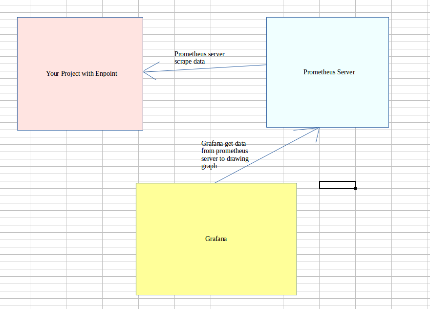

# Monitoring using prometheus and Grafana



## Prometheus
Prometheus is an open-source monitoring system that was originally built by SoundCloud. It consists of the following core components:
+ A data scraper that pulls metrics data over HTTP periodically at a configured interval.
+ A time-series database to store all the metrics data.
+ A simple user interface where you can visualize, query, and monitor all the metrics.

## Grafana
Grafana allows you to bring data from various data sources like Elasticsearch, Prometheus, Graphite, InfluxDB etc, and visualize them with beautiful graphs.
It also lets you set alert rules based on your metrics data. When an alert changes state, it can notify you over email, slack, or various other channels.

## Implement spring boot which expose prometheus metrics endpoint
To integrate actuator with Prometheus, you need to add the micrometer-registry-prometheus dependency
```xml
<!-- Micrometer Prometheus registry  -->
<dependency>
	<groupId>io.micrometer</groupId>
	<artifactId>micrometer-registry-prometheus</artifactId>
</dependency>
```
```
management.endpoint.prometheus.enabled=true
management.endpoints.web.exposure.include=*
management.endpoint.metrics.enabled=true
```
All the application metrics data are made available at an actuator endpoint called /prometheus. The Prometheus server can scrape this endpoint to get metrics data periodically.

## Exploring Spring Boot Actuator’s /prometheus Endpoint
First of all, you’ll start seeing the prometheus endpoint on the actuator endpoint-discovery page (http://localhost:8080/actuator)
```json
{"_links":{"self":{"href":"http://localhost:8080/actuator","templated":false},"beans":{"href":"http://localhost:8080/actuator/beans","templated":false},"caches-cache":{"href":"http://localhost:8080/actuator/caches/{cache}","templated":true},"caches":{"href":"http://localhost:8080/actuator/caches","templated":false},"health":{"href":"http://localhost:8080/actuator/health","templated":false},"health-path":{"href":"http://localhost:8080/actuator/health/{*path}","templated":true},"info":{"href":"http://localhost:8080/actuator/info","templated":false},"conditions":{"href":"http://localhost:8080/actuator/conditions","templated":false},"configprops":{"href":"http://localhost:8080/actuator/configprops","templated":false},"env-toMatch":{"href":"http://localhost:8080/actuator/env/{toMatch}","templated":true},"env":{"href":"http://localhost:8080/actuator/env","templated":false},"loggers":{"href":"http://localhost:8080/actuator/loggers","templated":false},"loggers-name":{"href":"http://localhost:8080/actuator/loggers/{name}","templated":true},"heapdump":{"href":"http://localhost:8080/actuator/heapdump","templated":false},"threaddump":{"href":"http://localhost:8080/actuator/threaddump","templated":false},"prometheus":{"href":"http://localhost:8080/actuator/prometheus","templated":false},"metrics":{"href":"http://localhost:8080/actuator/metrics","templated":false},"metrics-requiredMetricName":{"href":"http://localhost:8080/actuator/metrics/{requiredMetricName}","templated":true},"scheduledtasks":{"href":"http://localhost:8080/actuator/scheduledtasks","templated":false},"mappings":{"href":"http://localhost:8080/actuator/mappings","templated":false}}}
```

The prometheus endpoint exposes metrics data in a format that can be scraped by a Prometheus server. You can see the exposed metrics data by navigating to the prometheus endpoint (http://localhost:8080/actuator/prometheus)
```t
# HELP jvm_buffer_memory_used_bytes An estimate of the memory that the Java virtual machine is using for this buffer pool
# TYPE jvm_buffer_memory_used_bytes gauge
jvm_buffer_memory_used_bytes{id="direct",} 90112.0
jvm_buffer_memory_used_bytes{id="mapped",} 0.0
# HELP jvm_memory_used_bytes The amount of used memory
# TYPE jvm_memory_used_bytes gauge
jvm_memory_used_bytes{area="heap",id="PS Survivor Space",} 1359920.0
jvm_memory_used_bytes{area="heap",id="PS Old Gen",} 1.2727768E7
jvm_memory_used_bytes{area="heap",id="PS Eden Space",} 1.1717676E8
jvm_memory_used_bytes{area="nonheap",id="Metaspace",} 3.8572256E7
jvm_memory_used_bytes{area="nonheap",id="Code Cache",} 1.8405056E7
jvm_memory_used_bytes{area="nonheap",id="Compressed Class Space",} 4790304.0
# HELP jvm_gc_memory_allocated_bytes_total Incremented for an increase in the size of the young generation memory pool after one GC to before the next
# TYPE jvm_gc_memory_allocated_bytes_total counter
jvm_gc_memory_allocated_bytes_total 7.94080488E8
# HELP jvm_classes_loaded_classes The number of classes that are currently loaded in the Java virtual machine
# TYPE jvm_classes_loaded_classes gauge
jvm_classes_loaded_classes 7261.0
# HELP jvm_threads_live_threads The current number of live threads including both daemon and non-daemon threads
# TYPE jvm_threads_live_threads gauge
jvm_threads_live_threads 22.0
# HELP process_uptime_seconds The uptime of the Java virtual machine
# TYPE process_uptime_seconds gauge
process_uptime_seconds 13393.66
# HELP tomcat_sessions_active_max_sessions  
# TYPE tomcat_sessions_active_max_sessions gauge
tomcat_sessions_active_max_sessions 0.0
# HELP process_files_max_files The maximum file descriptor count
# TYPE process_files_max_files gauge
process_files_max_files 65535.0
# HELP tomcat_sessions_expired_sessions_total  
# TYPE tomcat_sessions_expired_sessions_total counter
tomcat_sessions_expired_sessions_total 0.0
```
## Downloading and Running Prometheus using Docker
### 1. Downloading Prometheus
You can download the Prometheus docker image using docker pull command like so
```
docker pull prom/prometheus
```
### 2. Prometheus Configuration (prometheus.yml)
```yaml
global:
  scrape_interval: 15s
scrape_configs:
  - job_name: 'spring-actuator'
    metrics_path: '/actuator/prometheus'
    scrape_interval: 5s
    static_configs:
      - targets: ['<Your EndPoint IP>:8080']
```
### 3. Running Prometheus using Docker
```docker
docker run \
    -p 9090:9090 \
    -v /tmp/prometheus.yml:/etc/prometheus/prometheus.yml \
    prom/prometheus
```

### 4. Visualizing Spring Boot Metrics from Prometheus dashboard
That’s it! You can now navigate to http://localhost:9090 to explore the Prometheus dashboard.

## Downloading and running Grafana using Docker
Type the following command to download and run Grafana using Docker -

```
docker run -d --name=grafana -p 3000:3000 grafana/grafana 
```

That’s it! You can now navigate to http://localhost:3000 and log in to Grafana with the default username admin and password admin.
